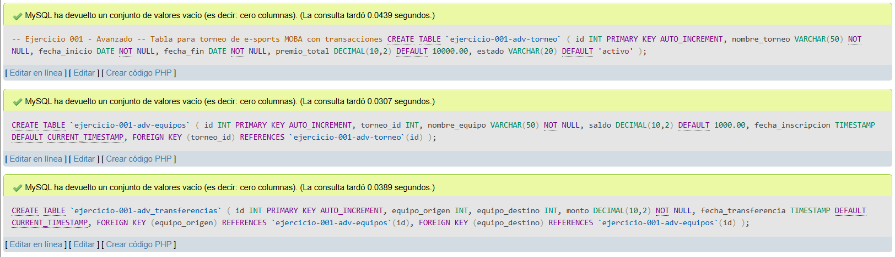
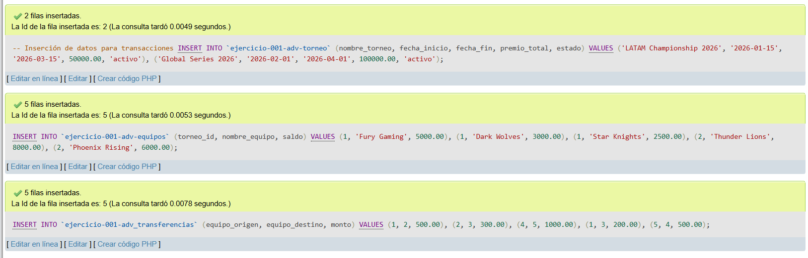
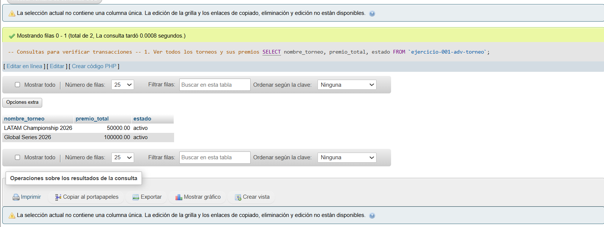
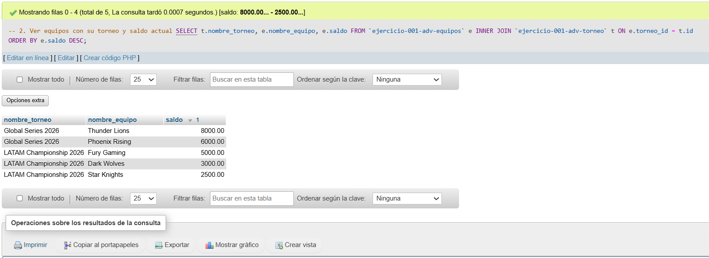
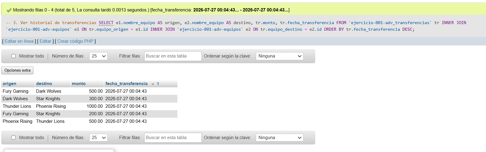
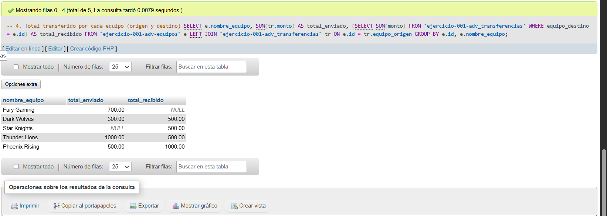
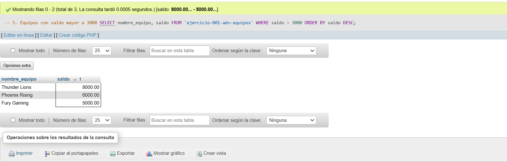

# Ejercicio 001 - Nivel Avanzado - Torneo E-Sports MOBA

## 1. Temática

Gestión de un torneo de e-sports MOBA con transacciones financieras entre equipos. Se manejan torneos, equipos con saldo y transferencias de dinero entre ellos.

## 2. Decisiones Técnicas

A continuación, se describen las decisiones clave tomadas para la resolución:

- **Diseño de Tablas (DDL):**
  - Se crearon 3 tablas relacionadas: `` `ejercicio-001-adv-torneo` ``, `` `ejercicio-001-adv-equipos` `` y `` `ejercicio-001-adv_transferencias` ``.
  - Se implementó el uso de comillas invertidas (backticks) en los nombres de las tablas para evitar errores de sintaxis en MySQL/MariaDB debido al uso de guiones medios (`-`).
  - Se usó `DECIMAL(10,2)` para saldos y montos para manejar valores monetarios con precisión.
  - Se aplicó `DEFAULT 1000.00` en saldo de equipos para tener un valor inicial consistente.
  - Se usó `FOREIGN KEY` en las relaciones para mantener integridad referencial entre torneos y equipos.
  - Se implementó `TIMESTAMP DEFAULT CURRENT_TIMESTAMP` para registrar automáticamente la fecha de inscripción y transferencias.

- **Inserción de Datos (DML):**
  - Se insertaron 2 torneos con diferentes premios para probar filtros.
  - Se agregaron 5 equipos distribuidos en ambos torneos con saldos realistas.
  - Se crearon 5 transferencias entre equipos para practicar consultas con JOIN y manejo de claves foráneas.

- **Consultas (DQL):**
  - La consulta `1` muestra información básica de torneos.
  - La consulta `2` usa `INNER JOIN` para ver equipos con su torneo y saldo ordenado de mayor a menor.
  - La consulta `3` muestra el historial completo de transferencias relacionando los nombres de los equipos de origen y destino.
  - La consulta `4` usa `LEFT JOIN` y una subconsulta agrupando por ID y nombre de equipo para calcular con precisión los totales enviados y recibidos.
  - La consulta `5` filtra equipos con saldo mayor a 3000 para análisis financiero ordenados descendentemente.

## 3. Evidencias

*A continuación, se adjuntan capturas de pantalla que demuestran la ejecución y los resultados de los scripts SQL en phpMyAdmin.*

Definición de tablas

Insertar datos

Consulta 1

Consulta 2

Consulta 3

Consulta 4

Consulta 5
