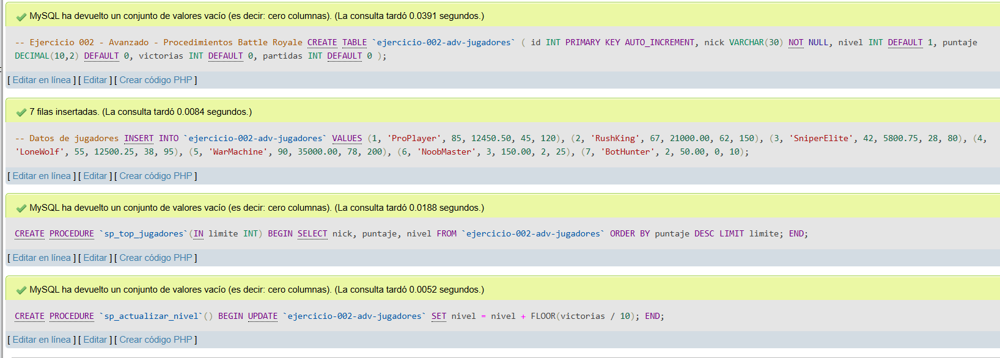
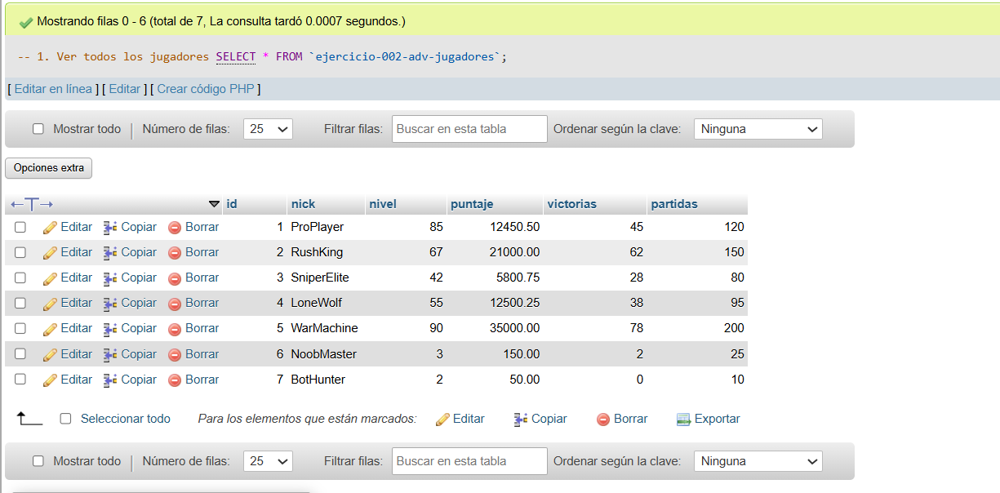
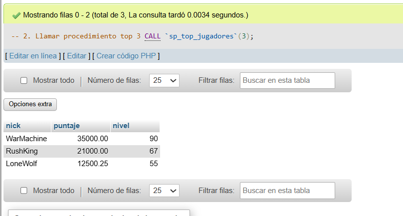
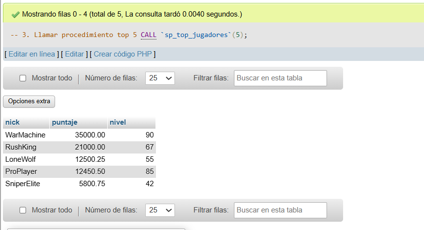
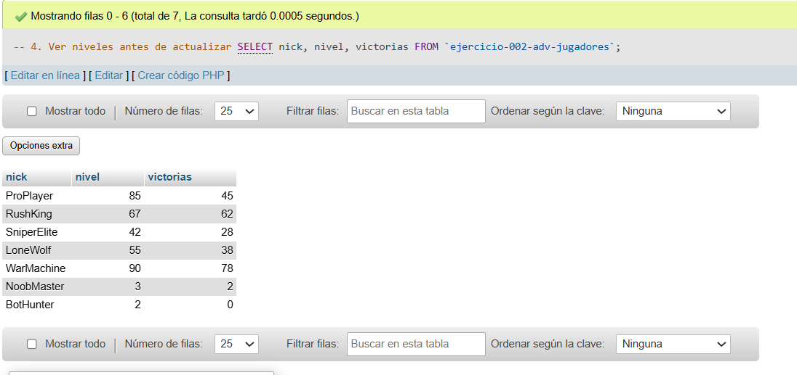
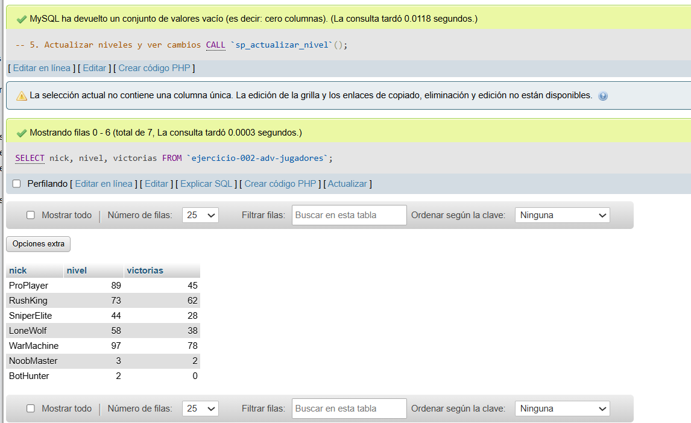

# Ejercicio 002 - Nivel Avanzado - Procedimientos Battle Royale

## 1. Temática

Ranking de jugadores de Battle Royale usando procedimientos almacenados para consultas y actualizaciones automáticas.

## 2. Decisiones Técnicas

- **Diseño de Tablas (DDL):**
  - Una tabla: `ejercicio-002-adv-jugadores`.
  - Columnas simples: `nick`, `nivel`, `puntaje`, `victorias`, `partidas`.
  - Uso de comillas invertidas `` ` `` para nombres con guiones.

- **Inserción de Datos (DML):**
  - 7 jugadores con estadísticas variadas.
  - Incluye jugadores de alto y bajo nivel.

- **Procedimientos:**
  - `sp_top_jugadores`: recibe límite y muestra top por puntaje.
  - `sp_actualizar_nivel`: incrementa nivel cada 10 victorias.
  - Uso de `DELIMITER` para crear procedimientos correctamente.

- **Consultas (DQL):**
  - Ver datos antes y después de procedimientos.
  - Llamar procedimientos con diferentes parámetros.

## 3. Evidencias

*A continuación, se adjuntan capturas de pantalla que demuestran la ejecución y los resultados de los scripts SQL en phpMyAdmin.*

Definición de tablas e insertar datos

Consulta 1

Consulta 2

Consulta 3

Consulta 4

Consulta 5
