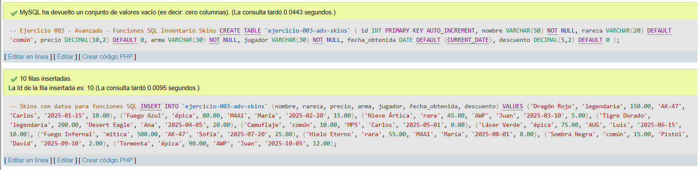
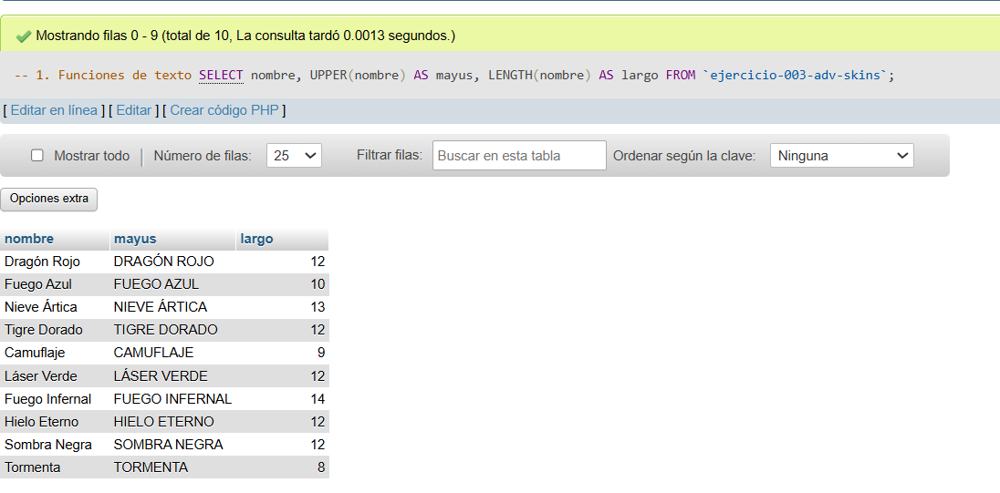
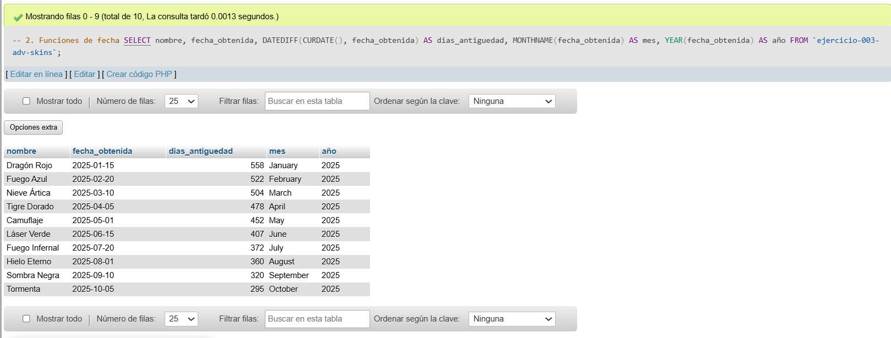
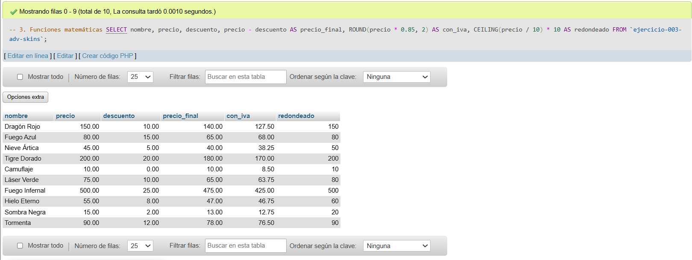
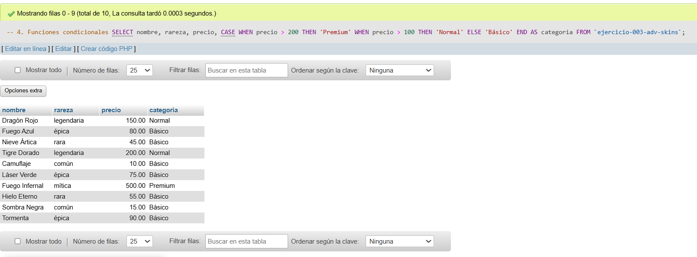
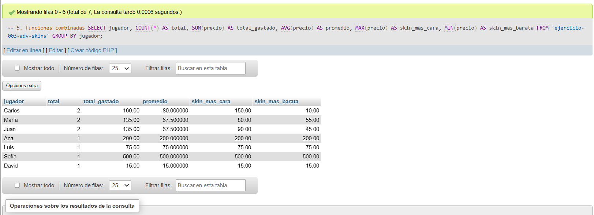

# Ejercicio 003 - Nivel Avanzado - Funciones SQL Inventario Skins

## 1. Temática

Inventario de skins de shooter usando funciones SQL de texto, fecha, matemáticas, condicionales y agregación.

## 2. Decisiones Técnicas

- **Diseño de Tablas (DDL):**
  - Una tabla: `ejercicio-003-adv-skins`.
  - Columnas: `id`, `nombre`, `rareza`, `precio`, `arma`, `jugador`, `fecha_obtenida`, `descuento`.
  - PRIMARY KEY en `id` con AUTO_INCREMENT.
  - Uso de comillas invertidas para nombres con guiones.

- **Inserción de Datos (DML):**
  - 10 skins con precios y descuentos variados.
  - Jugadores repetidos para pruebas de agregación.
  - Fechas distribuidas en 2025.

- **Consultas (DQL) - Funciones usadas:**
  - **Texto:** `UPPER()`, `LENGTH()` para manipular nombres.
  - **Fecha:** `DATEDIFF()`, `MONTHNAME()`, `YEAR()` para antigüedad.
  - **Matemáticas:** `ROUND()`, `CEILING()` para precios.
  - **Condicionales:** `CASE` para categorizar por precio.
  - **Agregación:** `COUNT()`, `SUM()`, `AVG()`, `MAX()`, `MIN()` por jugador.

## 3. Evidencias

*A continuación, se adjuntan capturas de pantalla que demuestran la ejecución y los resultados de los scripts SQL en phpMyAdmin.*

Definición de tablas e insertar datos

Consulta 1

Consulta 2

Consulta 3

Consulta 4

Consulta 5
