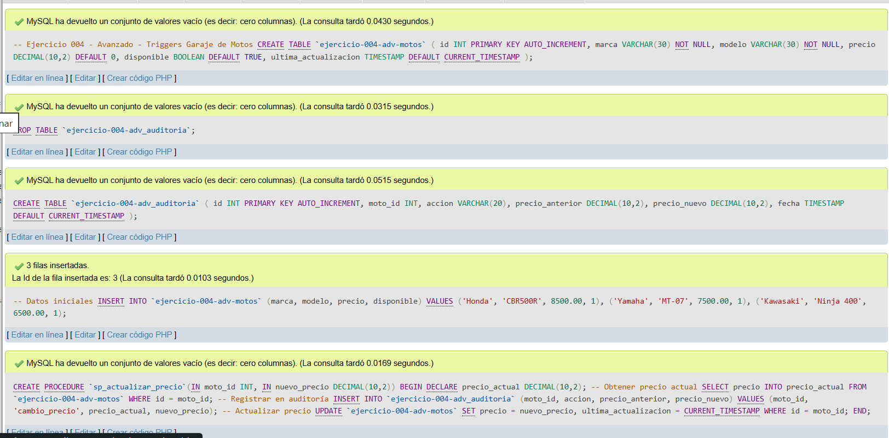
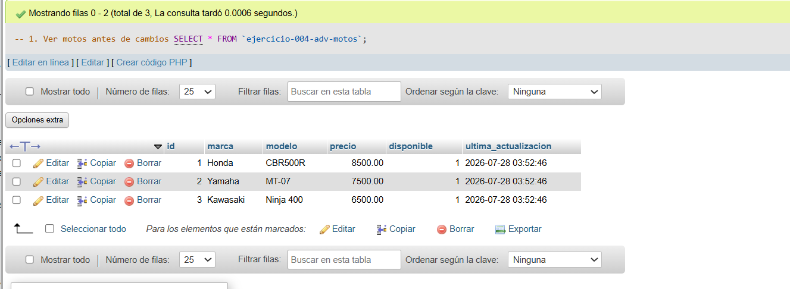
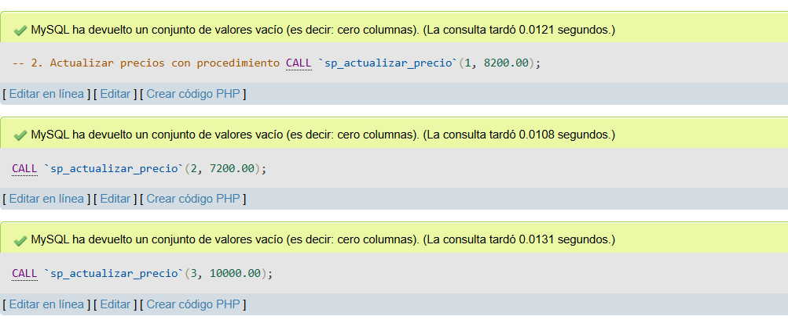
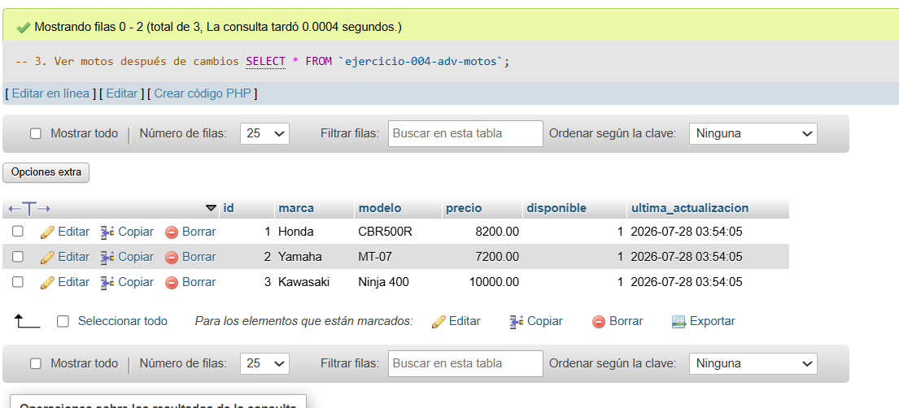
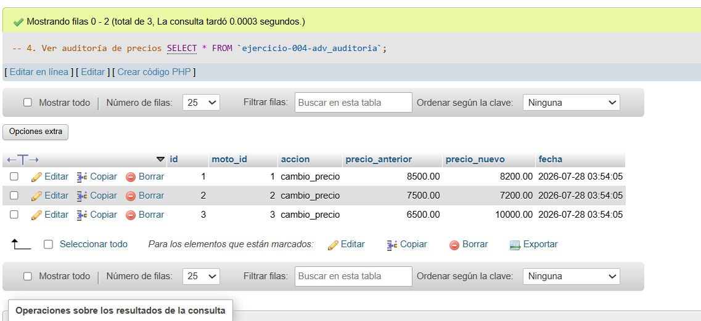
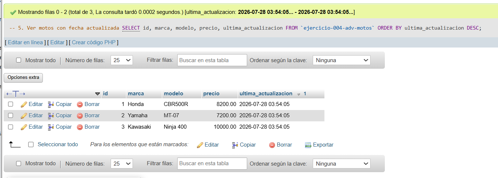

# Ejercicio 004 - Nivel Avanzado - Triggers Garaje de Motos

## 1. Temática

Garaje de motos con auditoría de precios usando procedimientos almacenados (alternativa a triggers por problemas de permisos).

## 2. Decisiones Técnicas

- **Diseño de Tablas (DDL):**
  - Tabla principal: `ejercicio-004-adv-motos`.
  - Tabla auditoría: `ejercicio-004-adv_auditoria`.
  - Uso de comillas invertidas para nombres con guiones.

- **Inserción de Datos (DML):**
  - 3 motos iniciales.
  - Procedimiento `sp_actualizar_precio` que:
    - Obtiene precio actual.
    - Registra en auditoría.
    - Actualiza precio y fecha.

- **Consultas (DQL):**
  - Ver estado antes y después.
  - Llamar procedimiento para actualizar.
  - Verificar auditoría.

## 3. Evidencias

*A continuación, se adjuntan capturas de pantalla que demuestran la ejecución y los resultados de los scripts SQL en phpMyAdmin.*

Definición de tablas e insertar datos

Consulta 1

Consulta 2

Consulta 3

Consulta 4

Consulta 5
