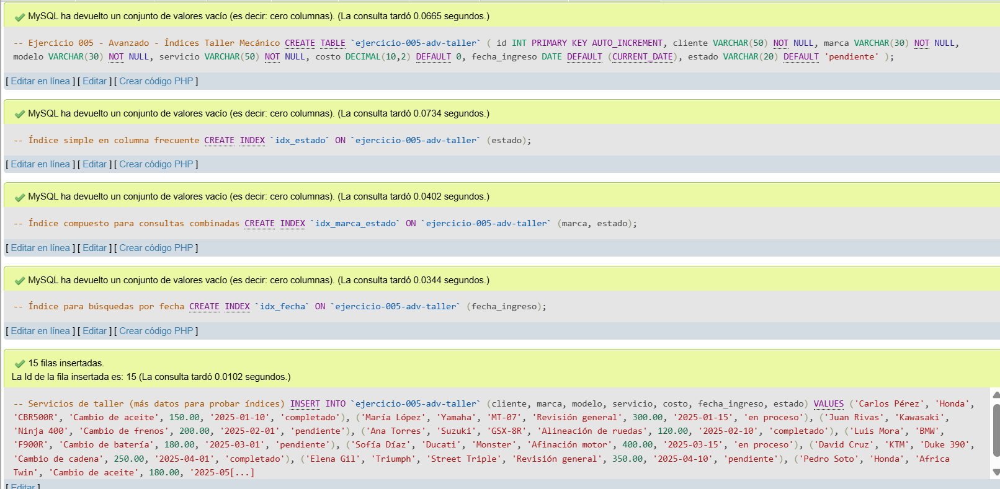
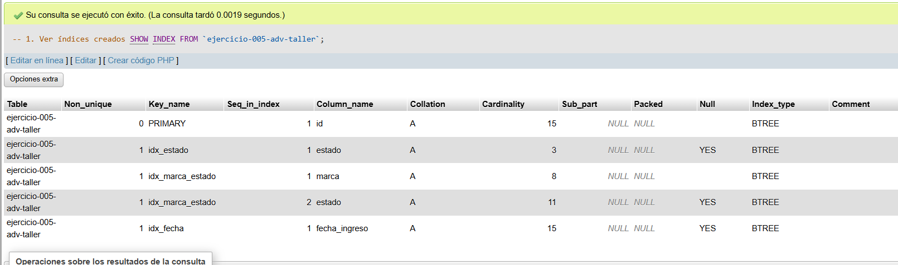
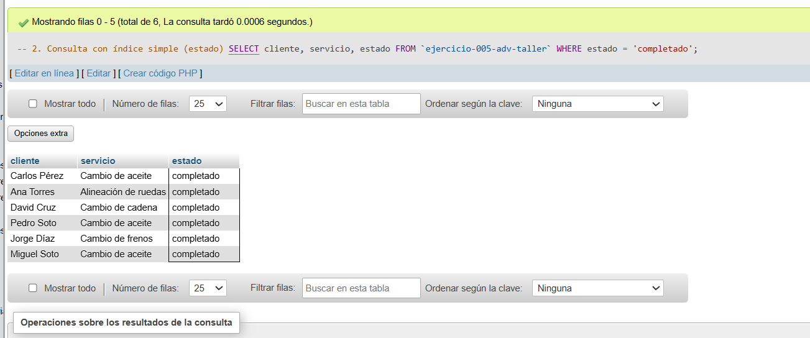
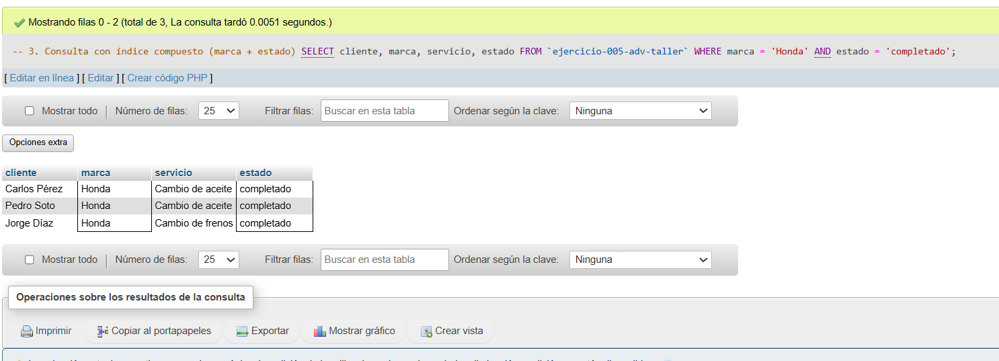
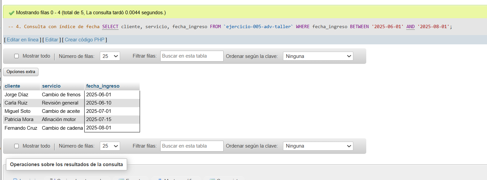
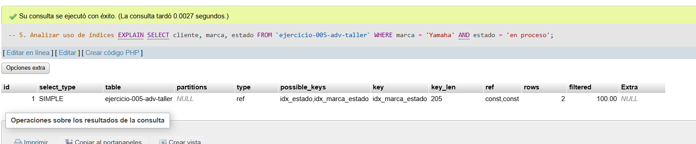

# Ejercicio 005 - Nivel Avanzado - Índices Taller Mecánico

## 1. Temática

Taller mecánico de motos con índices para optimizar consultas frecuentes y mejorar rendimiento.

## 2. Decisiones Técnicas

- **Diseño de Tablas (DDL):**
  - Una tabla: `ejercicio-005-adv-taller`.
  - Columnas: `id`, `cliente`, `marca`, `modelo`, `servicio`, `costo`, `fecha_ingreso`, `estado`.
  - PRIMARY KEY en `id` (índice automático).
  - Uso de comillas invertidas para nombres con guiones.

- **Índices creados:**
  - `idx_estado`: Índice simple para filtrar por estado (consultas frecuentes).
  - `idx_marca_estado`: Índice compuesto para búsquedas que usan ambas columnas.
  - `idx_fecha`: Índice para consultas por rango de fechas.

- **Inserción de Datos (DML):**
  - 15 servicios para probar el rendimiento de índices.
  - Diferentes marcas y estados.

- **Consultas (DQL):**
  - `SHOW INDEX` para ver índices creados.
  - Consultas que usan cada tipo de índice.
  - `EXPLAIN` para analizar el uso de índices en consultas.

## 3. Evidencias

*A continuación, se adjuntan capturas de pantalla que demuestran la ejecución y los resultados de los scripts SQL en phpMyAdmin.*

Definición de tablas e insertar datos

Consulta 1

Consulta 2

Consulta 3

Consulta 4

Consulta 5
