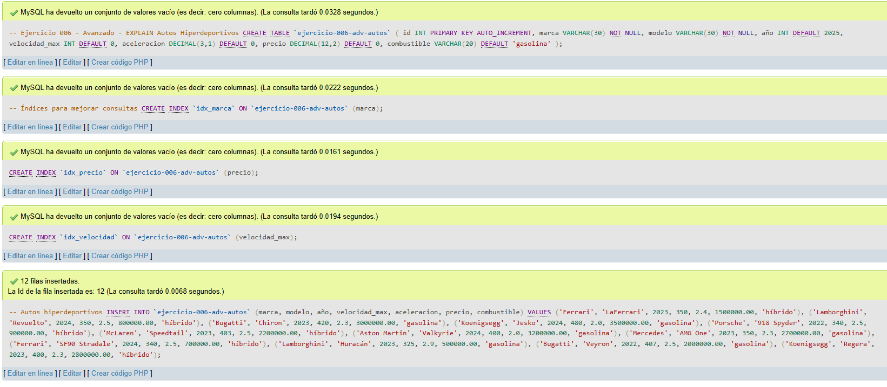
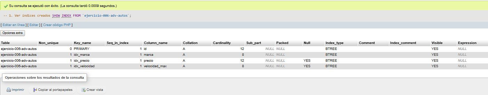
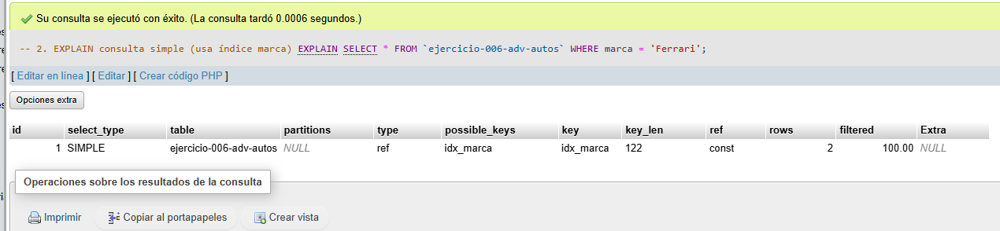
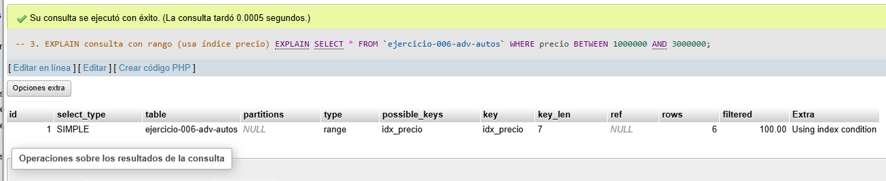
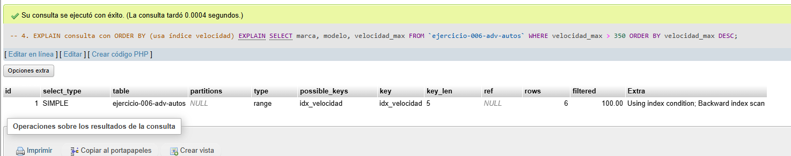
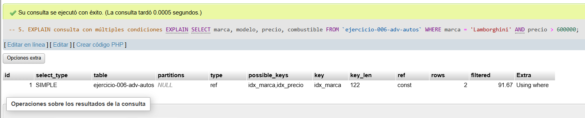

# Ejercicio 006 - Nivel Avanzado - EXPLAIN Autos Hiperdeportivos

## 1. Temática

Análisis de rendimiento de consultas en autos hiperdeportivos usando EXPLAIN para entender cómo MySQL ejecuta las consultas.

## 2. Decisiones Técnicas

- **Diseño de Tablas (DDL):**
  - Una tabla: `ejercicio-006-adv-autos`.
  - Columnas: `id`, `marca`, `modelo`, `año`, `velocidad_max`, `aceleracion`, `precio`, `combustible`.
  - PRIMARY KEY en `id` con AUTO_INCREMENT.
  - 3 índices: `idx_marca`, `idx_precio`, `idx_velocidad`.
  - Uso de comillas invertidas para nombres con guiones.

- **Inserción de Datos (DML):**
  - 12 autos de diferentes marcas.
  - Datos variados para probar diferentes consultas.

- **Consultas (DQL) - EXPLAIN:**
  - `EXPLAIN` con WHERE en columna indexada.
  - `EXPLAIN` con BETWEEN en columna indexada.
  - `EXPLAIN` con ORDER BY en columna indexada.
  - `EXPLAIN` con múltiples condiciones.
  - `SHOW INDEX` para ver los índices creados.

- **Qué analizar en EXPLAIN:**
  - `type`: tipo de acceso (const, ref, range, ALL).
  - `possible_keys`: índices que podría usar.
  - `key`: índice que realmente usa.
  - `rows`: filas estimadas a escanear.
  - `Extra`: información adicional (Using index, Using where).

## 3. Evidencias

*A continuación, se adjuntan capturas de pantalla que demuestran la ejecución y los resultados de los scripts SQL en phpMyAdmin.*

Definición de tablas e inserción de datos

Consulta 1

Consulta 2

Consulta 3

Consulta 4

Consulta 5
