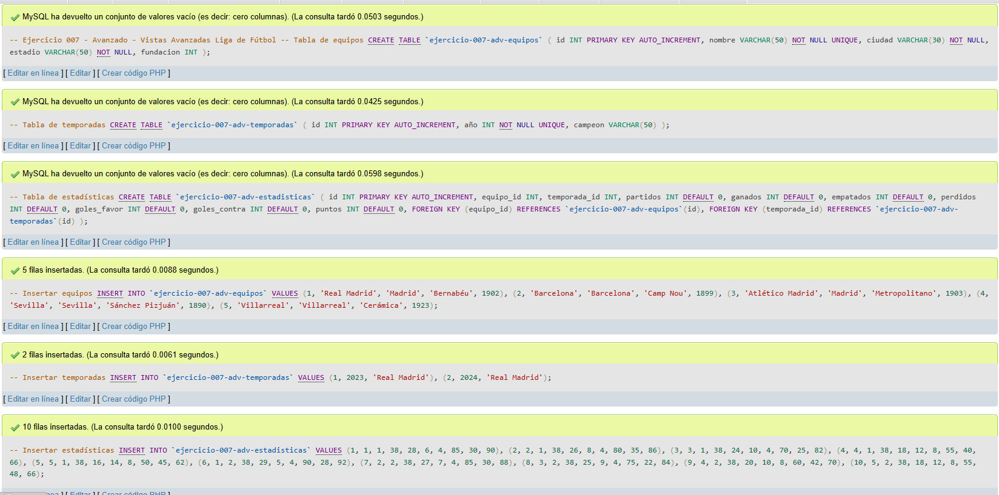
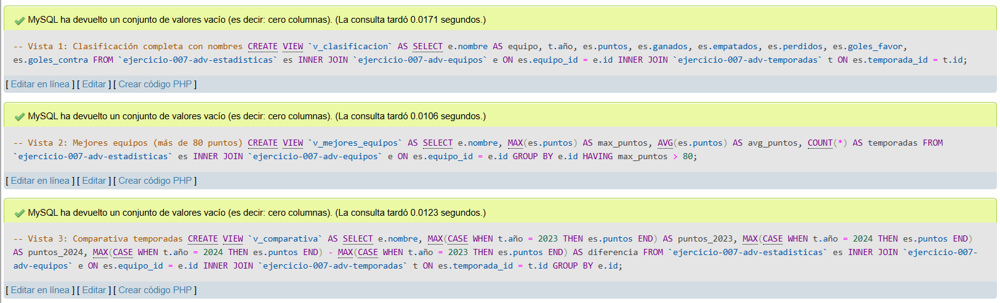
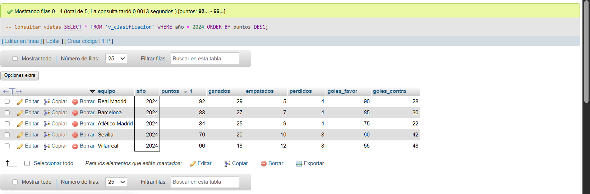
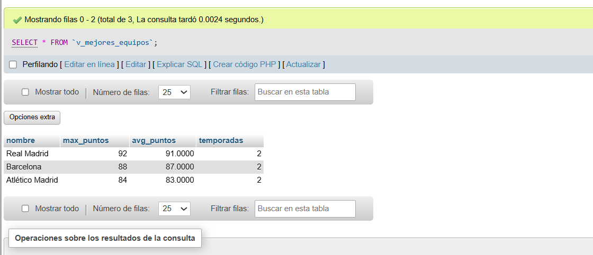
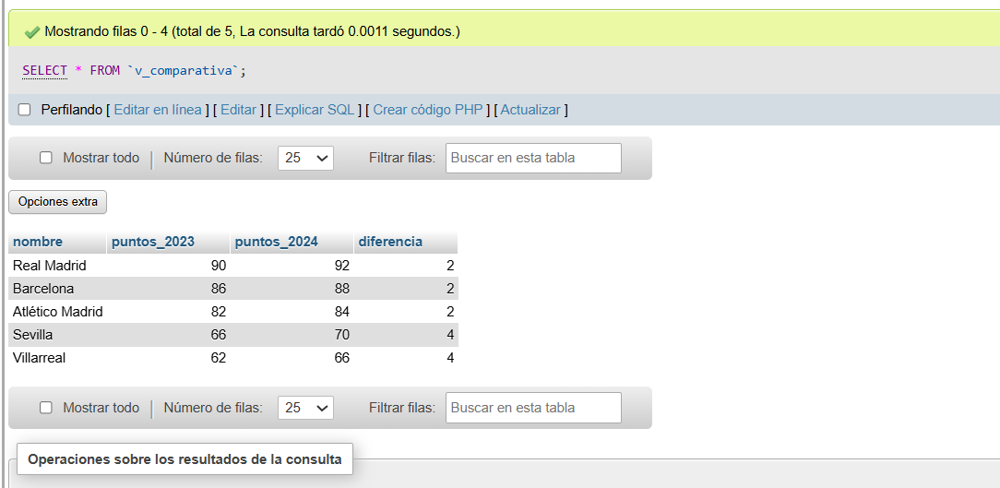

# Ejercicio 007 - Nivel Avanzado - Vistas Avanzadas Liga de Fútbol

## 1. Temática

Liga de fútbol con vistas avanzadas para simplificar consultas complejas y crear reportes reutilizables.

## 2. Decisiones Técnicas

- **Diseño de Tablas (DDL):**
  - 3 tablas normalizadas: equipos, temporadas, estadísticas.
  - Llaves foráneas para integridad referencial.
  - Uso de comillas invertidas para nombres con guiones.

- **Inserción de Datos (DML):**
  - 5 equipos, 2 temporadas, 10 registros de estadísticas.

- **Vistas creadas:**
  - `v_clasificacion`: Clasificación completa con nombres de equipos y temporadas.
  - `v_mejores_equipos`: Equipos con puntuación máxima > 80 puntos.
  - `v_comparativa`: Comparativa de puntos entre temporadas 2023 y 2024.

- **Ventajas de vistas:**
  - Simplifican consultas complejas.
  - Encapsulan lógica de negocio.
  - Reutilizables en múltiples consultas.
  - Mejoran la seguridad (ocultan columnas sensibles).

- **Consultas (DQL):**
  - SELECT simple desde vistas con filtros.
  - Uso de vistas como tablas virtuales.

## 3. Evidencias

*A continuación, se adjuntan capturas de pantalla que demuestran la ejecución y los resultados de los scripts SQL en phpMyAdmin.*

Definición de tablas e inserción de datos

Consulta 1-2-3

Consulta 1

Consulta 2

Consulta 3

