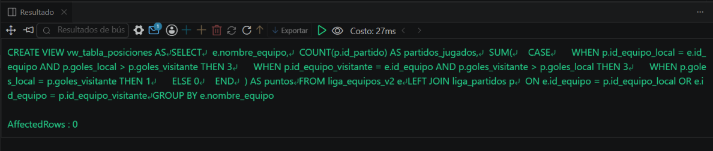
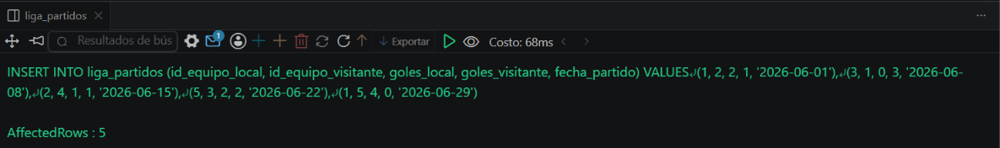
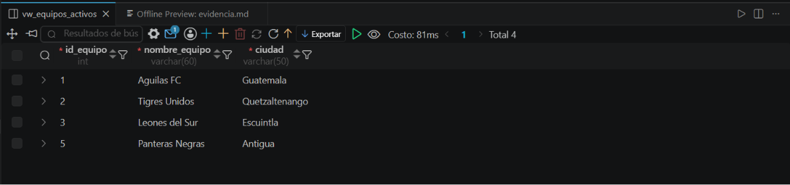

# Ejercicio 007 (Avanzado) - Selvin Lem

## Tematica
Liga de futbol

## Como ejecutar
1. Ejecutar `ddl/schema.sql`: crea las tablas y 2 vistas (simple y compleja).
2. Ejecutar `dml/inserts.sql` para insertar 5 equipos y 5 partidos.
3. Ejecutar `dql/consultas.sql`: consulta ambas vistas e inserta un
   equipo nuevo a traves de la vista simple.

## Entidad principal
- Tablas: liga_equipos_v2, liga_partidos (FK a liga_equipos_v2)
- Vistas: vw_equipos_activos (simple, actualizable),
  vw_tabla_posiciones (compleja, solo lectura)

## Restriccion aplicada
FOREIGN KEY doble en liga_partidos (local y visitante), referenciando
liga_equipos_v2.

## Caso limite incluido
Equipo sancionado (no aparece en la vista simple de activos) que si
jugo un partido y por lo tanto si aparece con sus puntos en la vista
compleja de posiciones, mostrando que ambas vistas responden
preguntas distintas.

## Evidencia ejecucion - schema.sql
 

## Evidencia ejecucion - inserts.sql
 

## Evidencia ejecucion - consultas.sql
 