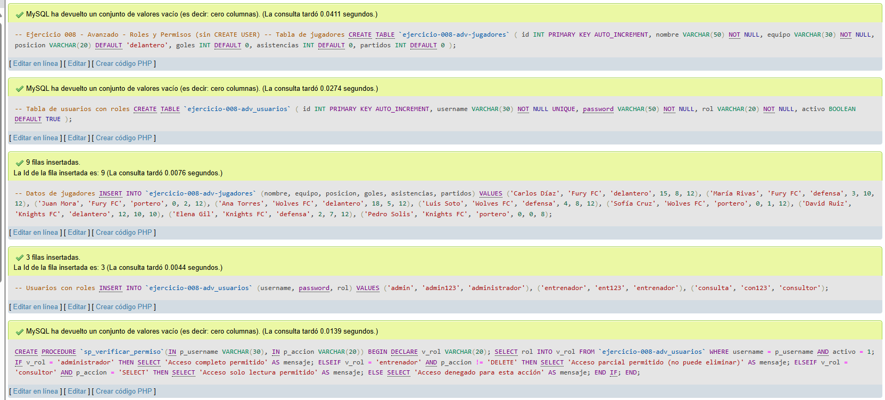
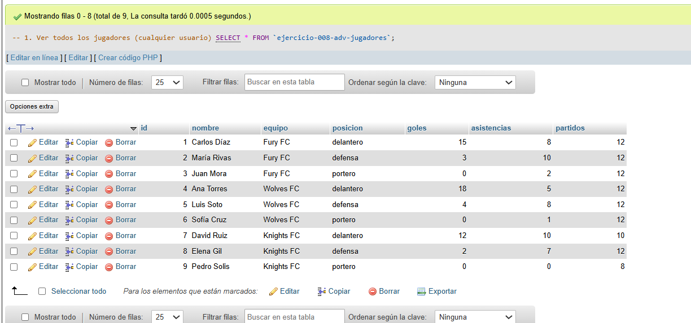
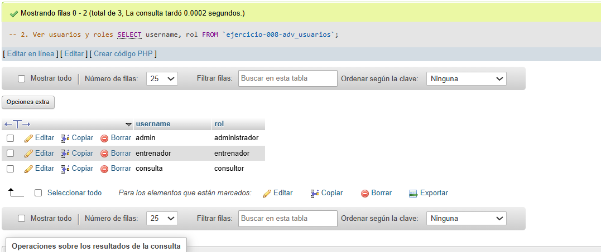
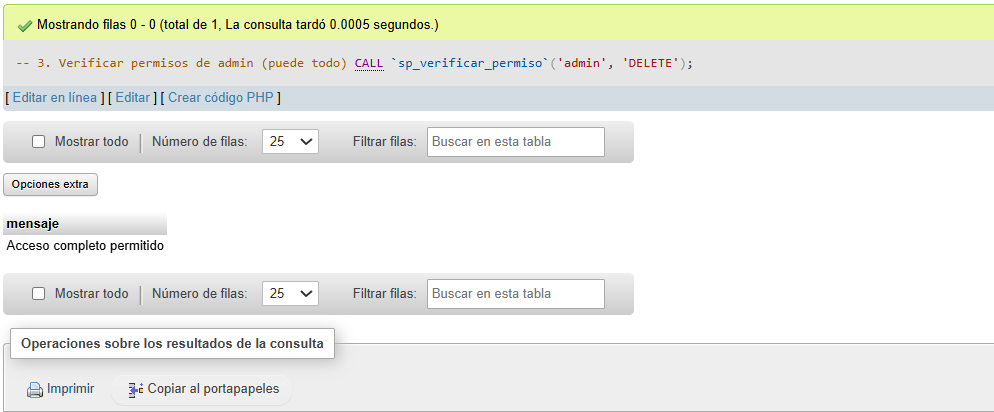
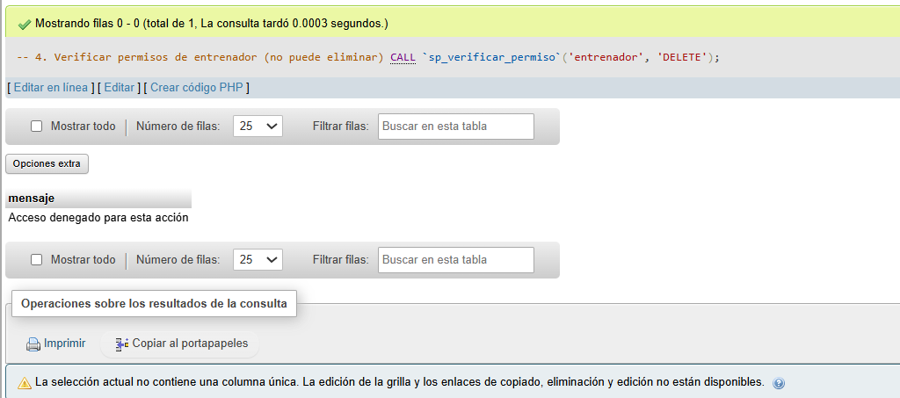
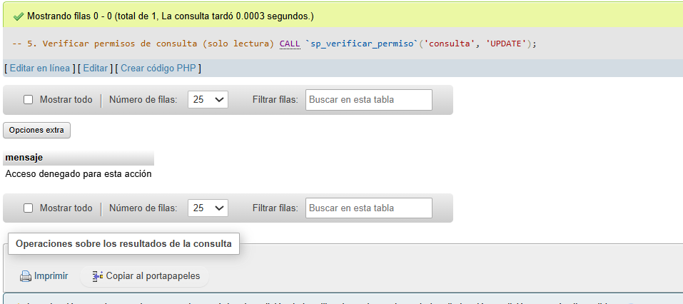
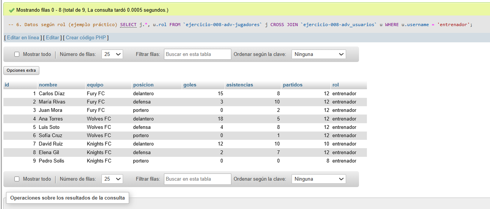
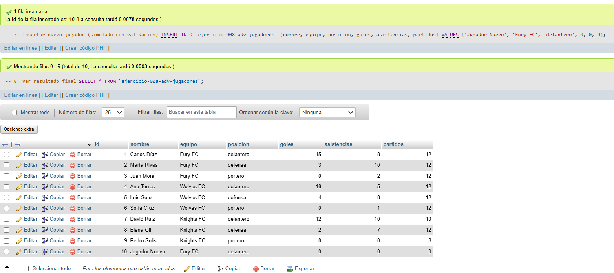

# Ejercicio 008 - Nivel Avanzado - Roles y Permisos Fútbol Sala (Alternativo)

## 1. Temática

Fútbol sala con sistema de roles y permisos implementado con tablas y procedimientos, sin necesidad de CREATE USER.

## 2. Decisiones Técnicas

- **Diseño de Tablas (DDL):**
  - Tabla principal: `ejercicio-008-adv-jugadores`.
  - Tabla de usuarios: `ejercicio-008-adv_usuarios` con username, password y rol.
  - Uso de comillas invertidas para nombres con guiones.

- **Roles definidos:**
  - **administrador:** Todos los permisos (SELECT, INSERT, UPDATE, DELETE).
  - **entrenador:** SELECT, INSERT, UPDATE (sin DELETE).
  - **consultor:** Solo SELECT (lectura).

- **Ventajas de este enfoque:**
  - No requiere privilegios de CREATE USER.
  - Funciona en cualquier entorno de hosting.
  - Más fácil de implementar y probar.
  - Control de permisos a nivel de aplicación.

- **Procedimiento:**
  - `sp_verificar_permiso`: Valida si un usuario tiene permiso para una acción.

- **Consultas (DQL):**
  - Verificación de permisos con procedimiento.
  - Consultas básicas de datos.
  - Inserción de nuevos jugadores.

## 3. Evidencias

*A continuación, se adjuntan capturas de pantalla que demuestran la ejecución y los resultados de los scripts SQL en phpMyAdmin.*

Definición de tablas e inserción de datos

Consulta 1

Consulta 2

Consulta 3

Consulta 4

Consulta 5

Consulta 6

Consulta 7 y 8
