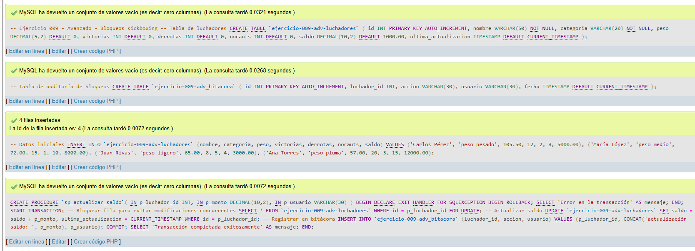
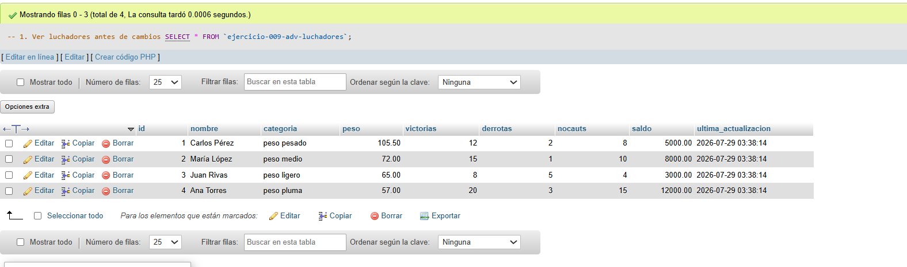
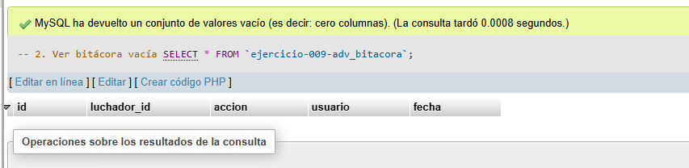
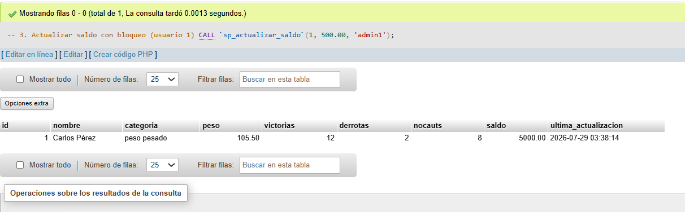
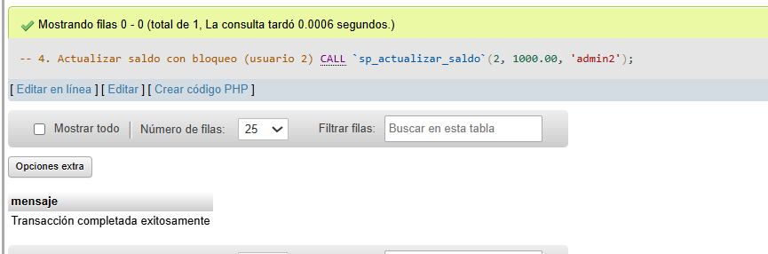
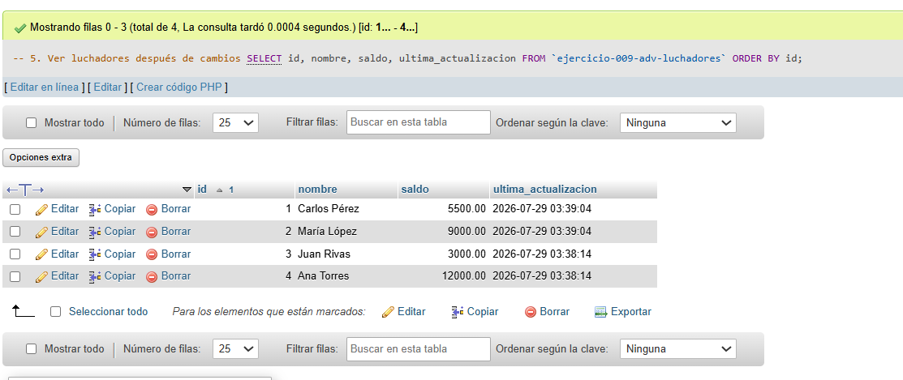
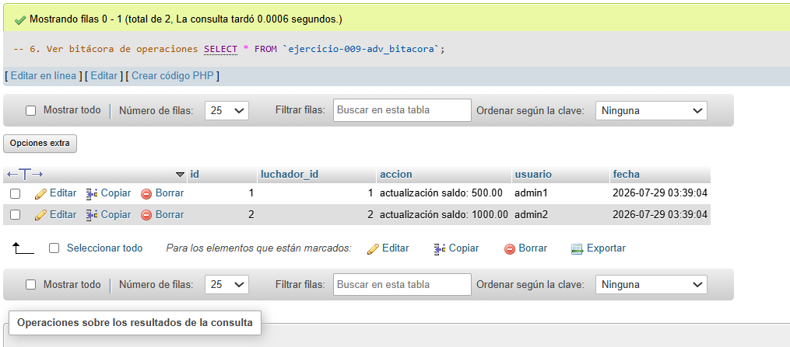
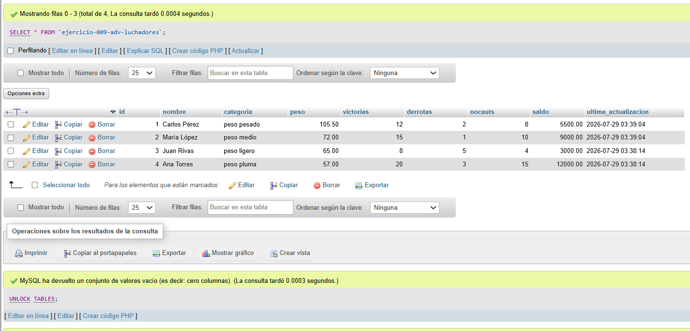
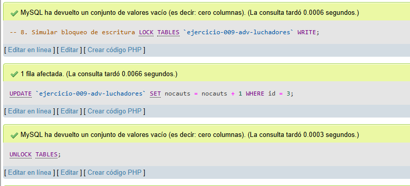
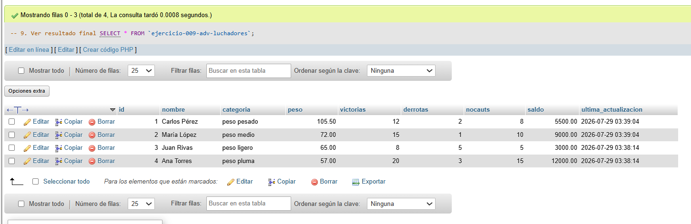

# Ejercicio 009 - Nivel Avanzado - Bloqueos Kickboxing

## 1. Temática

Kickboxing con bloqueos de filas y tablas para controlar accesos concurrentes y evitar inconsistencias.

## 2. Decisiones Técnicas

- **Diseño de Tablas (DDL):**
  - Tabla principal: `ejercicio-009-adv-luchadores`.
  - Tabla auditoría: `ejercicio-009-adv_bitacora`.
  - Columnas con `saldo` y `ultima_actualizacion` para seguimiento.
  - Uso de comillas invertidas para nombres con guiones.

- **Tipos de bloqueos:**
  - **FOR UPDATE:** Bloqueo de fila en transacción.
  - **LOCK TABLES READ:** Bloqueo de lectura (solo lectura).
  - **LOCK TABLES WRITE:** Bloqueo de escritura (lectura/escritura).

- **Procedimiento `sp_actualizar_saldo`:**
  - Inicia transacción.
  - Bloquea fila con `FOR UPDATE`.
  - Actualiza saldo.
  - Registra en bitácora.
  - Maneja errores con `ROLLBACK`.

- **Ventajas de bloqueos:**
  - Evita condiciones de carrera.
  - Garantiza consistencia en operaciones concurrentes.
  - Permite transacciones seguras.

- **Consultas (DQL):**
  - Ver estado antes y después.
  - Llamar procedimiento con bloqueo.
  - Pruebas de bloqueos de lectura/escritura.

## 3. Evidencias

*A continuación, se adjuntan capturas de pantalla que demuestran la ejecución y los resultados de los scripts SQL en phpMyAdmin.*

Definición de tablas e inserción de datos

Consulta 1

Consulta 2

Consulta 3

Consulta 4

Consulta 5

Consulta 6

Consulta 7

Consulta 8

Consulta 9

