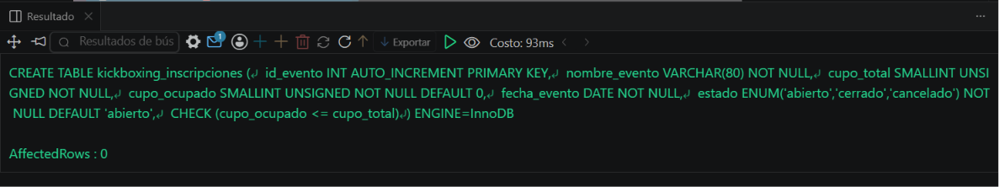
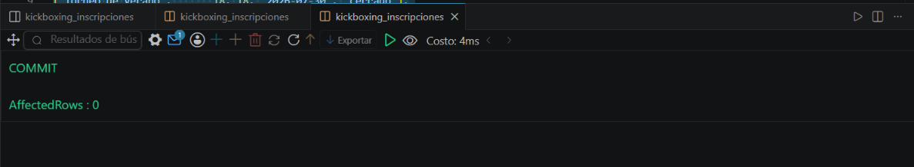
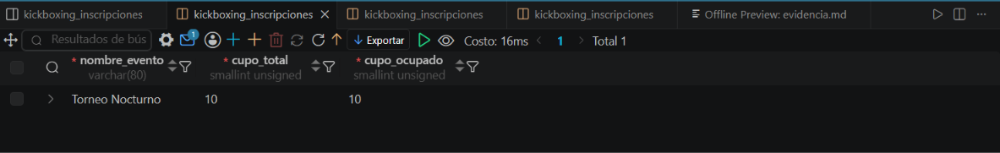

# Resolucion - Ejercicio 009 (Avanzado) - Selvin Lem

## Tematica
Kickboxing

## Como ejecutar
1. Ejecutar `ddl/schema.sql` para crear kickboxing_inscripciones (InnoDB).
2. Ejecutar `dml/inserts.sql`: inserta 8 eventos, aplica un LOCK TABLES
   para cerrar eventos llenos, y 2 transacciones con SELECT FOR UPDATE
   (una inscripcion exitosa, una fallida por cupo lleno).
3. Ejecutar `dql/consultas.sql` para verificar cupos y estados finales.

## Entidad principal
- Tabla: kickboxing_inscripciones
- Mecanismos: LOCK TABLES (nivel tabla), SELECT ... FOR UPDATE (nivel fila)

## Restriccion aplicada
CHECK (cupo_ocupado <= cupo_total), red de seguridad final ante
cualquier intento de sobrecupo.

## Caso limite incluido
Intento de inscripcion en evento con cupo lleno (15/15). El bloqueo
de fila (FOR UPDATE) da lectura consistente, pero es el WHERE del
UPDATE el que impide el sobrecupo; el cupo se mantiene sin cambios.

## Evidencia ejecucion - schema.sql
 

## Evidencia ejecucion - inserts.sql
 
 
## Evidencia ejecucion - consultas.sql
 