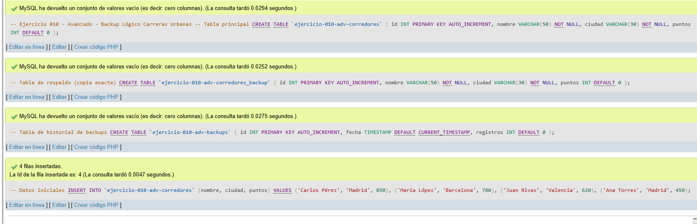
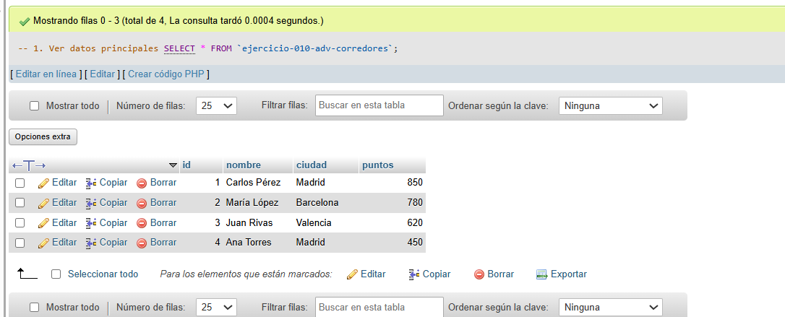
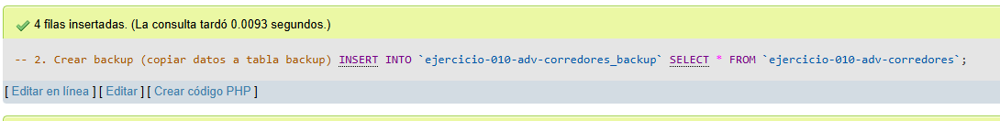
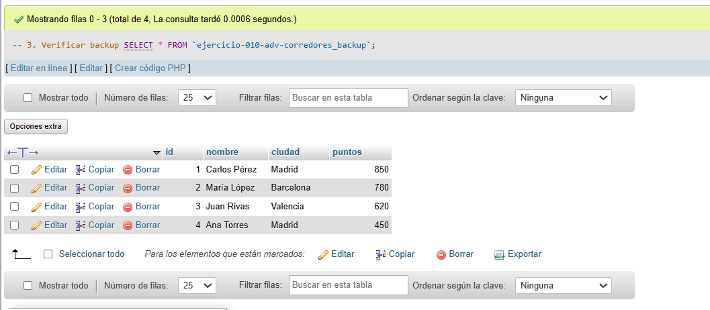
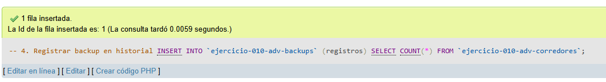
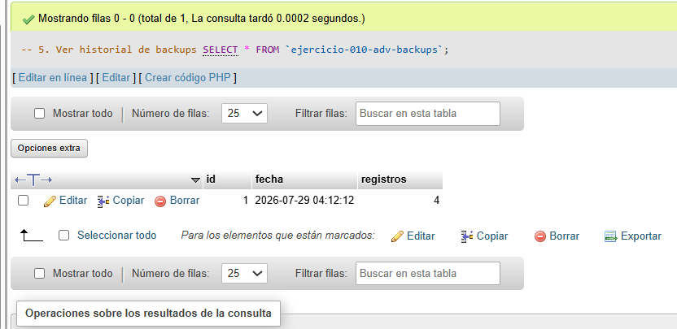
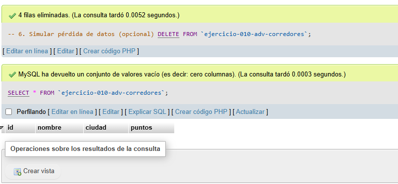
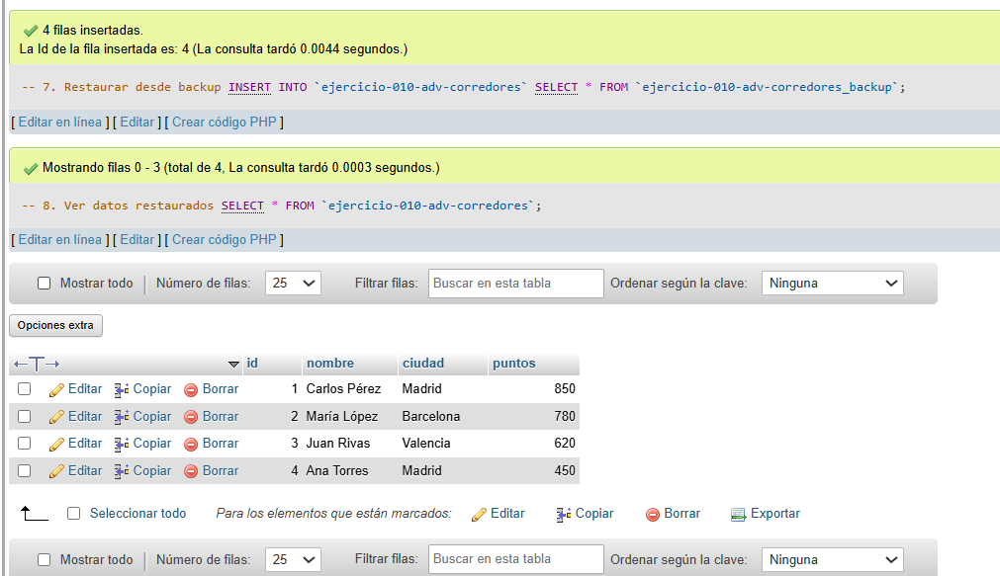

# Ejercicio 010 - Nivel Avanzado - Backup Lógico Carreras Urbanas

## 1. Temática

Carreras urbanas con sistema de backup simple usando tablas duplicadas.

## 2. Decisiones Técnicas

- **Diseño de Tablas (DDL):**
  - Tabla principal: `ejercicio-010-adv-corredores`.
  - Tabla backup: `ejercicio-010-adv-corredores_backup` (misma estructura).
  - Tabla historial: `ejercicio-010-adv-backups`.
  - Uso de comillas invertidas para nombres con guiones.

- **Método de backup (sin procedimientos):**
  - `INSERT INTO ... SELECT`: Copia todos los datos.
  - `INSERT INTO ... SELECT COUNT(*)`: Registra en historial.
  - Restauración con `INSERT SELECT` desde backup.

- **Ventajas:**
  - Sin procedimientos complicados.
  - Sin privilegios especiales.
  - Fácil de entender.
  - Copia exacta de datos.

- **Pasos:**
  1. Crear tabla backup con misma estructura.
  2. Copiar datos con INSERT SELECT.
  3. Restaurar cuando sea necesario.

## 3. Evidencias

*A continuación, se adjuntan capturas de pantalla que demuestran la ejecución y los resultados de los scripts SQL en phpMyAdmin.*

Definición de tablas e inserción de datos

Consulta 1

Consulta 2

Consulta 3

Consulta 4

Consulta 5

Consulta 6

Consulta 7 y 8

