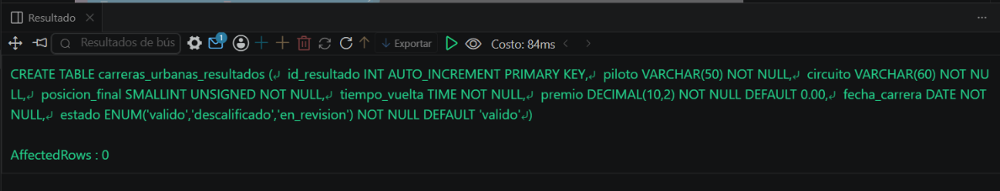
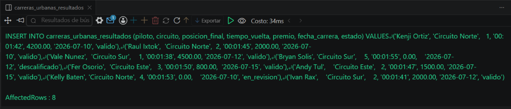
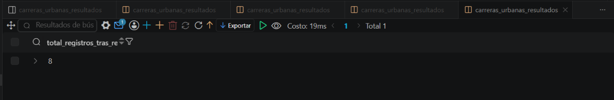

# Resolucion - Ejercicio 010 (Avanzado) - Selvin Lem

## Tematica
Carreras urbanas

## Como ejecutar
1. Ejecutar `ddl/schema.sql` para crear carreras_urbanas_resultados.
2. Ejecutar `dml/inserts.sql` para insertar 8 registros de prueba.
3. Desde terminal: generar backup con mysqldump, hacer TRUNCATE
   deliberado, y restaurar desde el backup (comandos en la seccion
   de backup del analisis, no en un archivo .sql).
4. Ejecutar `dql/consultas.sql` antes y despues de la restauracion
   para confirmar que el conteo de registros coincide.

## Entidad principal
- Tabla: carreras_urbanas_resultados
- Herramienta: mysqldump (backup logico via terminal)

## Restriccion aplicada
ENUM en estado, restringido a valido, descalificado o en_revision.

## Caso limite incluido
Piloto descalificado con premio en 0.00; el backup logico lo respalda
igual que los registros validos, sin excluir ningun estado.

## Evidencia ejecucion - schema.sql
 

## Evidencia ejecucion - inserts.sql
 
 
## Evidencia ejecucion - consultas.sql
 