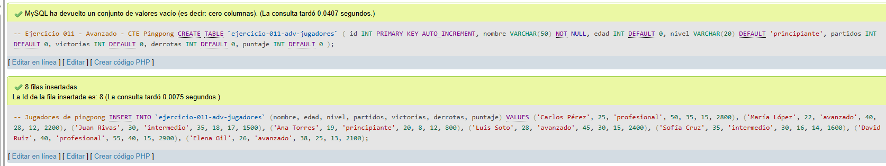
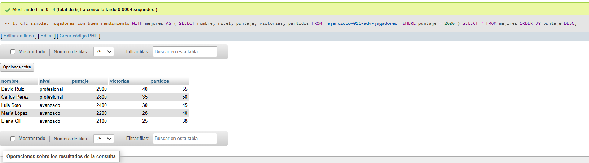
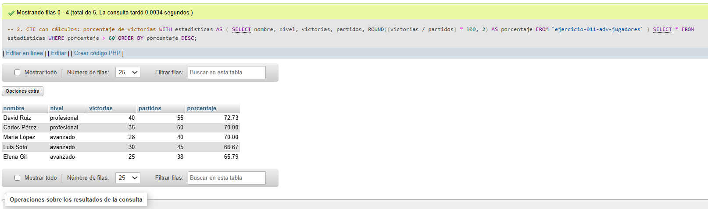
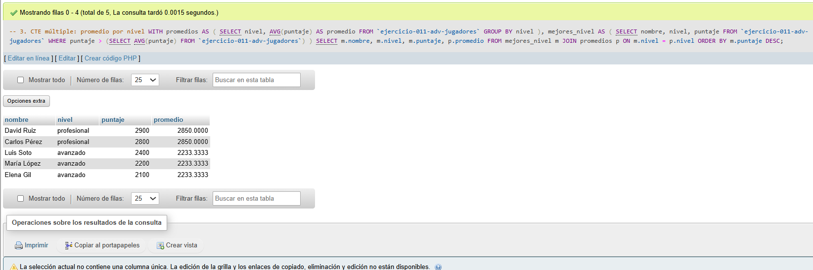
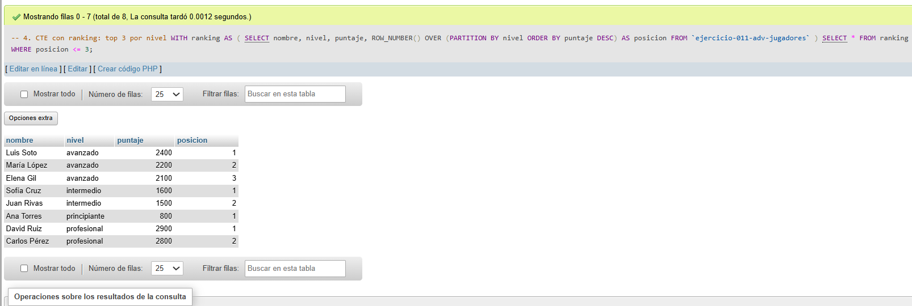
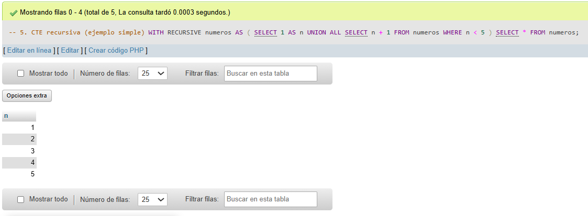

# Ejercicio 011 - Nivel Avanzado - CTE Pingpong

## 1. Temática

Pingpong con Common Table Expressions (CTE) para consultas más legibles y organizadas.

## 2. Decisiones Técnicas

- **Diseño de Tablas (DDL):**
  - Una tabla: `ejercicio-011-adv-jugadores`.
  - Columnas: `id`, `nombre`, `edad`, `nivel`, `partidos`, `victorias`, `derrotas`, `puntaje`.
  - Uso de comillas invertidas para nombres con guiones.

- **Inserción de Datos (DML):**
  - 8 jugadores con diferentes niveles y estadísticas.

- **Tipos de CTE:**
  - **CTE simple:** Mejores jugadores por puntaje.
  - **CTE con cálculos:** Porcentaje de victorias.
  - **CTE múltiple:** Promedios combinados.
  - **CTE con ranking:** Top 3 por nivel (ROW_NUMBER).
  - **CTE recursiva:** Ejemplo simple con números.

- **Ventajas de CTE:**
  - Mejora legibilidad de consultas.
  - Permite reutilizar resultados.
  - Facilita consultas complejas.
  - Ayuda a organizar SQL.

- **Consultas (DQL):**
  - WITH para definir CTE.
  - Múltiples CTE en una consulta.
  - ROW_NUMBER para ranking.
  - CTE recursiva básica.

## 3. Evidencias

*A continuación, se adjuntan capturas de pantalla que demuestran la ejecución y los resultados de los scripts SQL en phpMyAdmin.*

Definición de tablas e inserción de datos

Consulta 1

Consulta 2

Consulta 3

Consulta 4

Consulta 5

