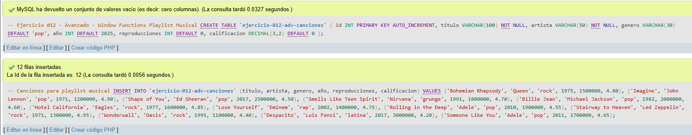
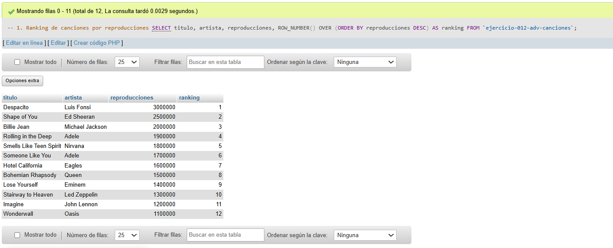
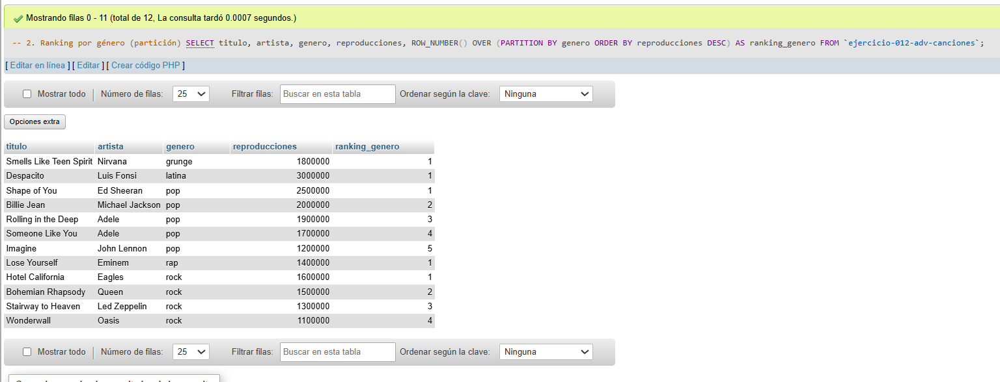
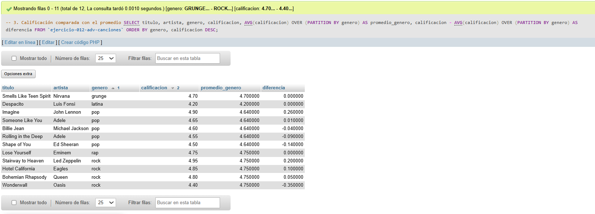
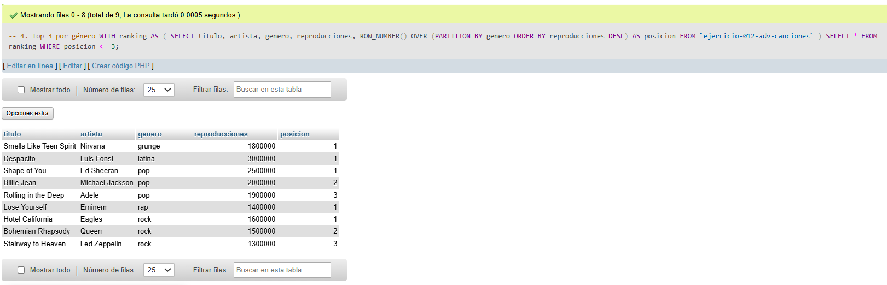
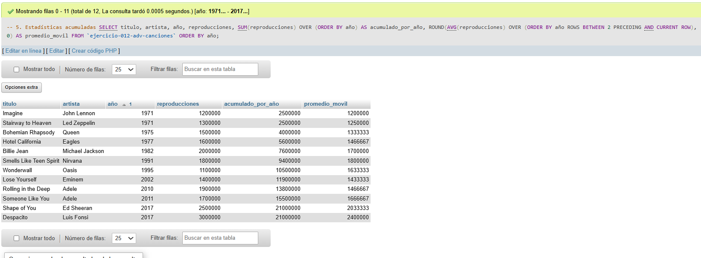

# Ejercicio 012 - Nivel Avanzado - Window Functions Playlist Musical

## 1. Temática

Playlist musical con window functions para análisis avanzado sin perder detalles.

## 2. Decisiones Técnicas

- **Diseño de Tablas (DDL):**
  - Una tabla: `ejercicio-012-adv-canciones`.
  - Columnas: `id`, `titulo`, `artista`, `genero`, `año`, `reproducciones`, `calificacion`.
  - Uso de comillas invertidas para nombres con guiones.

- **Inserción de Datos (DML):**
  - 12 canciones de diferentes géneros y años.
  - Datos variados para window functions.

- **Window Functions usadas:**
  - `ROW_NUMBER()`: Ranking general y por género.
  - `AVG() OVER (PARTITION BY)`: Promedio por género.
  - `SUM() OVER (ORDER BY)`: Acumulado por año.
  - `AVG() OVER (ROWS BETWEEN)`: Promedio móvil.

- **Conceptos clave:**
  - **PARTITION BY:** Agrupa para cálculos dentro de grupos.
  - **ORDER BY:** Define orden dentro de la ventana.
  - **ROWS BETWEEN:** Define rango de filas para cálculos.
  - **WITH ranking:** CTE para usar window functions en condiciones.

- **Consultas (DQL):**
  - Ranking simple y por género.
  - Comparación con promedios.
  - Top 3 por género con CTE.
  - Estadísticas acumuladas y promedio móvil.

## 3. Evidencias

*A continuación, se adjuntan capturas de pantalla que demuestran la ejecución y los resultados de los scripts SQL en phpMyAdmin.*

Definición de tablas e inserción de datos

Consulta 1

Consulta 2

Consulta 3

Consulta 4

Consulta 5

