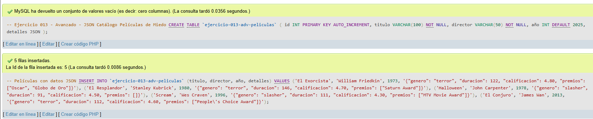
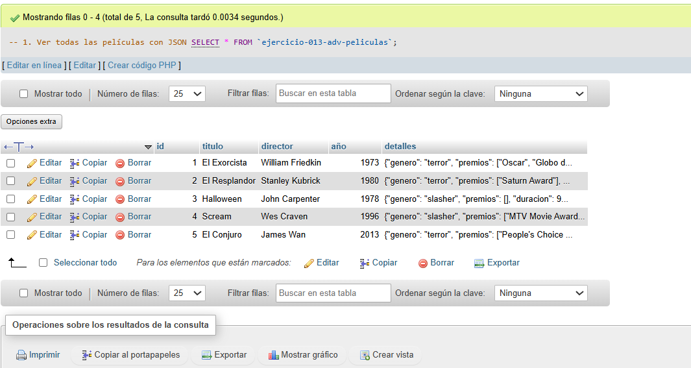
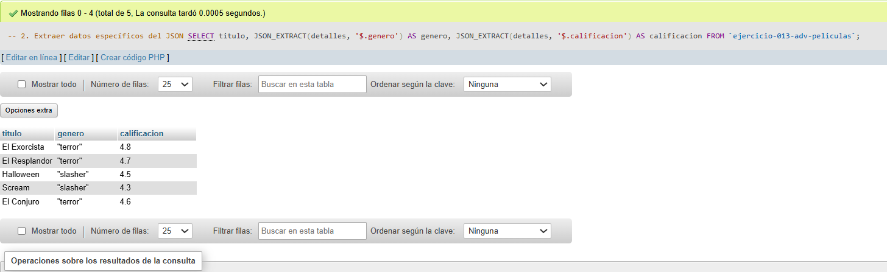
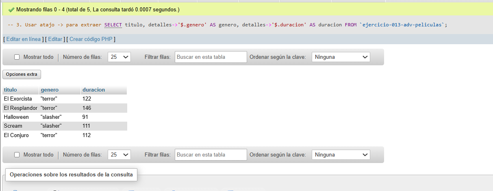
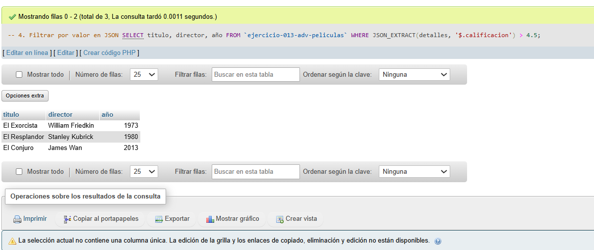
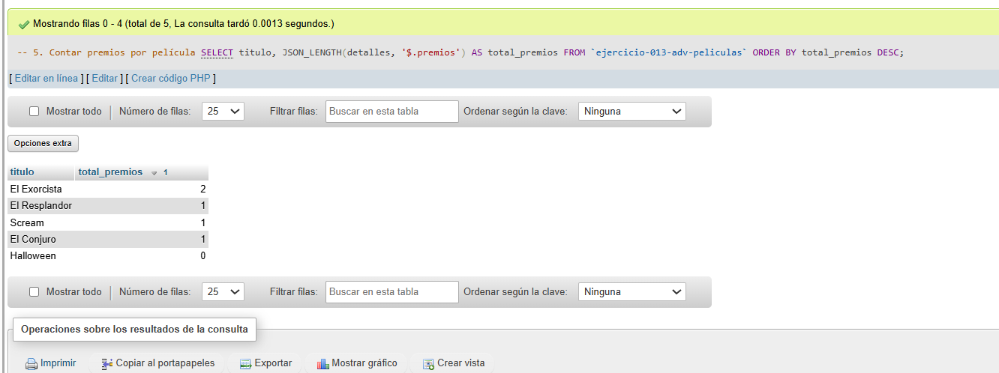

# Ejercicio 013 - Nivel Avanzado - JSON Catálogo Películas de Miedo

## 1. Temática

Catálogo de películas de miedo usando JSON para almacenar datos flexibles.

## 2. Decisiones Técnicas

- **Diseño de Tablas (DDL):**
  - Una tabla: `ejercicio-013-adv-peliculas`.
  - Columnas: `id`, `titulo`, `director`, `año`, `detalles` (tipo JSON).
  - Uso de comillas invertidas para nombres con guiones.

- **Datos JSON almacenados:**
  - `genero`: Tipo de película.
  - `duracion`: Minutos.
  - `calificacion`: Puntuación.
  - `premios`: Arreglo de premios.

- **Ventajas de JSON:**
  - Flexible (permite agregar campos fácilmente).
  - Ideal para datos variables.
  - Fácil de consultar con funciones JSON.

- **Funciones JSON usadas:**
  - `JSON_EXTRACT()`: Extraer valores.
  - `->` (atajo): Extraer valores.
  - `JSON_LENGTH()`: Contar elementos en arreglo.
  - `WHERE` con JSON_EXTRACT para filtrar.

- **Consultas (DQL):**
  - Ver datos completos.
  - Extraer campos específicos.
  - Filtrar por calificación.
  - Contar premios.

## 3. Evidencias

*A continuación, se adjuntan capturas de pantalla que demuestran la ejecución y los resultados de los scripts SQL en phpMyAdmin.*

Definición de tablas e inserción de datos

Consulta 1

Consulta 2

Consulta 3

Consulta 4

Consulta 5

