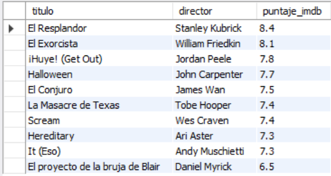
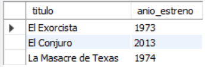
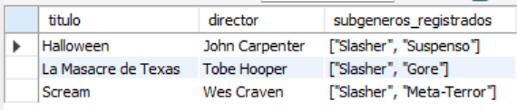
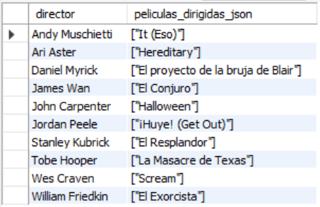
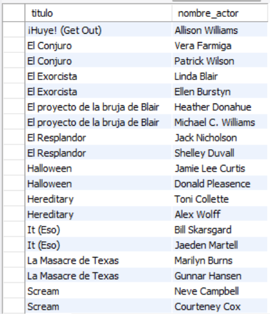

# Ejercicio Avanzado 013 - JSON en MySQL

**Camper:** Antonio Canux

## Descripción

Decimotercer ejercicio de nivel avanzado, aplicado a un módulo de datos de un catálogo de películas de terror. El objetivo central de esta práctica es dominar el tipo de dato **`JSON`** y sus funciones nativas en MySQL. Las bases de datos relacionales modernas soportan arquitecturas híbridas, permitiendo guardar atributos flexibles (como arrays de actores, subgéneros o un objeto anidado de calificaciones) dentro de una sola columna. Esto elimina la necesidad de crear tablas puente excesivas para datos que cambian frecuentemente.

---

## Tablas utilizadas

**avanzado_ejercicio_013_peliculas**
- id (PK)
- titulo
- director
- anio_estreno
- detalles_json (JSON)
- creado_en

Estructura del documento JSON almacenado:
```json
{
  "reparto": ["Actor 1", "Actor 2"],
  "subgeneros": ["Subgenero A", "Subgenero B"],
  "calificaciones": {
    "imdb": 8.0,
    "metacritic": 85
  },
  "basada_en_hechos_reales": true
}
```

---

## Consultas analíticas realizadas

### 1. ¿Cómo extraer un valor escalar anidado dentro de un objeto JSON (`->>`)?

```sql
SELECT titulo, director, 
           detalles_json->>'$.calificaciones.imdb' AS puntaje_imdb 
    FROM avanzado_ejercicio_013_peliculas 
    ORDER BY CAST(detalles_json->>'$.calificaciones.imdb' AS DECIMAL(3,1)) DESC;
```

**Resultado**



---

### 2. ¿Cómo filtrar registros evaluando un valor booleano interno del JSON (`JSON_EXTRACT`)?

```sql
SELECT titulo, anio_estreno 
    FROM avanzado_ejercicio_013_peliculas 
    WHERE JSON_EXTRACT(detalles_json, '$.basada_en_hechos_reales') = true;
```

**Resultado**



---

### 3. ¿Qué películas incluyen el término 'Slasher' dentro de su array JSON de subgéneros (`JSON_CONTAINS`)?

```sql
SELECT titulo, director, 
           detalles_json->>'$.subgeneros' AS subgeneros_registrados 
    FROM avanzado_ejercicio_013_peliculas 
    WHERE JSON_CONTAINS(detalles_json, '"Slasher"', '$.subgeneros');
```

**Resultado**



---

### 4. ¿Cómo agrupar datos relacionales y empaquetarlos en un nuevo array JSON dinámico (`JSON_ARRAYAGG`)?

```sql
SELECT director, JSON_ARRAYAGG(titulo) AS peliculas_dirigidas_json 
    FROM avanzado_ejercicio_013_peliculas 
    GROUP BY director;
```

**Resultado**



---

### 5. ¿Cómo desnormalizar (convertir en filas) un array almacenado dentro de un JSON (`JSON_TABLE`)?

```sql
SELECT p.titulo, actor.nombre_actor 
    FROM avanzado_ejercicio_013_peliculas p, 
    JSON_TABLE(p.detalles_json, '$.reparto[*]' COLUMNS (nombre_actor VARCHAR(100) PATH '$')) AS actor 
    ORDER BY p.titulo ASC;
```

**Resultado**



---

## Herramientas

- MySQL (8.0+)
- MySQL Workbench
- Git
- GitHub

---

**Campuslands · Skill SQL**