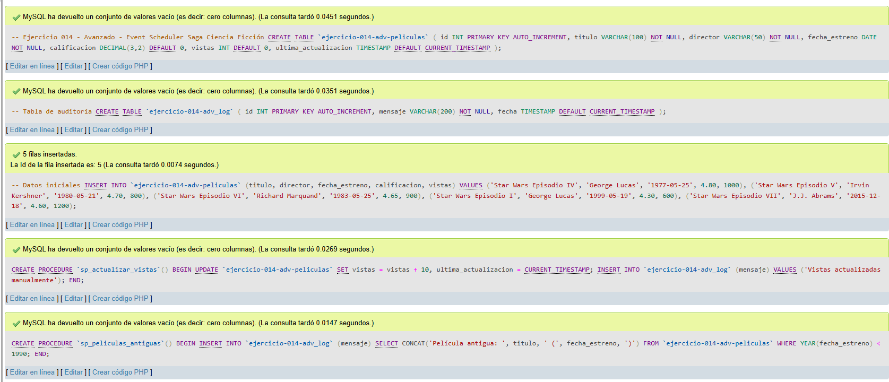
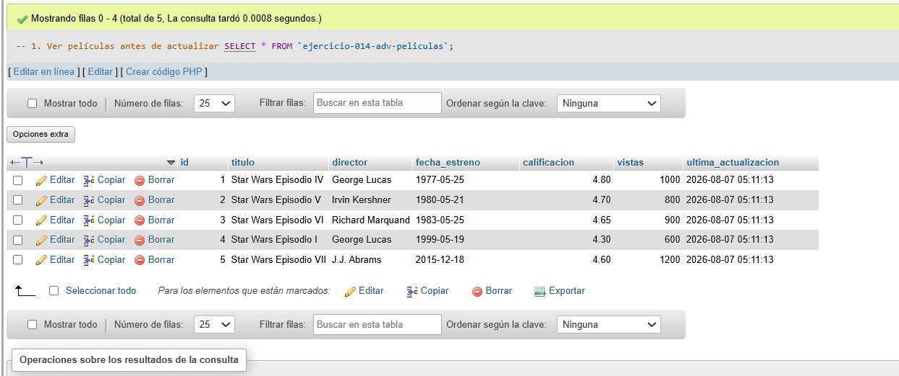
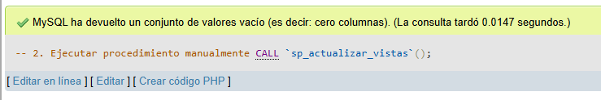
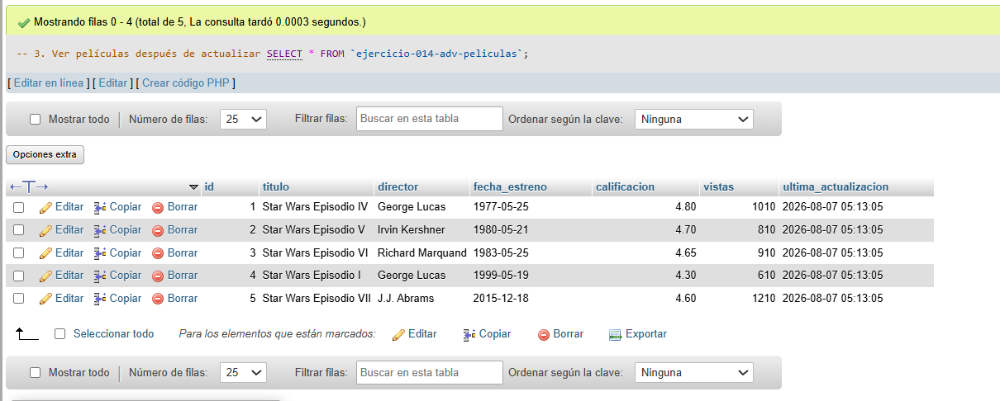
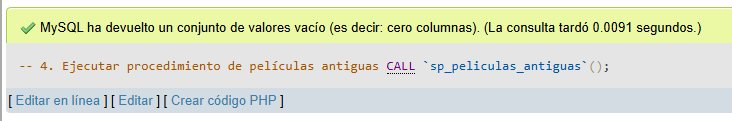
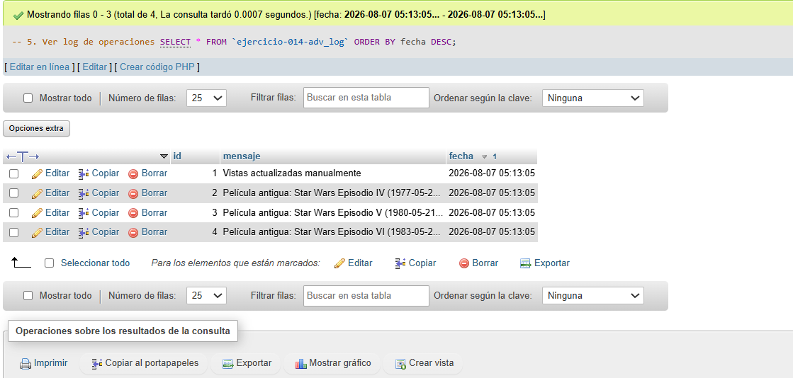
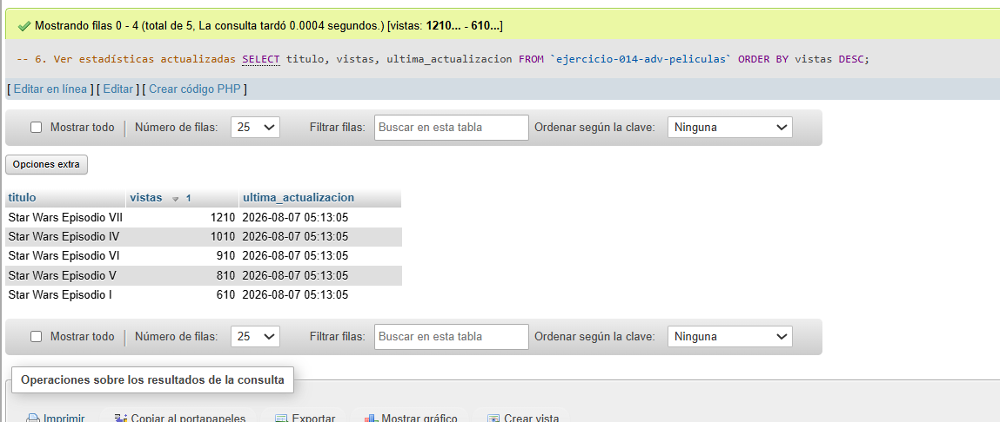
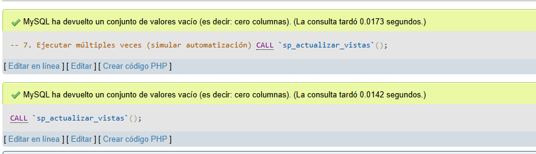
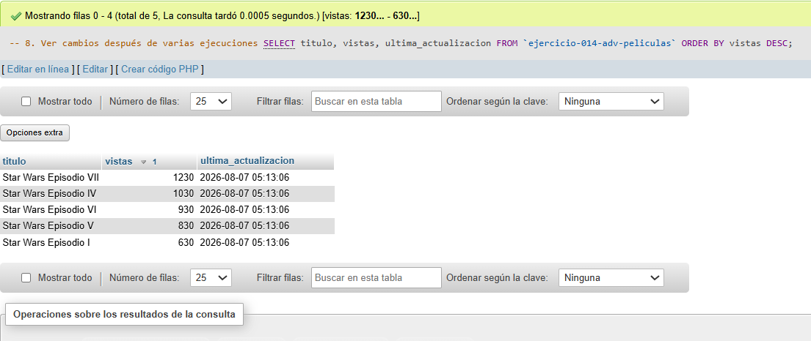

# Ejercicio 014 - Nivel Avanzado - Event Scheduler Saga Ciencia Ficción (Alternativo)

## 1. Temática

Saga de ciencia ficción con procedimientos almacenados como alternativa al event scheduler.

## 2. Decisiones Técnicas

- **Diseño de Tablas (DDL):**
  - Tabla principal: `ejercicio-014-adv-peliculas`.
  - Tabla log: `ejercicio-014-adv_log` para auditoría.
  - Uso de comillas invertidas para nombres con guiones.

- **Alternativa al event scheduler:**
  - No requiere permisos especiales.
  - Usa procedimientos almacenados.
  - Se ejecuta manualmente cuando se necesita.

- **Procedimientos creados:**
  - `sp_actualizar_vistas`: Actualiza vistas y registra en log.
  - `sp_peliculas_antiguas`: Registra películas antiguas.

- **Ventajas de esta alternativa:**
  - No necesita permisos SUPER.
  - Más control sobre cuándo ejecutar.
  - Igual funcionalidad que eventos.
  - Fácil de probar y depurar.

- **Consultas (DQL):**
  - Ver datos antes y después.
  - Ejecutar procedimientos manualmente.
  - Ver log de operaciones.
  - Simular múltiples ejecuciones.

## 3. Evidencias

*A continuación, se adjuntan capturas de pantalla que demuestran la ejecución y los resultados de los scripts SQL en phpMyAdmin.*

Definición de tablas e inserción de datos

Consulta 1

Consulta 2

Consulta 3

Consulta 4

Consulta 5

Consulta 6

Consulta 7

Consulta 8
