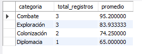
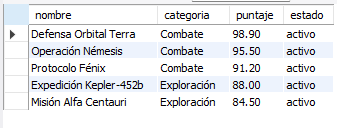
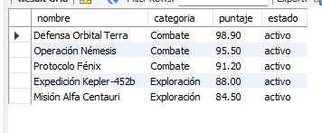
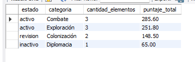
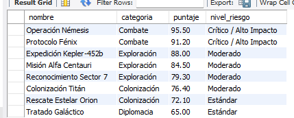

# Ejercicio 014 - Event Scheduler para Saga de Ciencia Ficción

Solución desarrollada para el módulo avanzado de MySQL, enfocada en la simulación de un registro galáctico de ciencia ficción utilizando automatización de tareas mediante el **Event Scheduler**.

## Estructura de la Solución
- `ddl/schema.sql`: Creación de la base de datos `campuslands_mysql` y la tabla base `avanzado_ejercicio_014`.
- `dml/inserts.sql`: Carga inicial de 9 registros orientados a misiones y proyectos espaciales.
- `dql/consultas.sql`: Consultas analíticas, reportes por categoría/estado, filtrado de riesgo y definición de un evento programado (`EVENT`) para mantenimiento automatizado.

## Instrucciones de Ejecución
Ejecuta los scripts en orden en tu gestor MySQL:
1. `ddl/schema.sql`
2. `dml/inserts.sql`
3. `dql/consultas.sql`

## consulta 1

## consulta 2

## consulta 3

## consulta 4

## consulta 5
