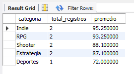
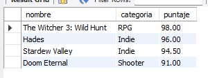
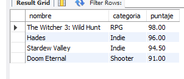
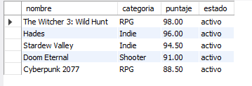

# Ejercicio 015 - Optimización para Biblioteca Gamer

Solución desarrollada para el módulo avanzado de MySQL, enfocada en la gestión eficiente de una biblioteca de videojuegos aplicando técnicas de **optimización de consultas e indexación**.

## Estructura de la Solución
- `ddl/schema.sql`: Creación de la base de datos `campuslands_mysql`, la tabla `avanzado_ejercicio_015` y la definición de índices estratégicos (`INDEX`) en columnas clave para mejorar el rendimiento.
- `dml/inserts.sql`: Carga inicial de 9 registros de videojuegos distribuidos en diferentes géneros y estados.
- `dql/consultas.sql`: Consultas de negocio eficientes y uso de la instrucción `EXPLAIN` para validar la correcta ejecución y uso de índices en el motor de MySQL.

## Instrucciones de Ejecución
Ejecuta los scripts en orden en tu gestor MySQL:
1. `ddl/schema.sql`
2. `dml/inserts.sql`
3. `dql/consultas.sql`

