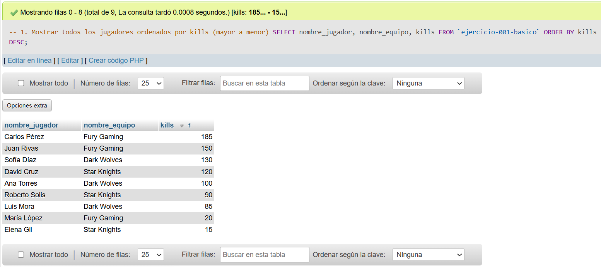
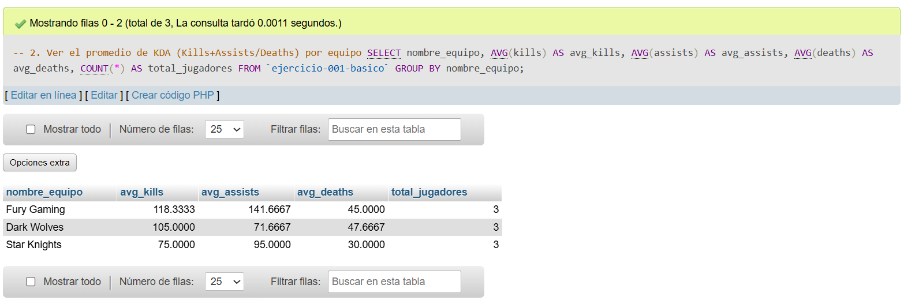
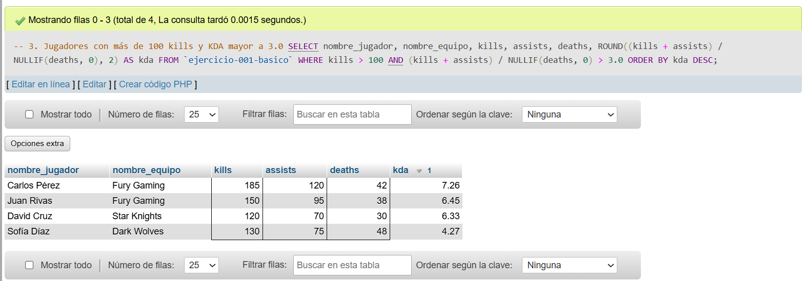
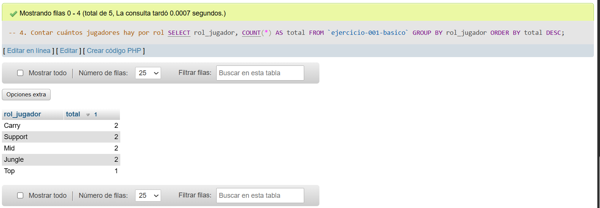

# Ejercicio 001 - Nivel Básico - Torneo E-Sports MOBA

## 1. Temática

Gestión de datos para un torneo de e-sports MOBA (Multiplayer Online Battle Arena), donde se registran estadísticas de jugadores profesionales como kills, deaths, assists, rol y campeón favorito.

## 2. Decisiones Técnicas

A continuación, se describen las decisiones clave tomadas para la resolución:

- **Diseño de Tablas (DDL):**
  - Se eligió `INT AUTO_INCREMENT` para la columna `id` porque funciona como llave primaria única y autoincrementable.
  - Se aplicó la restricción `NOT NULL` en campos como nombre_equipo, nombre_jugador, rol_jugador y campeon_favorito para asegurar que siempre tengan información relevante.
  - Se usó `DEFAULT 0` en partidas_jugadas, kills, deaths y assists para evitar valores nulos y facilitar cálculos posteriores.
  - Se empleó `BOOLEAN` con `DEFAULT FALSE` para registrar si el equipo ganó, con un valor por defecto.

- **Inserción de Datos (DML):**
  - Los datos insertados buscan cubrir casos como equipos ganadores y perdedores (3 equipos de 3 jugadores cada uno).
  - Se incluyen jugadores de diferentes roles (Carry, Support, Mid, Jungle, Top) para variedad.
  - Los valores de kills, deaths y assists son coherentes con partidas reales de MOBA.

- **Consultas (DQL):**
  - La consulta `1` responde a la pregunta de negocio sobre el ranking de jugadores por efectividad en kills.
  - La consulta `2` agrupa por equipo usando `GROUP BY` y `AVG()` para calcular promedios estadísticos.
  - La consulta `3` utiliza `NULLIF` para evitar división entre cero al calcular KDA y filtra jugadores con buen rendimiento.
  - La consulta `4` cuenta jugadores por rol usando `COUNT(*)` y `GROUP BY` para identificar qué roles tienen más representación.

## 3. Evidencias

*A continuación, se adjuntan capturas de pantalla que demuestran la ejecución y los resultados de los scripts SQL en phpMyAdmin.*

Consulta 1

Consulta 2

Consulta 3

Consulta 4
