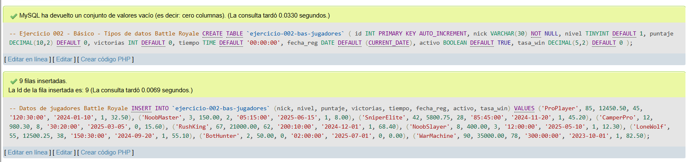
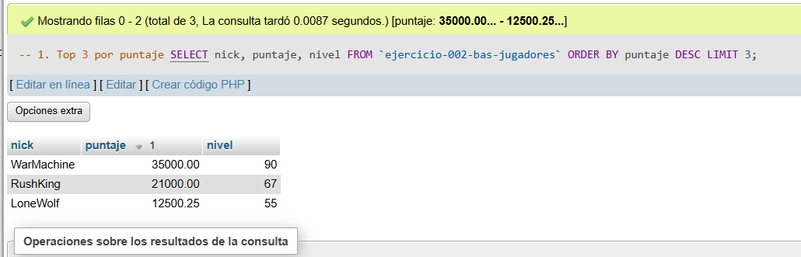
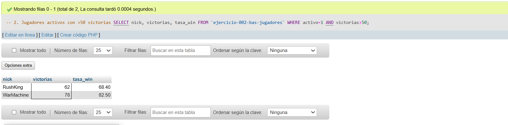
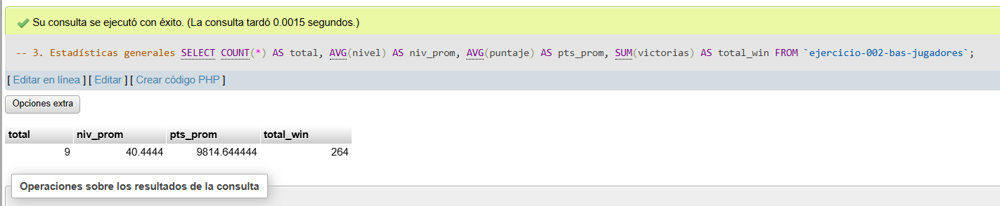
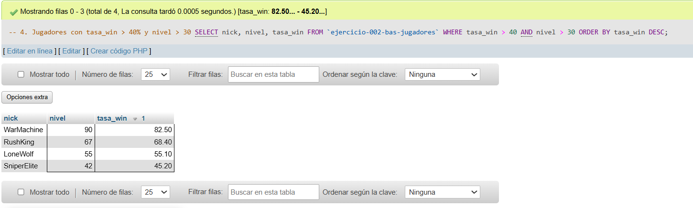
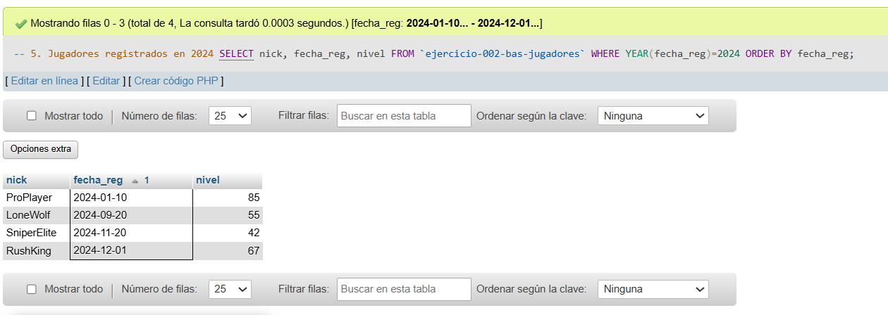

# Ejercicio 002 - Nivel Básico - Ranking Battle Royale

## 1. Temática

Ranking de jugadores de Battle Royale usando diferentes tipos de datos.

## 2. Decisiones Técnicas

- **Diseño de Tablas (DDL):**
  - Uso de nombres de tabla con comillas invertidas o guiones bajos para garantizar compatibilidad sintáctica en MySQL.
  - 8 columnas con tipos variados:
    - `VARCHAR(30)` para nick
    - `TINYINT` para nivel (ahorra espacio)
    - `DECIMAL(10,2)` para puntaje (precisión)
    - `INT` para victorias
    - `TIME` para tiempo de juego
    - `DATE` para fecha de registro
    - `BOOLEAN` para estado activo
    - `DECIMAL(5,2)` para tasa de victorias
  - Nombres cortos pero claros.

- **Inserción de Datos (DML):**
  - 9 jugadores variados (pros y casuales).
  - Datos realistas para pruebas.

- **Consultas (DQL):**
  - Top 3 con LIMIT.
  - Filtros con condiciones compuestas.
  - Estadísticas con AVG, SUM, COUNT.
  - Ordenamiento y filtros por fecha.

## 3. Evidencias

*A continuación, se adjuntan capturas de pantalla que demuestran la ejecución y los resultados de los scripts SQL en phpMyAdmin.*

Definición de tablas e insertar datos

Consulta 1

Consulta 2

Consulta 3

Consulta 4

Consulta 5
