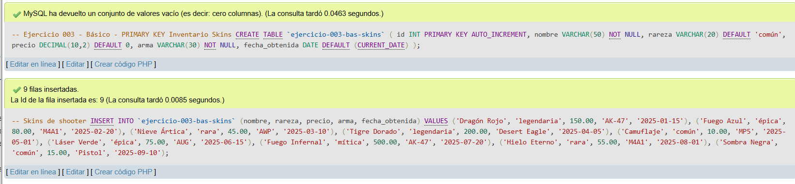
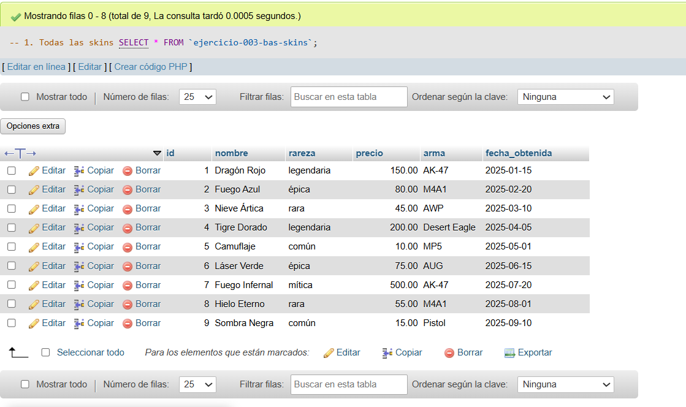
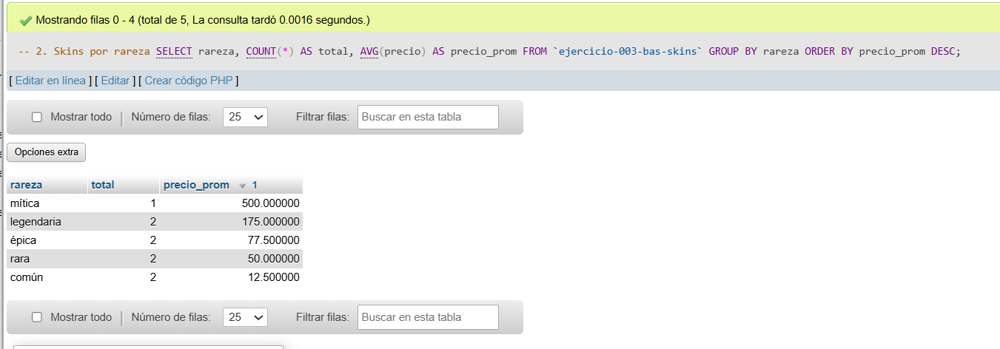
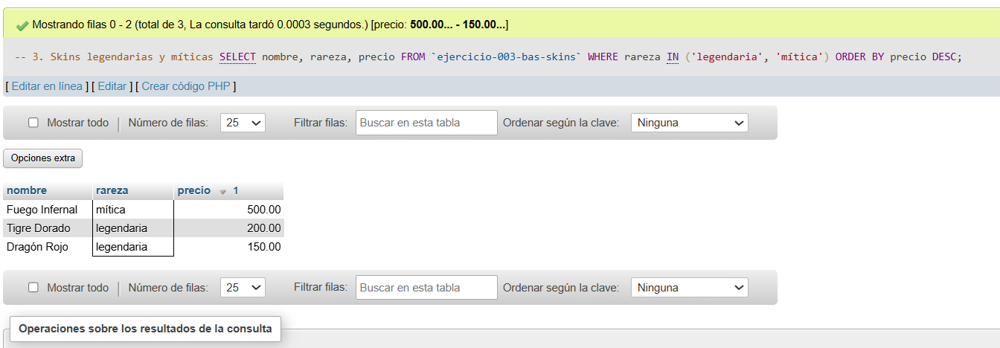
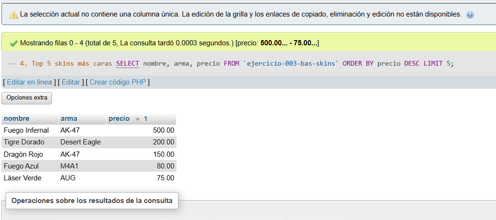
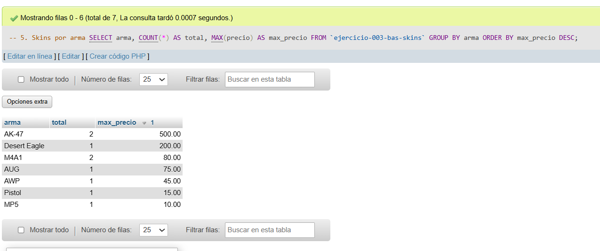

# Ejercicio 003 - Nivel Básico - PRIMARY KEY Inventario Skins

## 1. Temática

Inventario de skins de shooter con PRIMARY KEY AUTO_INCREMENT para identificar cada skin de forma única.

## 2. Decisiones Técnicas

- **Diseño de Tablas (DDL):**
  - Una tabla: `ejercicio-003-bas-skins`.
  - PRIMARY KEY en `id` con `AUTO_INCREMENT` para identificación automática.
  - Columnas: `nombre` (nombre skin), `rareza` (común, rara, épica, legendaria, mítica), `precio` (valor en moneda), `arma` (nombre arma), `fecha_obtenida` (fecha de adquisición).
  - Uso de comillas invertidas para nombres con guiones.

- **Inserción de Datos (DML):**
  - 9 skins de diferentes rarezas y precios.
  - Variedad de armas: AK-47, M4A1, AWP, etc.
  - Fechas de obtención distribuidas en 2025.

- **Consultas (DQL):**
  - GROUP BY con AVG para analizar precios por rareza.
  - Filtro IN para seleccionar rarezas específicas.
  - ORDER BY con LIMIT para top 5.
  - GROUP BY con MAX para precio máximo por arma.

## 3. Evidencias

*A continuación, se adjuntan capturas de pantalla que demuestran la ejecución y los resultados de los scripts SQL en phpMyAdmin.*

Definición de tablas e insertar datos

Consulta 1

Consulta 2

Consulta 3

Consulta 4

Consulta 5
