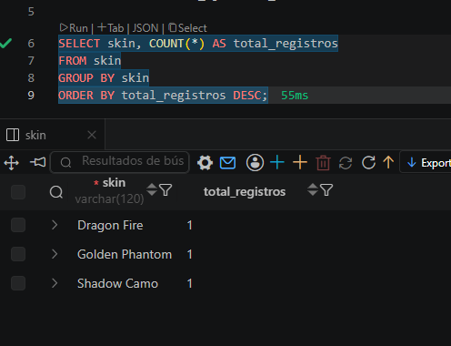

## Ejercicio 003

## DESCRIPCION
Una academia tecnica esta construyendo un modulo de datos inspirado en inventario de skins shooter. El objetivo es guardar informacion ordenada, consultar indicadores utiles y dejar scripts SQL faciles de revisar por otro desarrollador.

## DESARROLLO
En este trabajo se práctico la cosulta de datos, para obtener las skin registradas y la cantidad de cada una de ellas.

## EVIDENCIA

