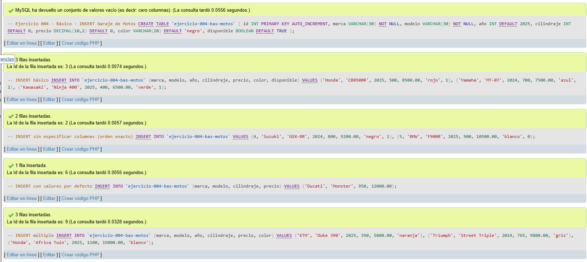
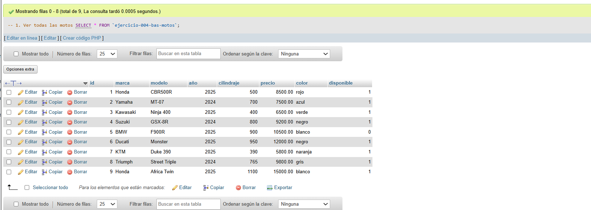
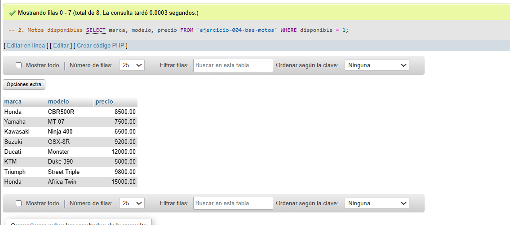
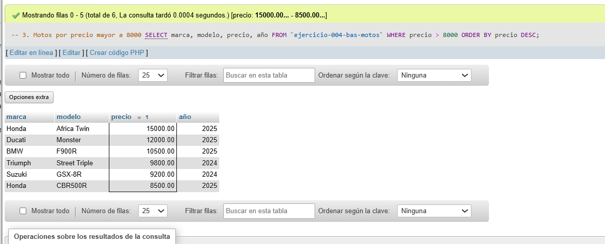
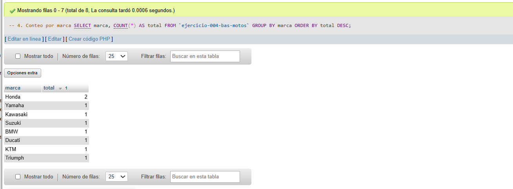
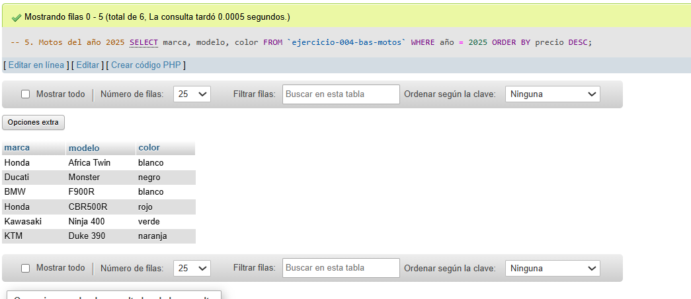

# Ejercicio 004 - Nivel Básico - INSERT Garaje de Motos

## 1. Temática

Garaje de motos con diferentes formas de INSERT para practicar inserción de datos en MySQL.

## 2. Decisiones Técnicas

- **Diseño de Tablas (DDL):**
  - Una tabla: `ejercicio-004-bas-motos`.
  - Columnas: `id`, `marca`, `modelo`, `año`, `cilindraje`, `precio`, `color`, `disponible`.
  - PRIMARY KEY en `id` con AUTO_INCREMENT.
  - Uso de comillas invertidas para nombres con guiones.

- **Inserción de Datos (DML) - 4 formas de INSERT:**
  - **INSERT con columnas especificadas:** Primeros 3 registros.
  - **INSERT sin columnas:** Registro 4 y 5 (respetar orden).
  - **INSERT con valores por defecto:** Registro 6 (usa DEFAULT en año y disponible).
  - **INSERT múltiple:** Últimos 3 registros en una sola sentencia.

- **Consultas (DQL):**
  - SELECT * para verificar inserciones.
  - Filtro por disponibilidad.
  - Ordenamiento por precio.
  - Agrupación por marca.
  - Filtro por año.

## 3. Evidencias

*A continuación, se adjuntan capturas de pantalla que demuestran la ejecución y los resultados de los scripts SQL en phpMyAdmin.*

Definición de tablas e insertar datos

Consulta 1

Consulta 2

Consulta 3

Consulta 4

Consulta 5
