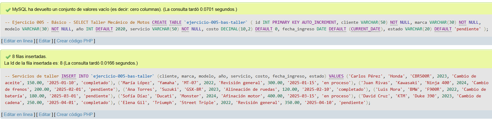
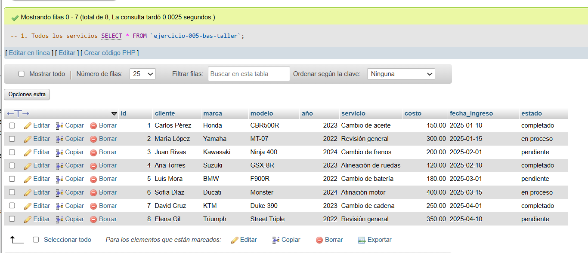
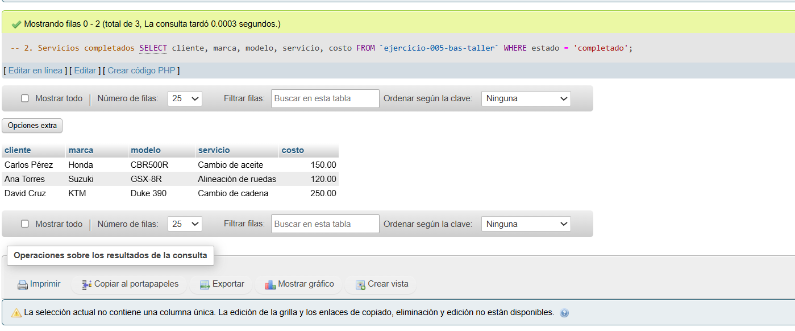
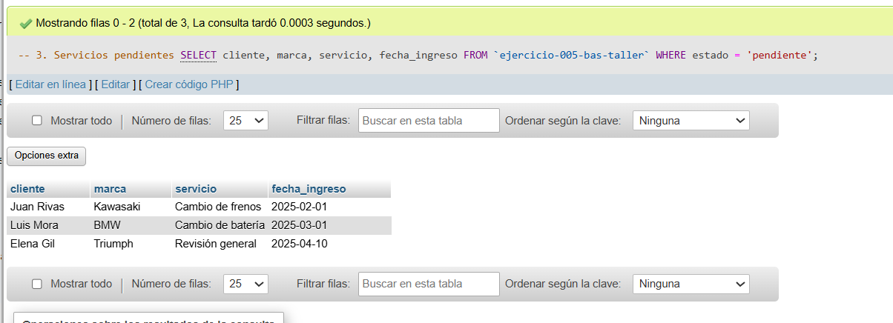
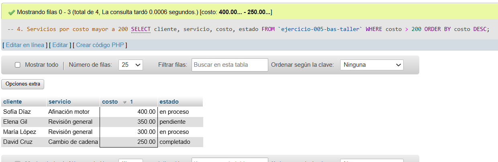
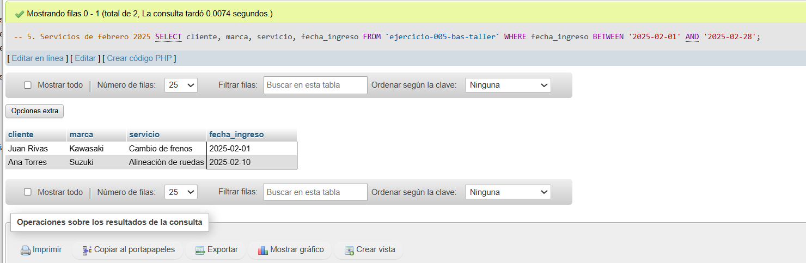

# Ejercicio 005 - Nivel Básico - SELECT Taller Mecánico de Motos

## 1. Temática

Taller mecánico de motos con consultas SELECT básicas para filtrar, ordenar y mostrar información.

## 2. Decisiones Técnicas

- **Diseño de Tablas (DDL):**
  - Una tabla: `ejercicio-005-bas-taller`.
  - Columnas: `id`, `cliente`, `marca`, `modelo`, `año`, `servicio`, `costo`, `fecha_ingreso`, `estado`.
  - PRIMARY KEY en `id` con AUTO_INCREMENT.
  - Uso de comillas invertidas para nombres con guiones.

- **Inserción de Datos (DML):**
  - 8 servicios de taller con diferentes estados.
  - Estados: 'completado', 'en proceso', 'pendiente'.
  - Fechas distribuidas en 2025.

- **Consultas (DQL):**
  - SELECT * para mostrar todos los datos.
  - SELECT con WHERE para filtrar por estado.
  - SELECT con ORDER BY para ordenar por costo.
  - SELECT con BETWEEN para filtrar por rango de fechas.
  - Proyección de columnas específicas para cada consulta.

## 3. Evidencias

*A continuación, se adjuntan capturas de pantalla que demuestran la ejecución y los resultados de los scripts SQL en phpMyAdmin.*

Definición de tablas e insertar datos

Consulta 1

Consulta 2

Consulta 3

Consulta 4

Consulta 5
