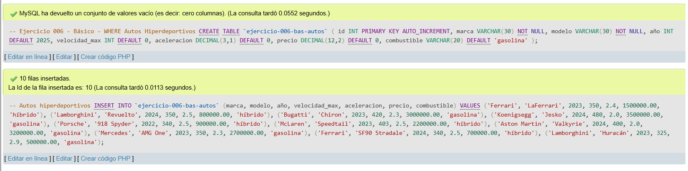
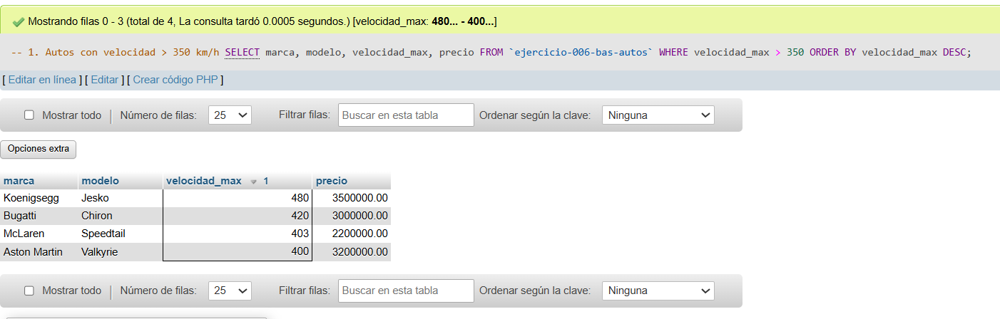
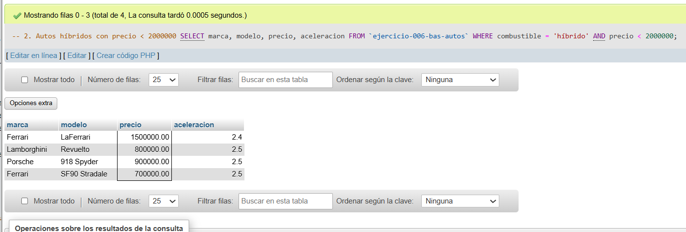
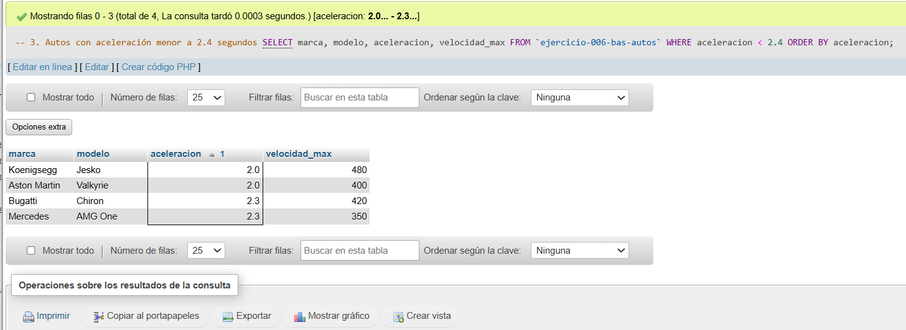
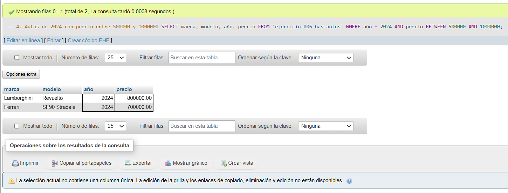
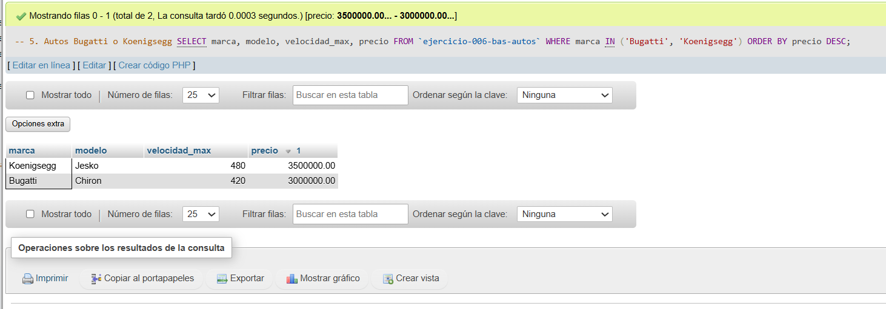

# Ejercicio 006 - Nivel Básico - WHERE Autos Hiperdeportivos

## 1. Temática

Catálogo de autos hiperdeportivos con condiciones WHERE para filtrar por velocidad, precio, combustible y marca.

## 2. Decisiones Técnicas

- **Diseño de Tablas (DDL):**
  - Una tabla: `ejercicio-006-bas-autos`.
  - Columnas: `id`, `marca`, `modelo`, `año`, `velocidad_max`, `aceleracion`, `precio`, `combustible`.
  - PRIMARY KEY en `id` con AUTO_INCREMENT.
  - Uso de comillas invertidas para nombres con guiones.

- **Inserción de Datos (DML):**
  - 10 autos de marcas famosas: Ferrari, Lamborghini, Bugatti, etc.
  - Datos realistas de velocidad, aceleración y precio.

- **Consultas (DQL) - Condiciones WHERE:**
  - `>` para velocidad mayor a 350 km/h.
  - `=` y `<` para combustible híbrido con precio menor.
  - `<` para aceleración menor a 2.4 segundos.
  - `BETWEEN` para filtrar por rango de precios.
  - `IN` para seleccionar marcas específicas.

## 3. Evidencias

*A continuación, se adjuntan capturas de pantalla que demuestran la ejecución y los resultados de los scripts SQL en phpMyAdmin.*

Definición de tablas e insertar datos

Consulta 1

Consulta 2

Consulta 3

Consulta 4

Consulta 5
