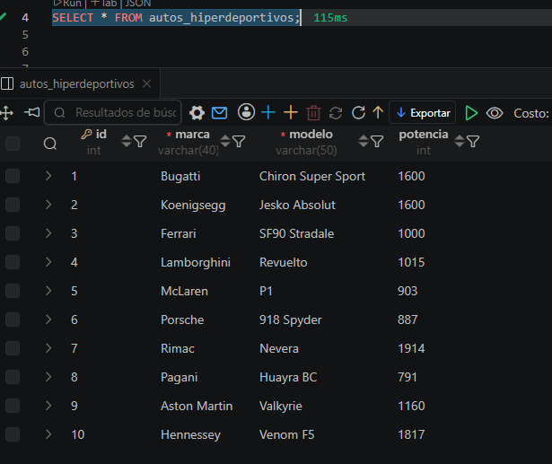
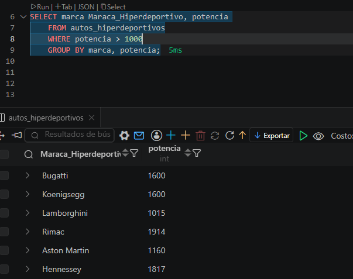
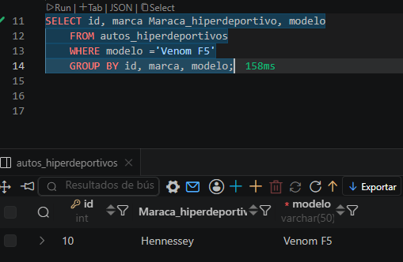

## Ejercicio 006 

## DESCRIPCION
- Una academia tecnica esta construyendo un modulo de datos inspirado en autos hiperdeportivos. El objetivo es guardar informacion ordenada, consultar indicadores utiles y dejar scripts SQL faciles de revisar por otro desarrollador.

- En este ejercicio se ha creado una pequeña tabla de autos_hiperdeportivos, con el objetivo de practicar el comando `WHERE` en las consultas de datos de una tabla.

# EJEMPLO

```SQL
SELECT id, marca Maraca_hiperdeportivo, modelo
    FROM autos_hiperdeportivos
    WHERE modelo ='Venom F5'
    GROUP BY id, marca, modelo;
```

## EVIDENCIA



