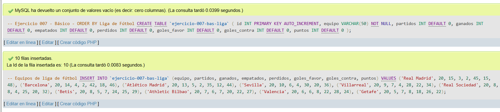
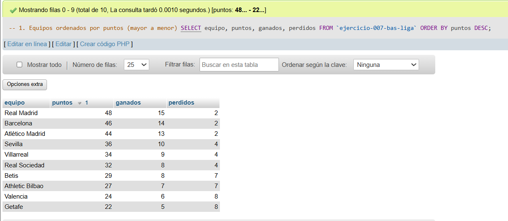
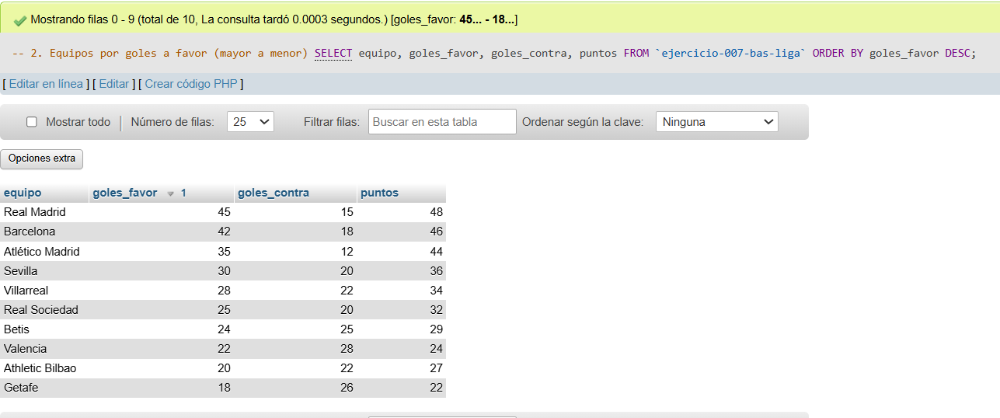
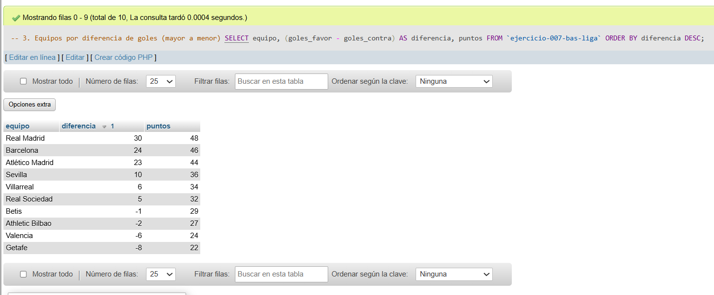
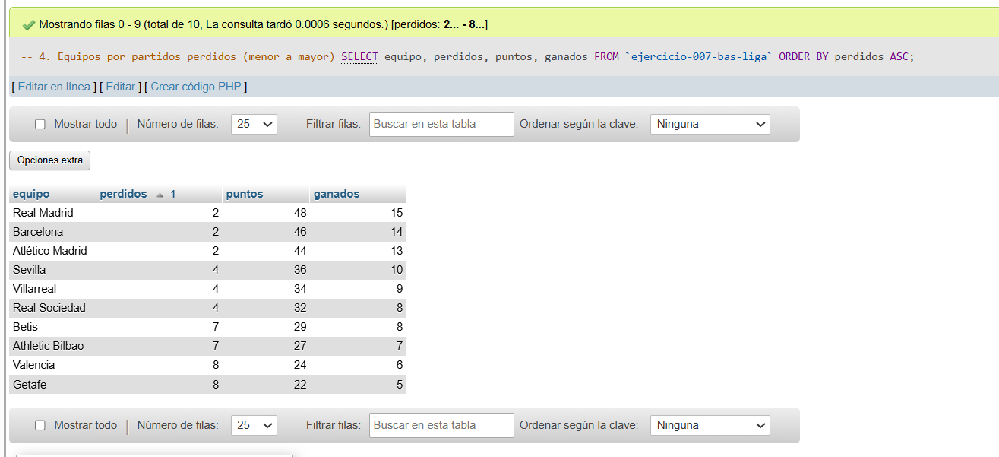
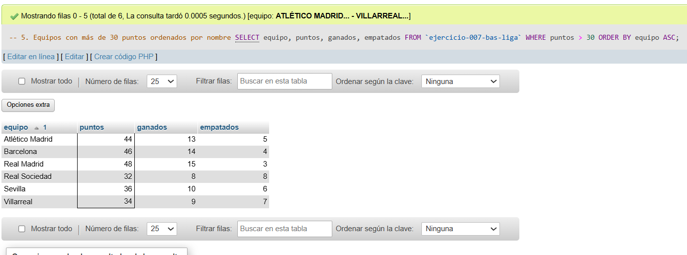

# Ejercicio 007 - Nivel Básico - ORDER BY Liga de Fútbol

## 1. Temática

Liga de fútbol con consultas ORDER BY para ordenar equipos por puntos, goles, diferencia y nombre.

## 2. Decisiones Técnicas

- **Diseño de Tablas (DDL):**
  - Una tabla: `ejercicio-007-bas-liga`.
  - Columnas: `id`, `equipo`, `partidos`, `ganados`, `empatados`, `perdidos`, `goles_favor`, `goles_contra`, `puntos`.
  - PRIMARY KEY en `id` con AUTO_INCREMENT.
  - Uso de comillas invertidas para nombres con guiones.

- **Inserción de Datos (DML):**
  - 10 equipos de liga con estadísticas realistas.
  - Diferentes niveles de rendimiento para probar ordenamientos.

- **Consultas (DQL) - ORDER BY:**
  - `ORDER BY puntos DESC`: Clasificación por puntos.
  - `ORDER BY goles_favor DESC`: Equipos más goleadores.
  - `ORDER BY (goles_favor - goles_contra) DESC`: Mejor diferencia de goles.
  - `ORDER BY perdidos ASC`: Equipos con menos derrotas.
  - `WHERE puntos > 30 ORDER BY equipo ASC`: Filtro con orden alfabético.

## 3. Evidencias

*A continuación, se adjuntan capturas de pantalla que demuestran la ejecución y los resultados de los scripts SQL en phpMyAdmin.*

Definición de tablas e inserción de datos

Consulta 1

Consulta 2

Consulta 3

Consulta 4

Consulta 5
