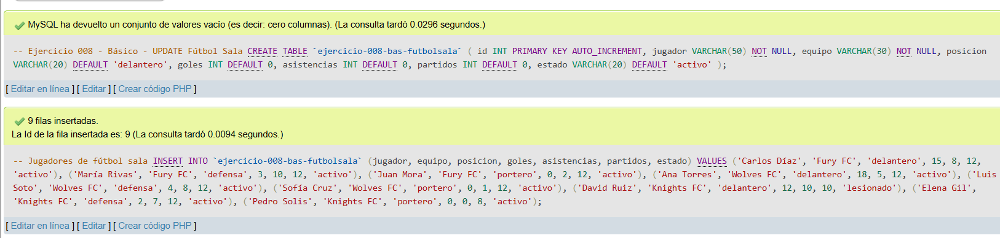
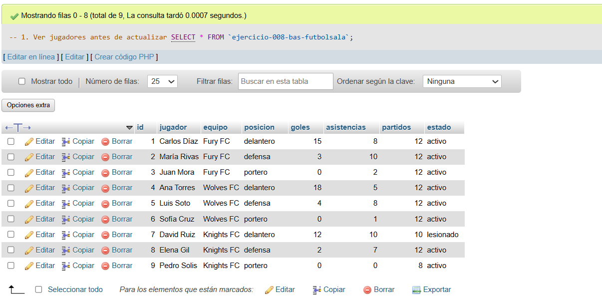
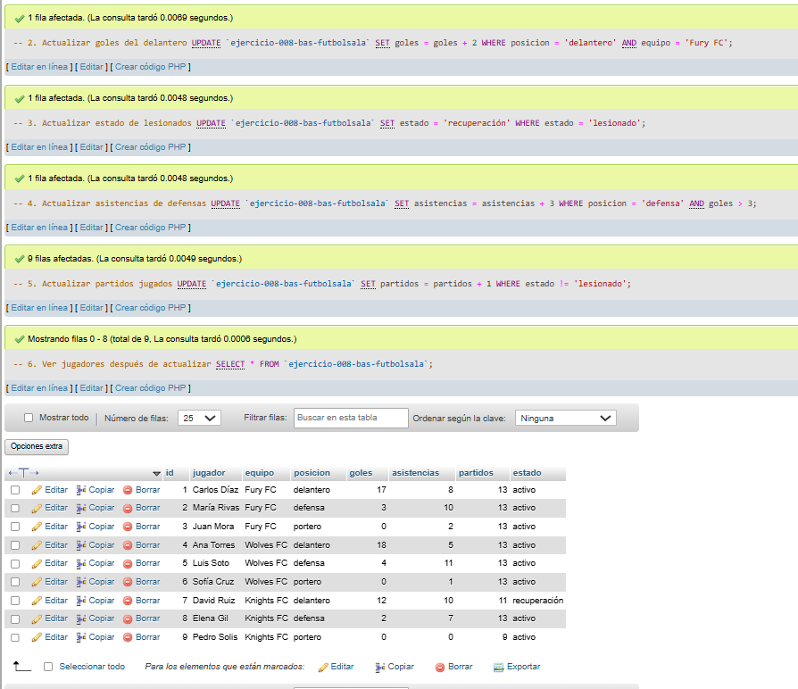

# Ejercicio 008 - Nivel Básico - UPDATE Fútbol Sala

## 1. Temática

Fútbol sala con operaciones UPDATE para modificar estadísticas de jugadores de manera selectiva.

## 2. Decisiones Técnicas

- **Diseño de Tablas (DDL):**
  - Una tabla: `ejercicio-008-bas-futbolsala`.
  - Columnas: `id`, `jugador`, `equipo`, `posicion`, `goles`, `asistencias`, `partidos`, `estado`.
  - PRIMARY KEY en `id` con AUTO_INCREMENT.
  - Uso de comillas invertidas para nombres con guiones.

- **Inserción de Datos (DML):**
  - 9 jugadores de 3 equipos diferentes.
  - Posiciones: delantero, defensa, portero.
  - Estadísticas variadas para probar UPDATE.

- **Consultas (DQL) - UPDATE:**
  - `UPDATE con WHERE`: Actualizar goles de delanteros de un equipo específico.
  - `UPDATE con condición`: Cambiar estado de lesionados a recuperación.
  - `UPDATE con múltiples condiciones`: Aumentar asistencias de defensas con más de 3 goles.
  - `UPDATE con condición negativa`: Incrementar partidos de jugadores no lesionados.
  - Verificar cambios con SELECT.

## 3. Evidencias

*A continuación, se adjuntan capturas de pantalla que demuestran la ejecución y los resultados de los scripts SQL en phpMyAdmin.*

Definición de tablas e inserción de datos

Consulta 1

Consulta 2

