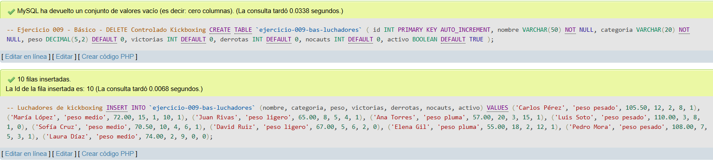
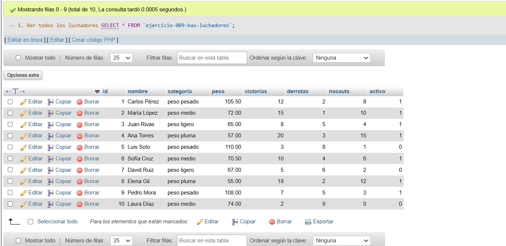
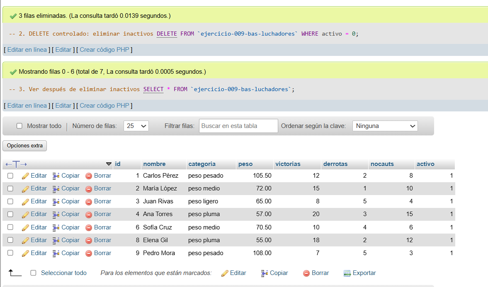
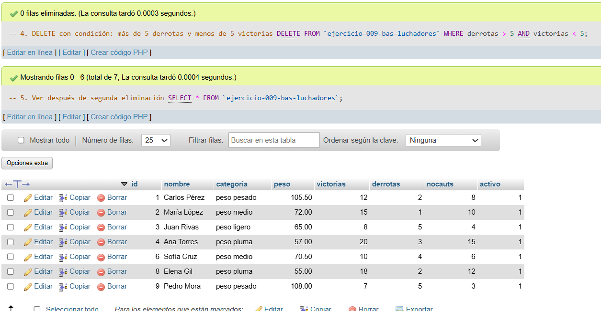
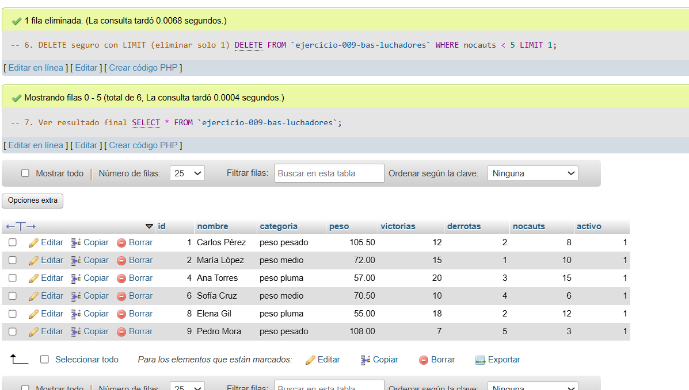

# Ejercicio 009 - Nivel Básico - DELETE Controlado Kickboxing

## 1. Temática

Kickboxing con operaciones DELETE controladas para eliminar luchadores según criterios específicos.

## 2. Decisiones Técnicas

- **Diseño de Tablas (DDL):**
  - Una tabla: `ejercicio-009-bas-luchadores`.
  - Columnas: `id`, `nombre`, `categoria`, `peso`, `victorias`, `derrotas`, `nocauts`, `activo`.
  - PRIMARY KEY en `id` con AUTO_INCREMENT.
  - Uso de comillas invertidas para nombres con guiones.

- **Inserción de Datos (DML):**
  - 10 luchadores en 4 categorías.
  - Mezcla de activos (8) e inactivos (2).
  - Diferentes estadísticas para pruebas.

- **Consultas (DQL) - DELETE controlado:**
  - `DELETE con WHERE`: Eliminar luchadores inactivos.
  - `DELETE con múltiples condiciones`: Eliminar con más derrotas que victorias.
  - `DELETE con LIMIT`: Eliminar solo 1 registro.
  - Siempre usar `WHERE` para evitar borrados masivos.
  - Verificar con SELECT antes y después.

- **Buenas prácticas:**
  - Siempre usar WHERE en DELETE.
  - Usar LIMIT para borrados controlados.
  - Verificar con SELECT primero.
  - Considerar usar UPDATE con estado en lugar de DELETE.

## 3. Evidencias

*A continuación, se adjuntan capturas de pantalla que demuestran la ejecución y los resultados de los scripts SQL en phpMyAdmin.*

Definición de tablas e inserción de datos

Consulta 1

Consulta 2 y 3

Consulta 4 y 5

Consulta 6 y 7

