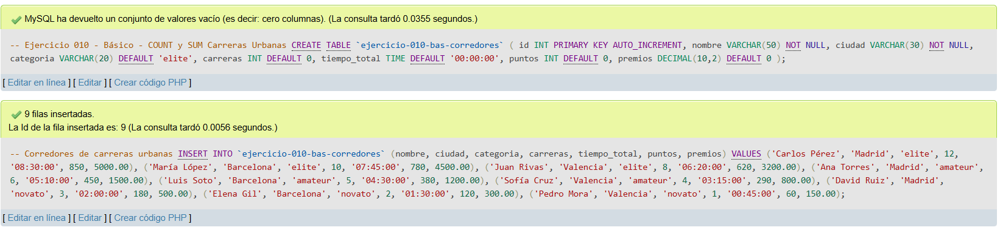
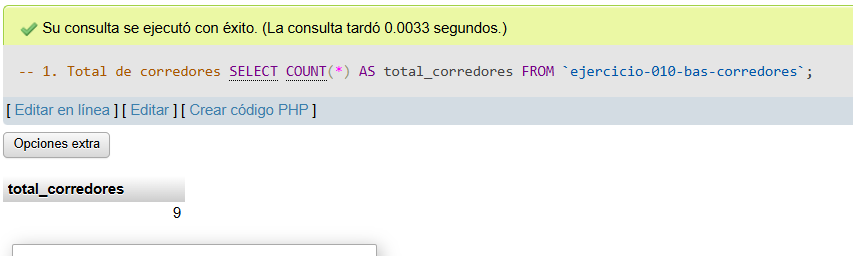
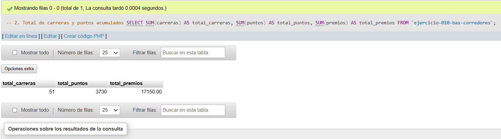
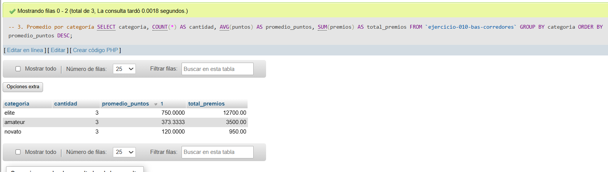
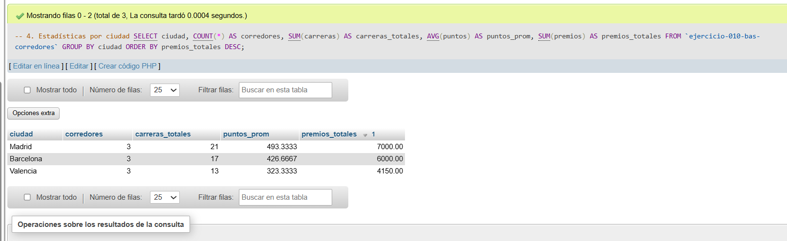
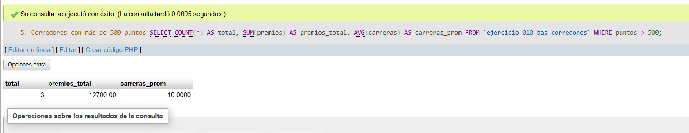

# Ejercicio 010 - Nivel Básico - COUNT y SUM Carreras Urbanas

## 1. Temática

Carreras urbanas con funciones de agregación COUNT, SUM y AVG para analizar estadísticas de corredores.

## 2. Decisiones Técnicas

- **Diseño de Tablas (DDL):**
  - Una tabla: `ejercicio-010-bas-corredores`.
  - Columnas: `id`, `nombre`, `ciudad`, `categoria`, `carreras`, `tiempo_total`, `puntos`, `premios`.
  - PRIMARY KEY en `id` con AUTO_INCREMENT.
  - Uso de comillas invertidas para nombres con guiones.

- **Inserción de Datos (DML):**
  - 9 corredores de 3 ciudades diferentes.
  - 3 categorías: elite, amateur, novato.
  - Datos variados para pruebas de agregación.

- **Consultas (DQL) - Funciones de agregación:**
  - `COUNT(*)`: Total de corredores.
  - `SUM(carreras)`: Total de carreras acumuladas.
  - `SUM(puntos)`: Total de puntos acumulados.
  - `SUM(premios)`: Total de premios monetarios.
  - `AVG(puntos)`: Promedio de puntos por categoría.
  - `GROUP BY`: Agrupar por categoría y ciudad.
  - `WHERE` con agregación para filtrar antes de calcular.

## 3. Evidencias

*A continuación, se adjuntan capturas de pantalla que demuestran la ejecución y los resultados de los scripts SQL en phpMyAdmin.*

Definición de tablas e inserción de datos

Consulta 1

Consulta 2

Consulta 3

Consulta 4

Consulta 5

