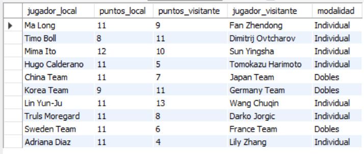
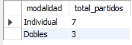
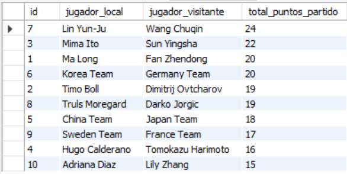

# Ejercicio Básico 011 - Validaciones Simples

**Camper:** Antonio Canux

## Descripción

Undécimo ejercicio de nivel básico, enfocado en un módulo de datos de pingpong (tenis de mesa). El objetivo principal de esta práctica es implementar validaciones simples a nivel de base de datos utilizando restricciones como **`CHECK`**, **`ENUM`** y **`DEFAULT`**. Estas reglas garantizan la integridad de los datos impidiendo, por ejemplo, que un jugador compita contra sí mismo o que se registren puntajes negativos en el marcador.

---

## Tabla utilizada

**basico_ejercicio_011_partidos**
- id (PK)
- jugador_local (NOT NULL)
- jugador_visitante (NOT NULL)
- puntos_local (DEFAULT 0, CHECK >= 0)
- puntos_visitante (DEFAULT 0, CHECK >= 0)
- modalidad (ENUM 'Individual', 'Dobles')
- creado_en

---

## Consultas realizadas

### 1. ¿Cuál es el listado general de los partidos y sus marcadores?

```sql
SELECT jugador_local, puntos_local, puntos_visitante, jugador_visitante, modalidad 
    FROM basico_ejercicio_011_partidos;
```

**Resultado**



---

### 2. ¿Cuántos partidos se jugaron en cada modalidad (Individual vs Dobles)?

```sql
SELECT modalidad, COUNT(id) AS total_partidos 
    FROM basico_ejercicio_011_partidos 
    GROUP BY modalidad;
```

**Resultado**



---

### 3. ¿En qué partidos hubo victorias contundentes (diferencia de 5 puntos o más)?

```sql
SELECT jugador_local, puntos_local, puntos_visitante, jugador_visitante, ABS(puntos_local - puntos_visitante) AS diferencia_puntos 
    FROM basico_ejercicio_011_partidos 
    WHERE ABS(puntos_local - puntos_visitante) >= 5;
```

**Resultado**


---

### 4. ¿Cuál fue el total de puntos disputados por partido sumando ambos marcadores?

```sql
SELECT id, jugador_local, jugador_visitante, (puntos_local + puntos_visitante) AS total_puntos_partido 
    FROM basico_ejercicio_011_partidos 
    ORDER BY total_puntos_partido DESC;
```

**Resultado**



---

### 5. ¿Qué encuentros fueron tan reñidos que requirieron un "Deuce" (ambos superando los 10 puntos)?

```sql
SELECT jugador_local, puntos_local, puntos_visitante, jugador_visitante 
    FROM basico_ejercicio_011_partidos 
    WHERE puntos_local >= 10 AND puntos_visitante >= 10;
```

*(Nota técnica: El DDL cuenta con restricciones como `CONSTRAINT chk_jugadores_distintos CHECK (jugador_local <> jugador_visitante)` que impiden ingresar datos lógicamente incorrectos).*

**Resultado**


---

## Herramientas

- MySQL
- MySQL Workbench
- Git
- GitHub

---

**Campuslands · Skill SQL**