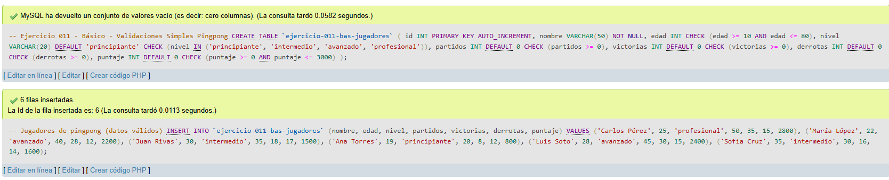
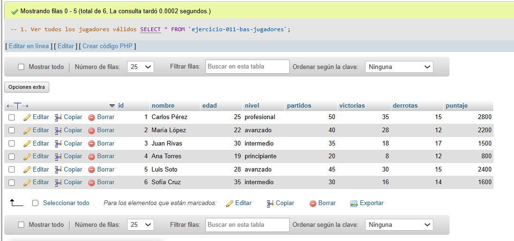
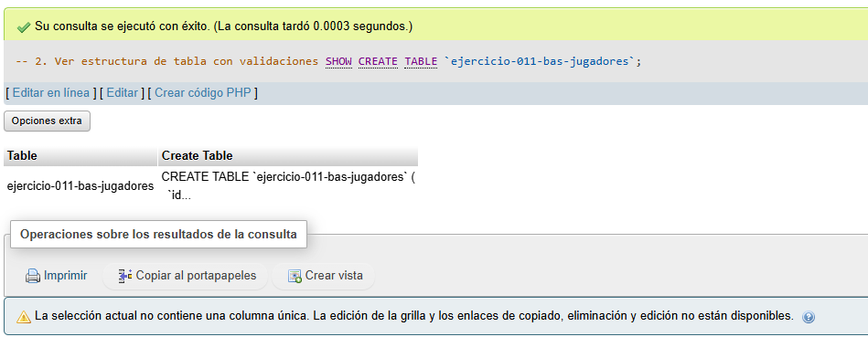
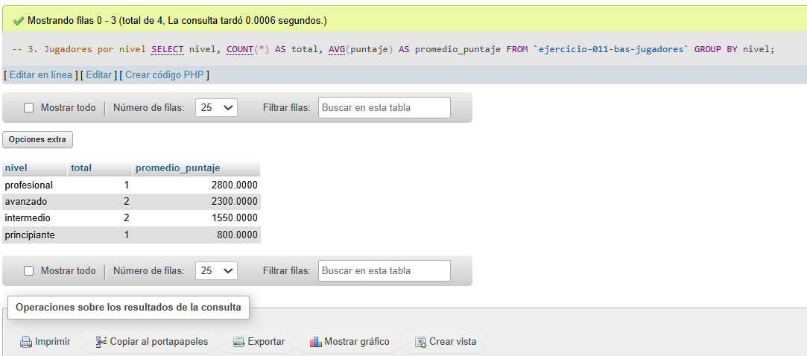
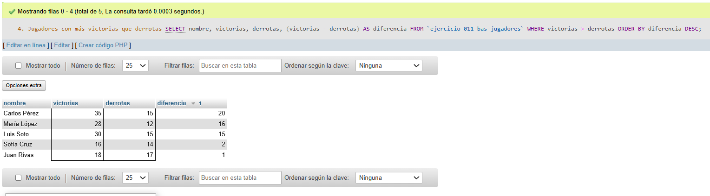
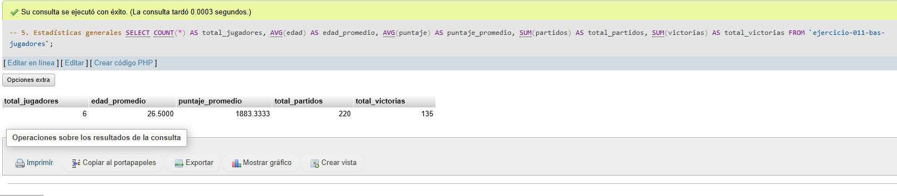

# Ejercicio 011 - Nivel Básico - Validaciones Simples Pingpong

## 1. Temática

Pingpong con validaciones simples en la tabla para garantizar datos correctos.

## 2. Decisiones Técnicas

- **Diseño de Tablas (DDL):**
  - Una tabla: `ejercicio-011-bas-jugadores`.
  - Columnas: `id`, `nombre`, `edad`, `nivel`, `partidos`, `victorias`, `derrotas`, `puntaje`.
  - PRIMARY KEY en `id` con AUTO_INCREMENT.
  - Uso de comillas invertidas para nombres con guiones.

- **Validaciones aplicadas (CHECK):**
  - **Edad:** Entre 10 y 80 años.
  - **Nivel:** Solo 4 valores permitidos (principiante, intermedio, avanzado, profesional).
  - **Partidos:** Mayor o igual a 0.
  - **Victorias:** Mayor o igual a 0.
  - **Derrotas:** Mayor o igual a 0.
  - **Puntaje:** Entre 0 y 3000.

- **Ventajas de CHECK:**
  - Garantiza integridad de datos.
  - Previene datos incorrectos.
  - No permite insertar valores inválidos.
  - Aplica validación en la base de datos.

- **Inserción de Datos (DML):**
  - 6 jugadores con datos válidos.
  - Comentarios con ejemplos de datos inválidos.

- **Consultas (DQL):**
  - Ver datos válidos.
  - Ver estructura con validaciones.
  - Estadísticas por nivel.
  - Jugadores con mejor rendimiento.

## 3. Evidencias
*A continuación, se adjuntan capturas de pantalla que demuestran la ejecución y los resultados de los scripts SQL en phpMyAdmin.*

Definición de tablas e inserción de datos

Consulta 1

Consulta 2

Consulta 3

Consulta 4

Consulta 5

