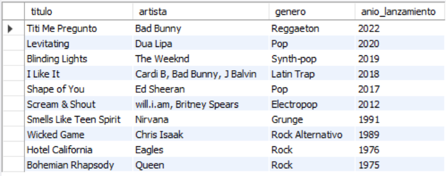
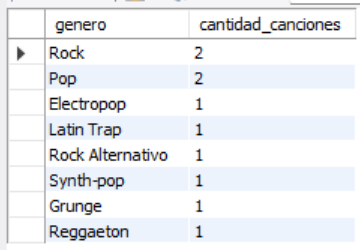
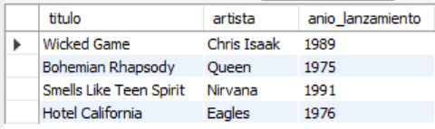
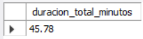

# Ejercicio Básico 012 - Modelado de Entidad

**Camper:** Antonio Canux

## Descripción

Duodécimo ejercicio de nivel básico, enfocado en un módulo de datos de una playlist musical. El objetivo principal de esta práctica es implementar el **Modelado de Entidad** en MySQL. A nivel básico, esto significa estructurar correctamente una tabla única (`playlist`) eligiendo los tipos de datos adecuados para cada atributo: cadenas de texto de longitud variable (`VARCHAR`) para títulos y artistas, y enteros numéricos (`INT`) exactos para la duración en segundos y el año de lanzamiento, estableciendo la llave primaria (`PRIMARY KEY`) para identificar inequívocamente cada pista.

---

## Tabla utilizada

**basico_ejercicio_012_playlist**
- id (PK, INT)
- titulo (VARCHAR)
- artista (VARCHAR)
- genero (VARCHAR)
- duracion_segundos (INT)
- anio_lanzamiento (INT)
- creado_en (DATETIME)

---

## Consultas realizadas

### 1. ¿Cuál es el listado general de la playlist ordenado desde los lanzamientos más recientes?

```sql
SELECT titulo, artista, genero, anio_lanzamiento 
    FROM basico_ejercicio_012_playlist 
    ORDER BY anio_lanzamiento DESC;
```

**Resultado**



---

### 2. ¿Cuántas canciones existen en la playlist agrupadas por género musical?

```sql
SELECT genero, COUNT(id) AS cantidad_canciones 
    FROM basico_ejercicio_012_playlist 
    GROUP BY genero 
    ORDER BY cantidad_canciones DESC;
```

**Resultado**



---

### 3. ¿Cuáles son las pistas consideradas "clásicas" (lanzadas antes del año 2000)?

```sql
SELECT titulo, artista, anio_lanzamiento 
    FROM basico_ejercicio_012_playlist 
    WHERE anio_lanzamiento < 2000;
```

**Resultado**



---

### 4. ¿Cuál es el tiempo total estimado de reproducción de toda la playlist en minutos?

```sql
SELECT ROUND(SUM(duracion_segundos) / 60, 2) AS duracion_total_minutos 
    FROM basico_ejercicio_012_playlist;
```

**Resultado**



---

### 5. ¿Cuál es la pista con mayor duración registrada en la base de datos?

```sql
SELECT titulo, artista, duracion_segundos 
    FROM basico_ejercicio_012_playlist 
    ORDER BY duracion_segundos DESC 
    LIMIT 1;
```

**Resultado**


---

## Herramientas

- MySQL
- MySQL Workbench
- Git
- GitHub

---

**Campuslands · Skill SQL**