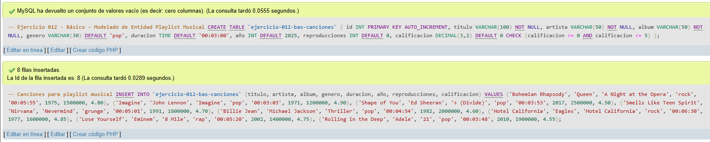
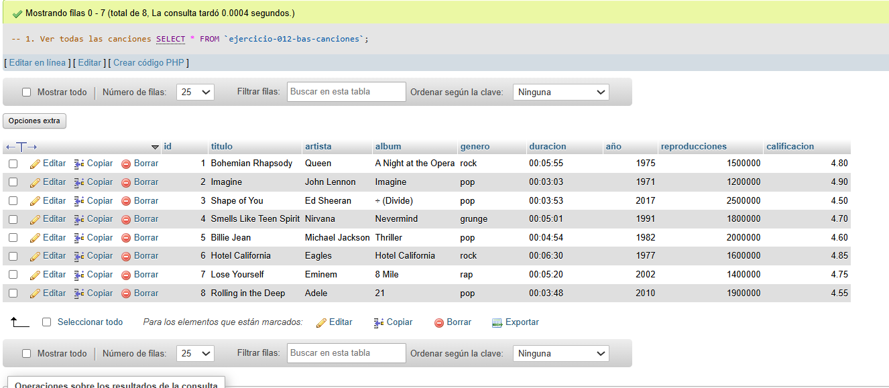
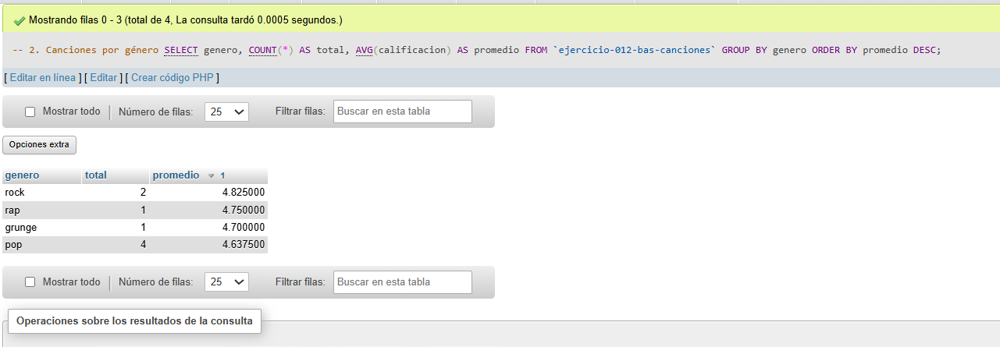
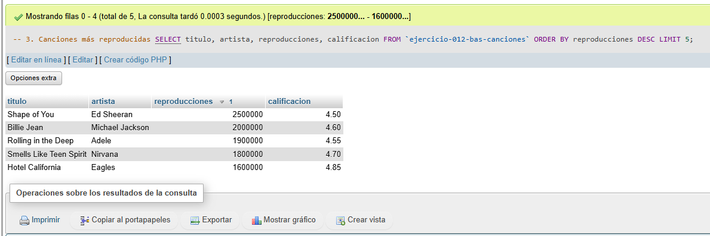
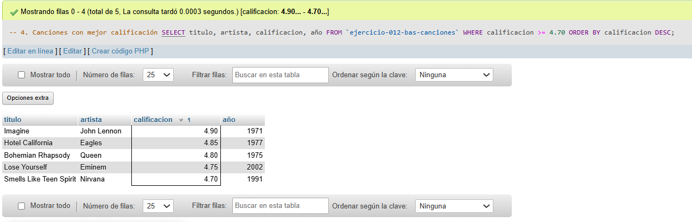
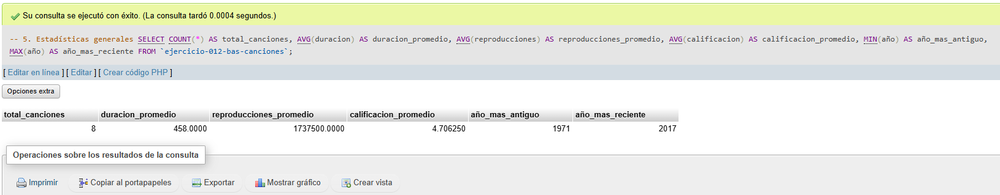

# Ejercicio 012 - Nivel Básico - Modelado de Entidad Playlist Musical

## 1. Temática

Playlist musical con modelado de entidad para almacenar canciones con sus atributos principales.

## 2. Decisiones Técnicas

- **Diseño de Tablas (DDL):**
  - Una tabla: `ejercicio-012-bas-canciones`.
  - Columnas: `id`, `titulo`, `artista`, `album`, `genero`, `duracion`, `año`, `reproducciones`, `calificacion`.
  - PRIMARY KEY en `id` con AUTO_INCREMENT.
  - Uso de comillas invertidas para nombres con guiones.

- **Atributos de la entidad canción:**
  - **Título:** Identificador principal (NOT NULL).
  - **Artista:** Nombre del intérprete.
  - **Álbum:** Nombre del disco.
  - **Género:** Categoría musical (default 'pop').
  - **Duración:** Tiempo de la canción (tipo TIME).
  - **Año:** Año de lanzamiento.
  - **Reproducciones:** Contador de escuchas.
  - **Calificación:** Puntuación entre 0 y 5 (con CHECK).

- **Inserción de Datos (DML):**
  - 8 canciones de diferentes géneros y épocas.
  - Datos variados para pruebas.

- **Consultas (DQL):**
  - Ver todos los datos.
  - Agrupación por género.
  - Top 5 más reproducidas.
  - Filtro por calificación.
  - Estadísticas generales con funciones de agregación.

## 3. Evidencias

*A continuación, se adjuntan capturas de pantalla que demuestran la ejecución y los resultados de los scripts SQL en phpMyAdmin.*

Definición de tablas e inserción de datos

Consulta 1

Consulta 2

Consulta 3

Consulta 4

Consulta 5

