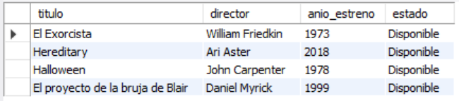
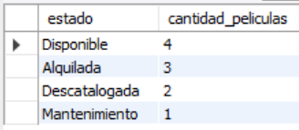
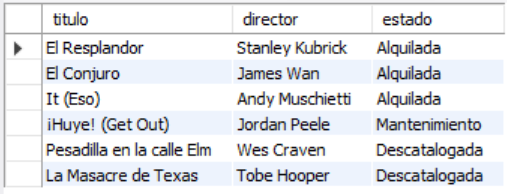
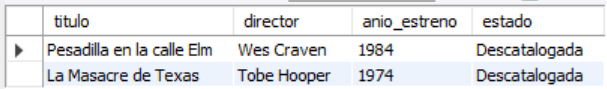
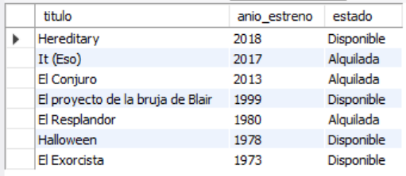

# Ejercicio Básico 013 - Filtros por Estado

**Camper:** Antonio Canux

## Descripción

Decimotercer ejercicio de nivel básico, aplicado a un módulo de datos de un catálogo de películas de miedo. El objetivo de esta práctica es implementar y consultar **Filtros por Estado**. Utilizando el tipo de dato `ENUM`, establecemos un ciclo de vida o estado para cada registro (Disponible, Alquilada, Mantenimiento, Descatalogada). Las consultas se enfocan en utilizar operadores como `=`, `!=`, `IN` y combinaciones con `AND` para filtrar eficazmente el inventario basándose en su disponibilidad lógica.

---

## Tabla utilizada

**basico_ejercicio_013_peliculas**
- id (PK)
- titulo
- director
- anio_estreno
- estado (ENUM)
- creado_en

---

## Consultas realizadas

### 1. ¿Cuáles son las películas que están actualmente disponibles para los usuarios?

```sql
SELECT titulo, director, anio_estreno, estado 
    FROM basico_ejercicio_013_peliculas 
    WHERE estado = 'Disponible';
```

**Resultado**



---

### 2. ¿Cómo se distribuye el inventario actual agrupado por el estado de las películas?

```sql
SELECT estado, COUNT(id) AS cantidad_peliculas 
    FROM basico_ejercicio_013_peliculas 
    GROUP BY estado 
    ORDER BY cantidad_peliculas DESC;
```

**Resultado**



---

### 3. ¿Qué películas del catálogo actualmente no se encuentran disponibles?

```sql
SELECT titulo, director, estado 
    FROM basico_ejercicio_013_peliculas 
    WHERE estado != 'Disponible' 
    ORDER BY estado ASC;
```

**Resultado**



---

### 4. ¿Cuáles películas clásicas (antes de 1990) se encuentran en estado descatalogado?

```sql
SELECT titulo, director, anio_estreno, estado 
    FROM basico_ejercicio_013_peliculas 
    WHERE anio_estreno < 1990 AND estado = 'Descatalogada';
```

**Resultado**



---

### 5. ¿Cuál es el catálogo activo actual (películas disponibles o actualmente alquiladas)?

```sql
SELECT titulo, anio_estreno, estado 
    FROM basico_ejercicio_013_peliculas 
    WHERE estado IN ('Disponible', 'Alquilada') 
    ORDER BY anio_estreno DESC;
```

**Resultado**



---

## Herramientas

- MySQL
- MySQL Workbench
- Git
- GitHub

---

**Campuslands · Skill SQL**