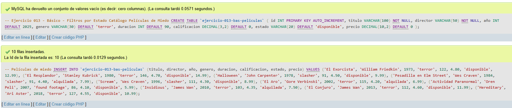
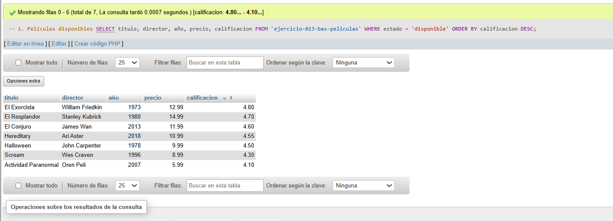
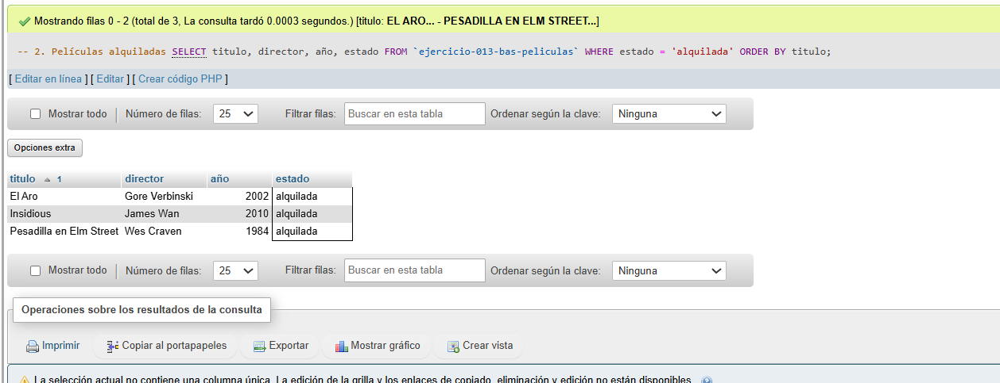
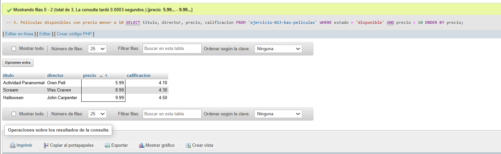
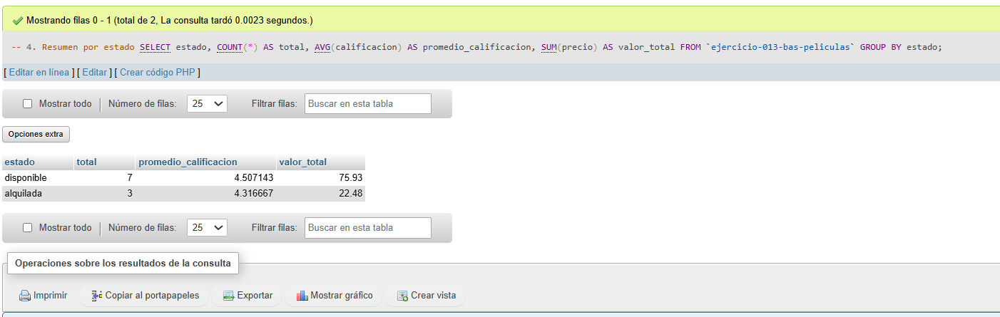
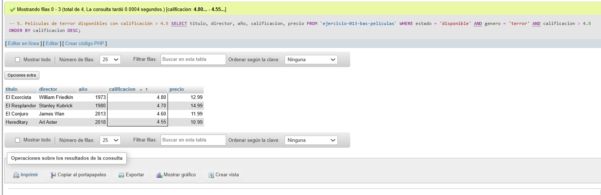

# Ejercicio 013 - Nivel Básico - Filtros por Estado Catálogo Películas de Miedo

## 1. Temática

Catálogo de películas de miedo con filtros por estado para gestionar disponibilidad.

## 2. Decisiones Técnicas

- **Diseño de Tablas (DDL):**
  - Una tabla: `ejercicio-013-bas-peliculas`.
  - Columnas: `id`, `titulo`, `director`, `año`, `genero`, `duracion`, `calificacion`, `estado`, `precio`.
  - PRIMARY KEY en `id` con AUTO_INCREMENT.
  - Uso de comillas invertidas para nombres con guiones.

- **Estados definidos:**
  - **disponible:** Película para alquilar.
  - **alquilada:** Película prestada.
  - (Se pueden agregar más: 'proximamente', 'reservada', etc.)

- **Inserción de Datos (DML):**
  - 10 películas de terror de diferentes épocas.
  - 7 disponibles y 3 alquiladas.

- **Consultas (DQL):**
  - Filtrar por estado 'disponible'.
  - Filtrar por estado 'alquilada'.
  - Combinar estado con precio menor a 10.
  - Resumen agrupado por estado.
  - Combinar estado, género y calificación.

- **Ventajas de los filtros:**
  - Gestión de inventario simple.
  - Consultas rápidas por disponibilidad.
  - Fácil mantenimiento.

## 3. Evidencias

*A continuación, se adjuntan capturas de pantalla que demuestran la ejecución y los resultados de los scripts SQL en phpMyAdmin.*

Definición de tablas e inserción de datos

Consulta 1

Consulta 2

Consulta 3

Consulta 4

Consulta 5

