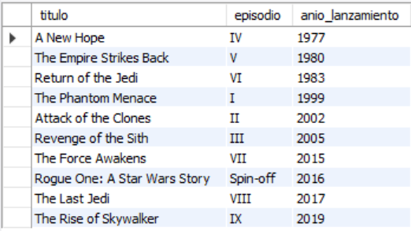
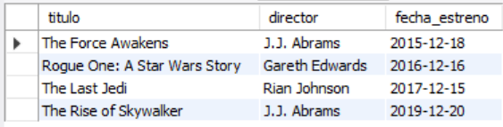
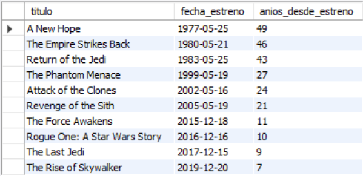
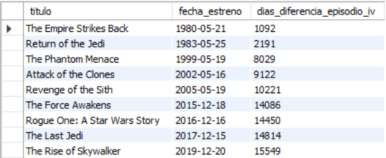
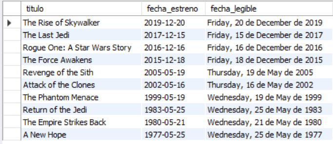

# Ejercicio Básico 014 - Fechas Básicas

**Camper:** Antonio Canux

## Descripción

Decimocuarto ejercicio de nivel básico, enfocado en un módulo de datos de una saga de ciencia ficción (Star Wars). El objetivo principal de esta práctica es implementar el manejo de **Fechas Básicas** en MySQL utilizando el tipo de dato `DATE`. A través de las consultas, se explota el uso de funciones nativas de tiempo como `YEAR()`, `MONTH()`, `CURDATE()`, `DATEDIFF()` y `DATE_FORMAT()`, las cuales son indispensables para generar reportes cronológicos y calcular métricas temporales en aplicaciones reales.

---

## Tabla utilizada

**basico_ejercicio_014_peliculas_scifi**
- id (PK)
- titulo
- episodio
- director
- fecha_estreno (DATE)
- creado_en (DATETIME)

---

## Consultas realizadas

### 1. ¿Cómo extraer únicamente el año de lanzamiento de un campo tipo fecha?

```sql
SELECT titulo, episodio, YEAR(fecha_estreno) AS anio_lanzamiento 
    FROM basico_ejercicio_014_peliculas_scifi 
    ORDER BY fecha_estreno ASC;
```

**Resultado**



---

### 2. ¿Cuáles películas de la saga fueron estrenadas específicamente en el mes de diciembre?

```sql
SELECT titulo, director, fecha_estreno 
    FROM basico_ejercicio_014_peliculas_scifi 
    WHERE MONTH(fecha_estreno) = 12 
    ORDER BY fecha_estreno ASC;
```

**Resultado**



---

### 3. ¿Cuántos años han transcurrido exactamente desde el estreno de cada película hasta el día de hoy?

```sql
SELECT titulo, fecha_estreno, (YEAR(CURDATE()) - YEAR(fecha_estreno)) AS anios_desde_estreno 
    FROM basico_ejercicio_014_peliculas_scifi 
    ORDER BY anios_desde_estreno DESC;
```

**Resultado**



---

### 4. ¿Cuál es la diferencia exacta en días entre cada estreno y el lanzamiento de la primera película en 1977?

```sql
SELECT titulo, fecha_estreno, DATEDIFF(fecha_estreno, '1977-05-25') AS dias_diferencia_episodio_iv 
    FROM basico_ejercicio_014_peliculas_scifi 
    WHERE titulo != 'A New Hope' 
    ORDER BY dias_diferencia_episodio_iv ASC;
```

**Resultado**



---

### 5. ¿Cómo presentar la fecha en un formato de texto más legible (Día de la semana, Día, Mes, Año)?

```sql
SELECT titulo, fecha_estreno, DATE_FORMAT(fecha_estreno, '%W, %d de %M de %Y') AS fecha_legible 
    FROM basico_ejercicio_014_peliculas_scifi 
    ORDER BY fecha_estreno DESC;
```

**Resultado**



---

## Herramientas

- MySQL
- MySQL Workbench
- Git
- GitHub

---

**Campuslands · Skill SQL**