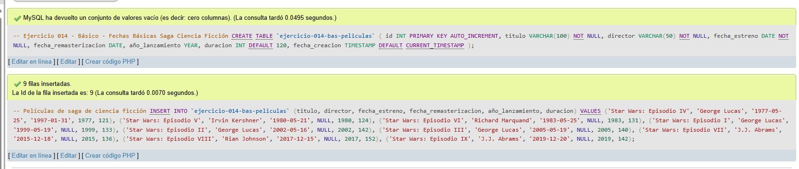
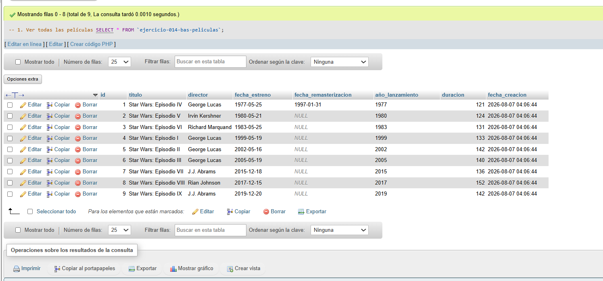
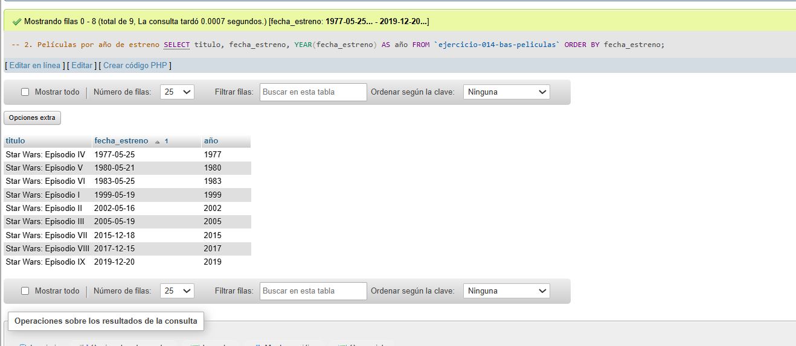
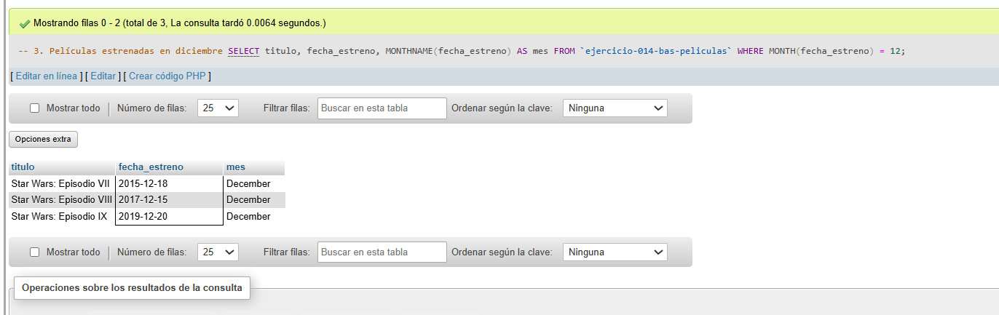
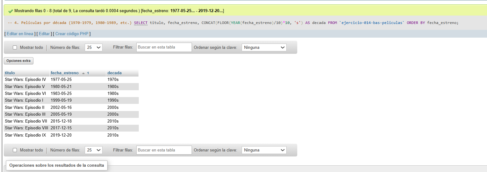
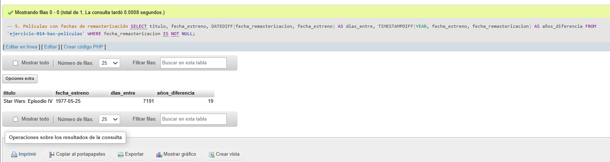

# Ejercicio 014 - Nivel Básico - Fechas Básicas Saga Ciencia Ficción

## 1. Temática

Saga de ciencia ficción con diferentes tipos de fechas para gestión de lanzamientos.

## 2. Decisiones Técnicas

- **Diseño de Tablas (DDL):**
  - Una tabla: `ejercicio-014-bas-peliculas`.
  - Columnas: `id`, `titulo`, `director`, `fecha_estreno`, `fecha_remasterizacion`, `año_lanzamiento`, `duracion`, `fecha_creacion`.
  - Uso de comillas invertidas para nombres con guiones.

- **Tipos de fecha usados:**
  - **DATE:** Fecha completa (YYYY-MM-DD).
  - **YEAR:** Solo año (YYYY).
  - **TIMESTAMP:** Fecha y hora automática.

- **Inserción de Datos (DML):**
  - 9 películas de Star Wars.
  - Fechas de estreno originales.
  - Una película con fecha de remasterización.

- **Funciones de fecha usadas:**
  - `YEAR()`: Extraer año.
  - `MONTH()`: Extraer mes.
  - `MONTHNAME()`: Nombre del mes.
  - `DATEDIFF()`: Días entre fechas.
  - `TIMESTAMPDIFF()`: Diferencia en años.
  - `CONCAT()` y `FLOOR()` para décadas.

- **Consultas (DQL):**
  - Ordenar por fecha.
  - Filtrar por mes (diciembre).
  - Agrupar por décadas.
  - Calcular diferencias entre fechas.

## 3. Evidencias

*A continuación, se adjuntan capturas de pantalla que demuestran la ejecución y los resultados de los scripts SQL en phpMyAdmin.*

Definición de tablas e inserción de datos

Consulta 1

Consulta 2

Consulta 3

Consulta 4

Consulta 5

