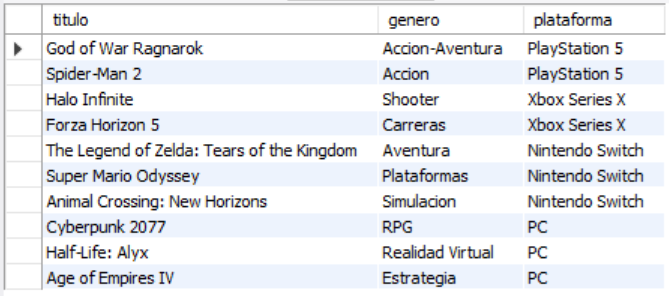
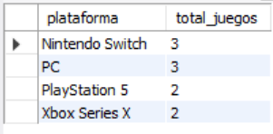
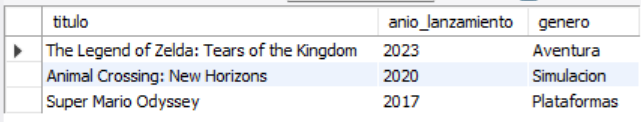
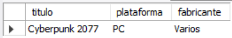
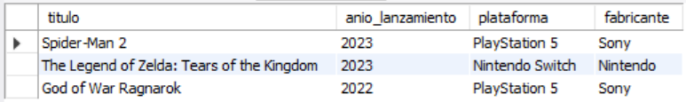

    # Ejercicio Básico 015 - Relaciones Simples

**Camper:** Antonio Canux

## Descripción

Decimoquinto y último ejercicio de nivel básico, diseñado para un módulo de datos de una biblioteca gamer. El objetivo central de esta práctica es implementar **Relaciones Simples** entre dos entidades utilizando llaves foráneas (`FOREIGN KEY`). Se establece una relación uno a muchos (1:N) donde una plataforma (ej. PlayStation 5) puede tener muchos videojuegos asociados, pero cada videojuego registrado en la tabla pertenece a una plataforma específica. Se hace uso de sentencias `JOIN` para unir la información fragmentada y presentarla de forma legible.

---

## Tablas utilizadas

**basico_ejercicio_015_plataformas**
- id (PK)
- nombre
- fabricante

**basico_ejercicio_015_juegos**
- id (PK)
- plataforma_id (FK)
- titulo
- genero
- anio_lanzamiento

---

## Consultas realizadas

### 1. ¿Cuál es el listado completo del catálogo de juegos indicando la plataforma a la que pertenecen?

```sql
SELECT j.titulo, j.genero, p.nombre AS plataforma 
    FROM basico_ejercicio_015_juegos j 
    JOIN basico_ejercicio_015_plataformas p ON j.plataforma_id = p.id;
```

**Resultado**



---

### 2. ¿Cuántos juegos hay registrados en la biblioteca por cada consola o plataforma?

```sql
SELECT p.nombre AS plataforma, COUNT(j.id) AS total_juegos 
    FROM basico_ejercicio_015_plataformas p 
    LEFT JOIN basico_ejercicio_015_juegos j ON p.id = j.plataforma_id 
    GROUP BY p.id, p.nombre 
    ORDER BY total_juegos DESC;
```

**Resultado**



---

### 3. ¿Cuáles son los juegos disponibles registrados en el ecosistema de 'Nintendo Switch'?

```sql
SELECT j.titulo, j.anio_lanzamiento, j.genero 
    FROM basico_ejercicio_015_juegos j 
    JOIN basico_ejercicio_015_plataformas p ON j.plataforma_id = p.id 
    WHERE p.nombre = 'Nintendo Switch' 
    ORDER BY j.anio_lanzamiento DESC;
```

**Resultado**



---

### 4. ¿Quién es el fabricante de la plataforma donde está registrado 'Cyberpunk 2077'?

```sql
SELECT j.titulo, p.nombre AS plataforma, p.fabricante 
    FROM basico_ejercicio_015_juegos j 
    JOIN basico_ejercicio_015_plataformas p ON j.plataforma_id = p.id 
    WHERE j.titulo = 'Cyberpunk 2077';
```

**Resultado**



---

### 5. ¿Cuáles son los juegos más recientes del catálogo (2022 en adelante) con la información de su fabricante?

```sql
SELECT j.titulo, j.anio_lanzamiento, p.nombre AS plataforma, p.fabricante 
    FROM basico_ejercicio_015_juegos j 
    JOIN basico_ejercicio_015_plataformas p ON j.plataforma_id = p.id 
    WHERE j.anio_lanzamiento >= 2022 
    ORDER BY j.anio_lanzamiento DESC;
```

**Resultado**



---

## Herramientas

- MySQL
- MySQL Workbench
- Git
- GitHub

---

**Campuslands · Skill SQL**