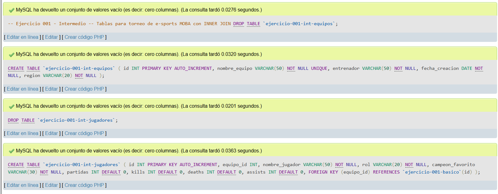
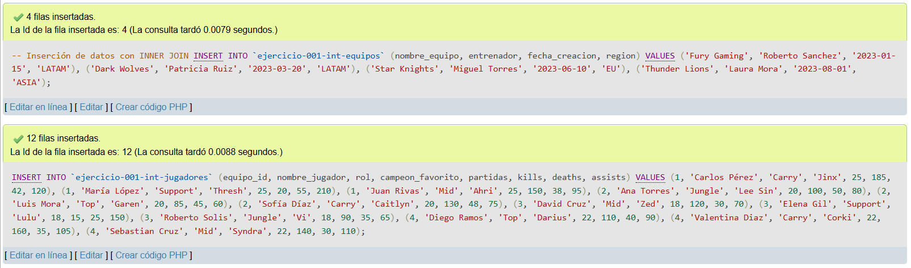
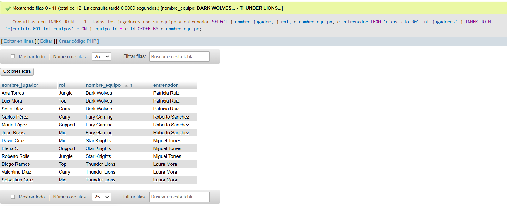
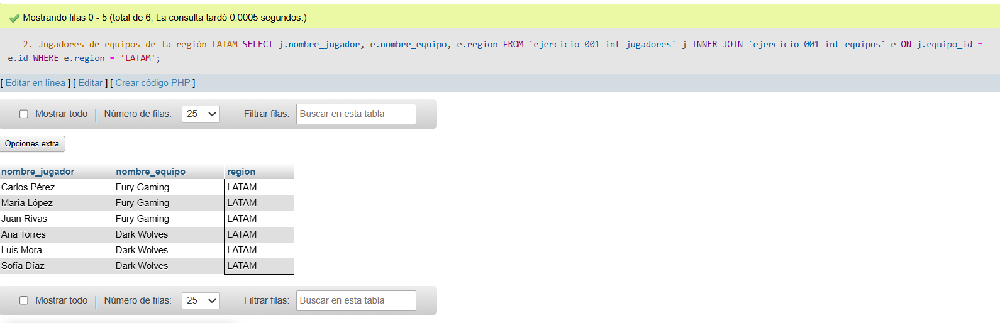
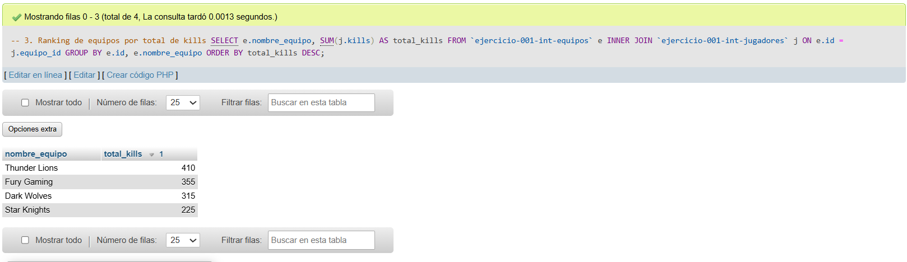
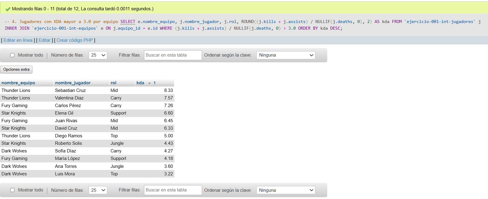

# Ejercicio 001 - Nivel Intermedio - Torneo E-Sports MOBA

## 1. Temática

Gestión de datos para un torneo de e-sports MOBA con relación entre equipos y jugadores. Se registran estadísticas de jugadores y metadatos de los equipos.

## 2. Decisiones Técnicas

A continuación, se describen las decisiones clave tomadas para la resolución:

- **Diseño de Tablas (DDL):**
  - Se crearon 2 tablas relacionadas: `ejercicio-001-int-equipos` (tabla padre) y `ejercicio-001-int-jugadores` (tabla hija).
  - Se eligió `INT AUTO_INCREMENT` para las llaves primarias `id` en ambas tablas.
  - Se aplicó `UNIQUE` en `nombre_equipo` para evitar duplicados.
  - Se usó `FOREIGN KEY` en `equipo_id` de jugadores para mantener integridad referencial y permitir `INNER JOIN`.
  - Se estableció `NOT NULL` en los campos principales para asegurar información completa.
  - Se eligió `DATE` para `fecha_creacion` porque solo se necesita la fecha sin hora.

- **Inserción de Datos (DML):**
  - Se insertaron 4 equipos con diferentes regiones (LATAM, EU, ASIA) para probar filtros.
  - Se agregaron 12 jugadores (3 por equipo) con estadísticas realistas (partidas, kills, deaths, assists).
  - Los datos permiten probar operaciones como `SUM`, `GROUP BY`, `WHERE` y `ORDER BY`.

- **Consultas (DQL):**
  - La consulta `1` muestra jugadores con su equipo y entrenador usando `INNER JOIN`.
  - La consulta `2` filtra por región `LATAM` con `WHERE` para práctica de filtros.
  - La consulta `3` calcula ranking de equipos por total de kills usando `SUM` y `GROUP BY`.
  - La consulta `4` calcula KDA individual usando `NULLIF` para evitar división entre cero.
  - La consulta `5` usa `LIMIT 5` para mostrar el top 5 de jugadores con más partidas.

## 3. Evidencias

*A continuación, se adjuntan capturas de pantalla que demuestran la ejecución y los resultados de los scripts SQL en phpMyAdmin.*

Definición de tablas

Insertar datos

Consulta 1

Consulta 2

Consulta 3

Consulta 4
