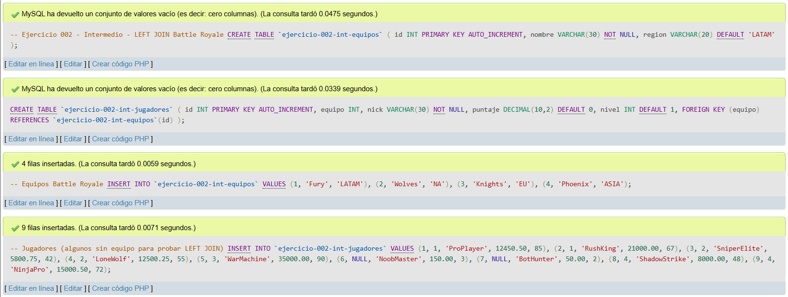
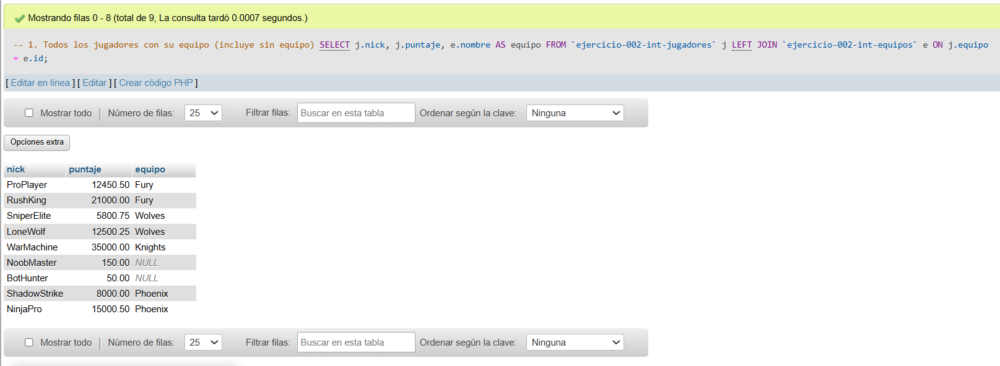
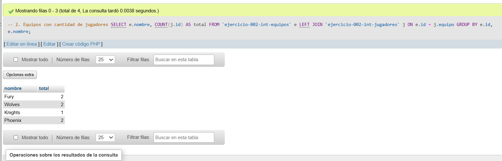
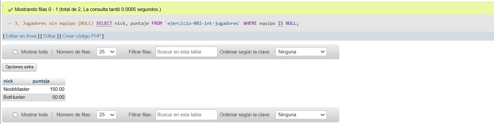
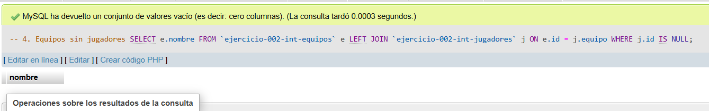
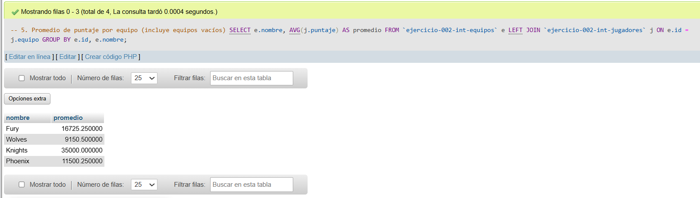

# Ejercicio 002 - Nivel Intermedio - LEFT JOIN Battle Royale

## 1. Temática

Ranking de jugadores de Battle Royale con relación equipos-jugadores usando LEFT JOIN para mostrar todos los registros de la tabla izquierda.

## 2. Decisiones Técnicas

- **Diseño de Tablas (DDL):**
  - Uso de nombres de tabla con comillas invertidas o guiones bajos para garantizar compatibilidad sintáctica en MySQL.
  - 2 tablas: `ejercicio-002-int-equipos` y `ejercicio-002-int-jugadores`.
  - Llave foránea `equipo` en jugadores.
  - Nombres simples: `nombre`, `region`, `nick`, `puntaje`.

- **Inserción de Datos (DML):**
  - 4 equipos en diferentes regiones.
  - 9 jugadores (2 sin equipo para probar NULL).
  - Datos variados para pruebas.

- **Consultas (DQL):**
  - LEFT JOIN para mostrar jugadores con o sin equipo.
  - COUNT para contar jugadores por equipo.
  - Filtro IS NULL para encontrar jugadores sin equipo.
  - LEFT JOIN con condición para equipos vacíos.
  - AVG para calcular promedios por equipo.

## 3. Evidencias

*A continuación, se adjuntan capturas de pantalla que demuestran la ejecución y los resultados de los scripts SQL en phpMyAdmin.*

Definición de tablas e insertar datos

Consulta 1

Consulta 2

Consulta 3

Consulta 4

Consulta 5
