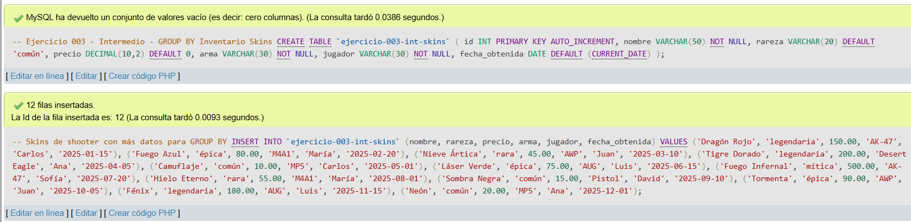
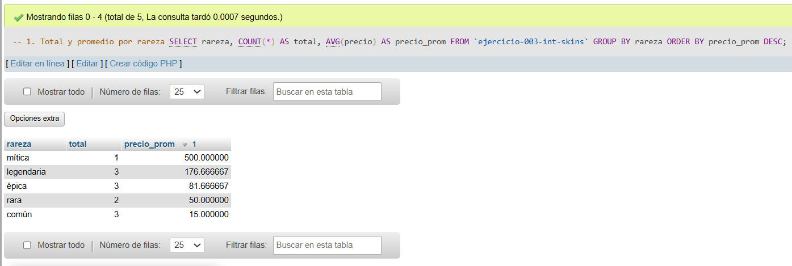
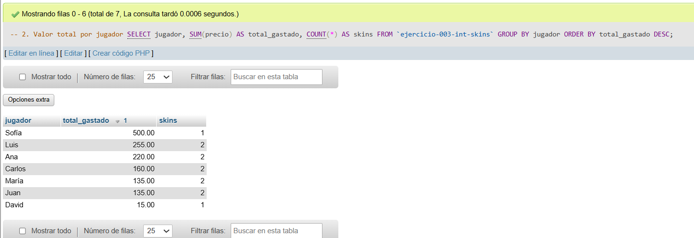
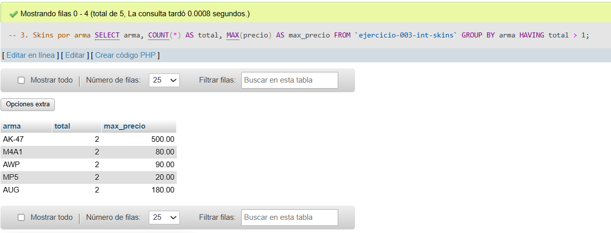
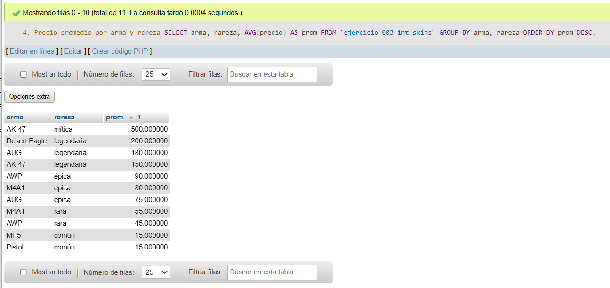
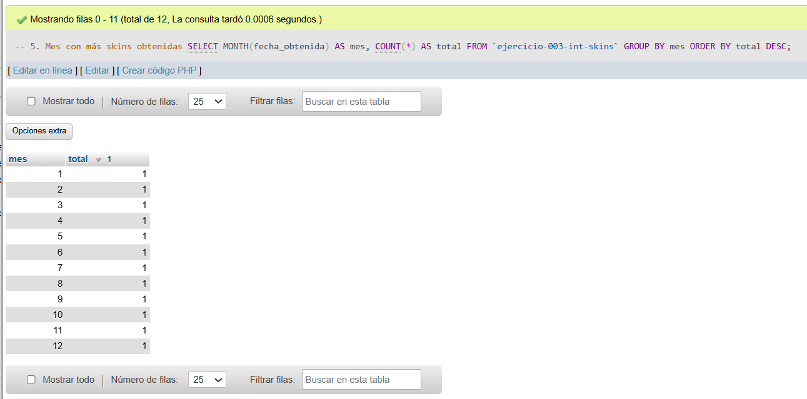

# Ejercicio 003 - Nivel Intermedio - GROUP BY Inventario Skins

## 1. Temática

Inventario de skins de shooter con agrupaciones para análisis de datos por rareza, jugador, arma y fechas.

## 2. Decisiones Técnicas

- **Diseño de Tablas (DDL):**
  - Una tabla: `ejercicio-003-int-skins`.
  - Columnas: `id`, `nombre`, `rareza`, `precio`, `arma`, `jugador`, `fecha_obtenida`.
  - PRIMARY KEY en `id` con AUTO_INCREMENT.
  - Uso de comillas invertidas para nombres con guiones.

- **Inserción de Datos (DML):**
  - 12 skins con diferentes rarezas, precios y jugadores.
  - 5 jugadores distintos para pruebas de GROUP BY.
  - Fechas distribuidas en varios meses de 2025.

- **Consultas (DQL):**
  - GROUP BY simple con COUNT y AVG.
  - GROUP BY con SUM para totales por jugador.
  - GROUP BY con HAVING para filtrar grupos.
  - GROUP BY múltiple (arma + rareza).
  - GROUP BY con función MONTH para agrupar por mes.

## 3. Evidencias

*A continuación, se adjuntan capturas de pantalla que demuestran la ejecución y los resultados de los scripts SQL en phpMyAdmin.*

Definición de tablas e insertar datos

Consulta 1

Consulta 2

Consulta 3

Consulta 4

Consulta 5
