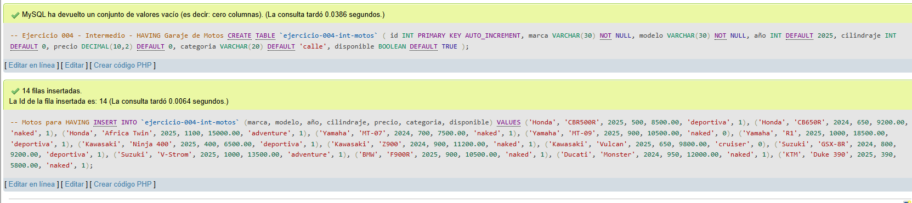
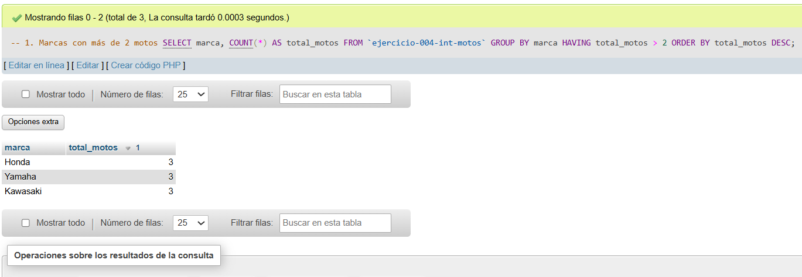
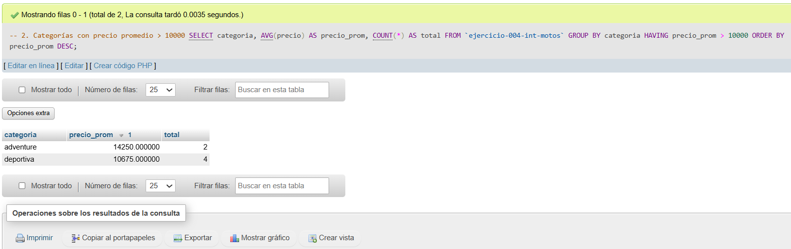
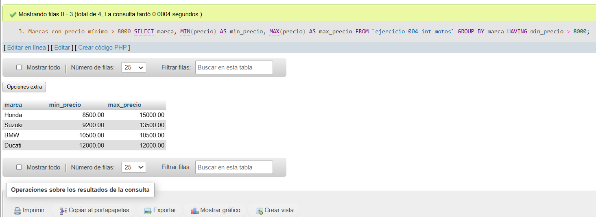
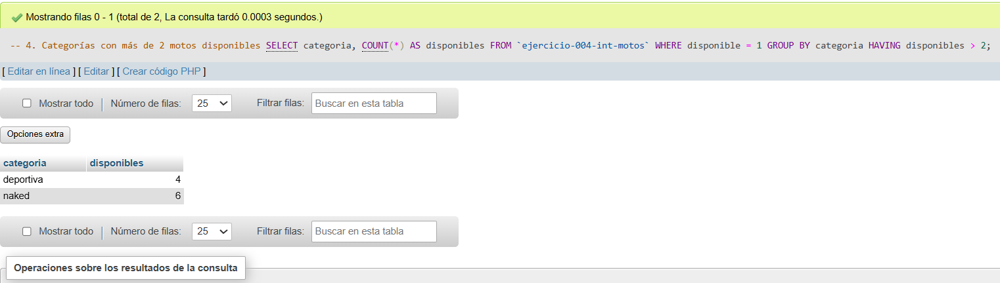
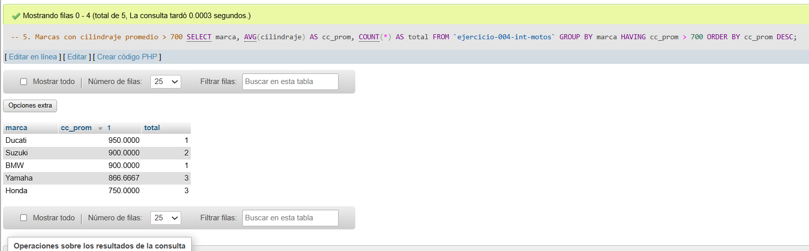

# Ejercicio 004 - Nivel Intermedio - HAVING Garaje de Motos

## 1. Temática

Garaje de motos con HAVING para filtrar resultados después de agrupar por marca, categoría y cilindraje.

## 2. Decisiones Técnicas

- **Diseño de Tablas (DDL):**
  - Una tabla: `ejercicio-004-int-motos`.
  - Columnas: `id`, `marca`, `modelo`, `año`, `cilindraje`, `precio`, `categoria`, `disponible`.
  - PRIMARY KEY en `id` con AUTO_INCREMENT.
  - Uso de comillas invertidas para nombres con guiones.

- **Inserción de Datos (DML):**
  - 14 motos de 8 marcas diferentes.
  - 4 categorías: deportiva, naked, adventure, cruiser.
  - Mezcla de disponibles y no disponibles.

- **Consultas (DQL):**
  - HAVING con COUNT para marcas con más de 2 motos.
  - HAVING con AVG para categorías con precio promedio > 10000.
  - HAVING con MIN para marcas con precio mínimo > 8000.
  - HAVING con WHERE y COUNT para categorías con más de 2 disponibles.
  - HAVING con AVG para marcas con cilindraje promedio > 700.

## 3. Evidencias

*A continuación, se adjuntan capturas de pantalla que demuestran la ejecución y los resultados de los scripts SQL en phpMyAdmin.*

Definición de tablas e insertar datos

Consulta 1

Consulta 2

Consulta 3

Consulta 4

Consulta 5
