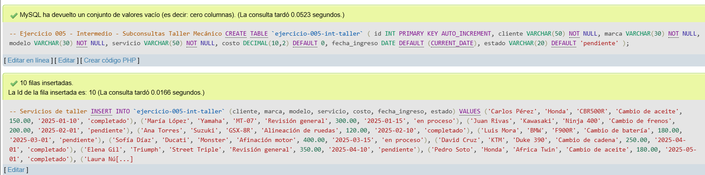
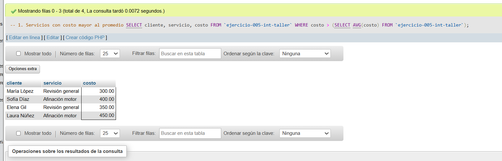
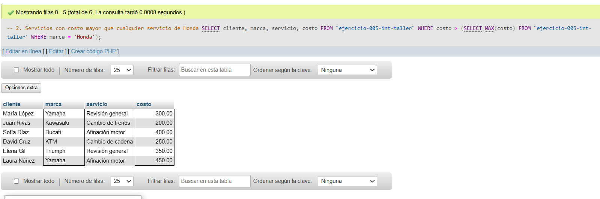
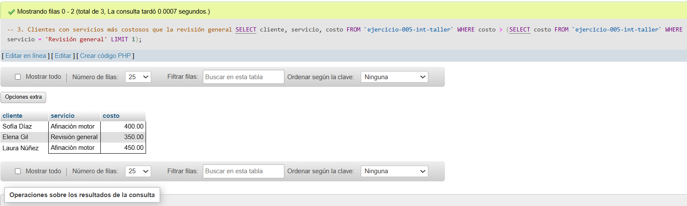
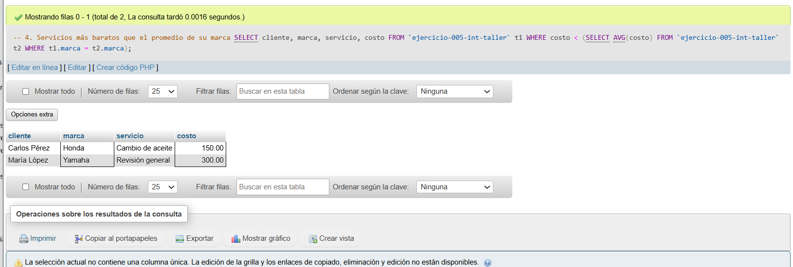
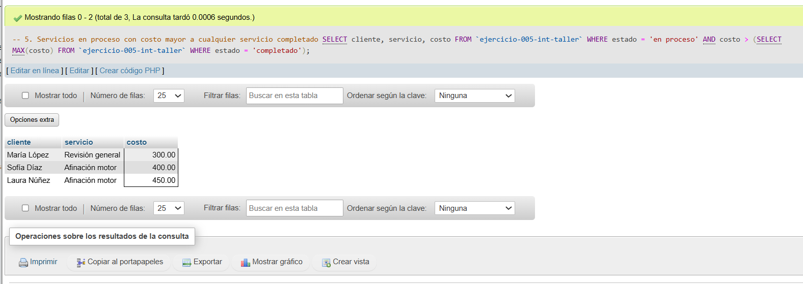

# Ejercicio 005 - Nivel Intermedio - Subconsultas Taller Mecánico

## 1. Temática

Taller mecánico de motos con subconsultas para comparar costos, filtrar por promedios y condiciones específicas.

## 2. Decisiones Técnicas

- **Diseño de Tablas (DDL):**
  - Una tabla: `ejercicio-005-int-taller`.
  - Columnas: `id`, `cliente`, `marca`, `modelo`, `servicio`, `costo`, `fecha_ingreso`, `estado`.
  - Uso de comillas invertidas para nombres con guiones.

- **Inserción de Datos (DML):**
  - 10 servicios con diferentes marcas, costos y estados.
  - Marcas: Honda, Yamaha, Kawasaki, Suzuki, BMW, Ducati, KTM, Triumph.

- **Consultas (DQL) - Tipos de subconsultas:**
  - **Subconsulta en WHERE:** Servicios con costo > promedio general.
  - **Subconsulta con MAX:** Servicios con costo > máximo de Honda.
  - **Subconsulta con LIMIT:** Servicios más costosos que revisión general.
  - **Subconsulta correlacionada:** Servicios más baratos que el promedio de su marca.
  - **Subconsulta con estado:** Servicios en proceso más costosos que cualquier completado.

## 3. Evidencias

*A continuación, se adjuntan capturas de pantalla que demuestran la ejecución y los resultados de los scripts SQL en phpMyAdmin.*

Definición de tablas e insertar datos

Consulta 1

Consulta 2

Consulta 3

Consulta 4

Consulta 5
