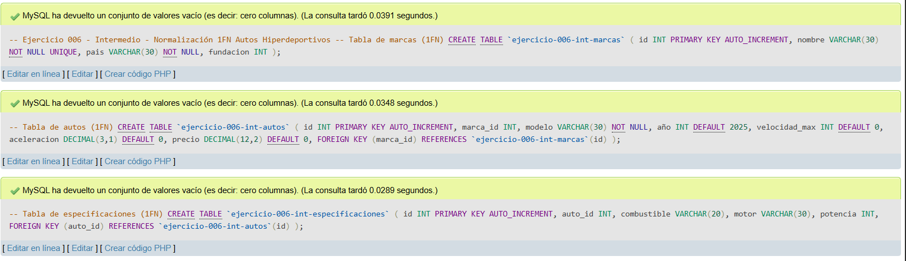
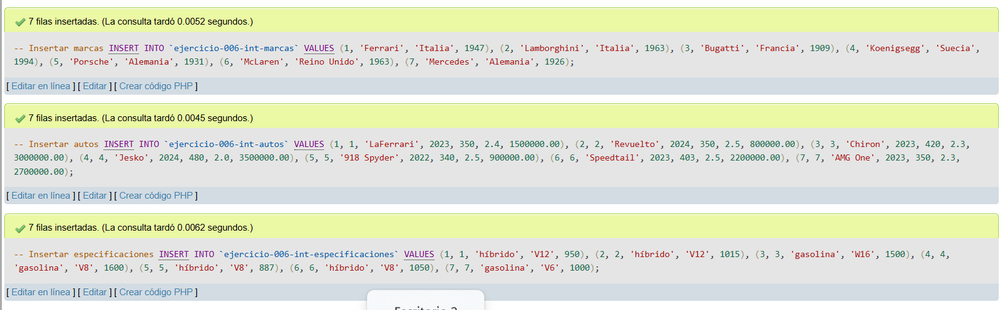
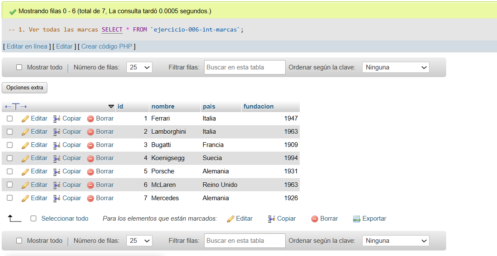
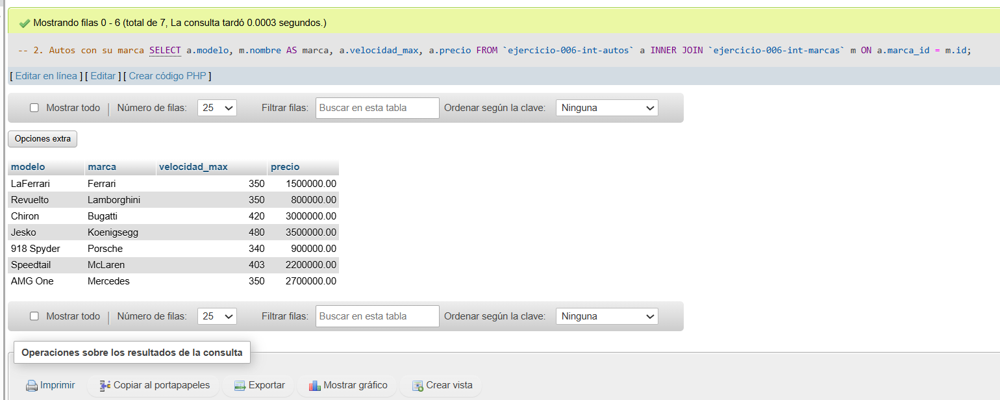
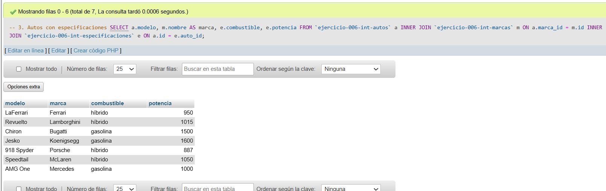
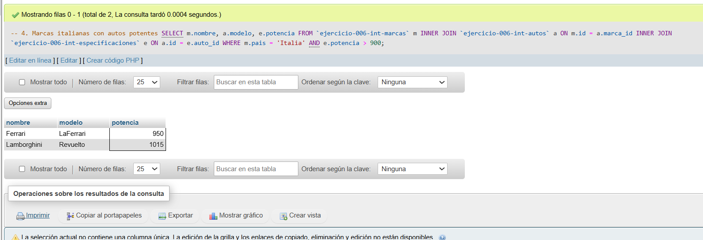
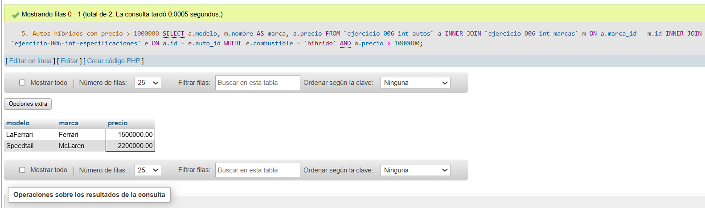

# Ejercicio 006 - Nivel Intermedio - Normalización 1FN Autos Hiperdeportivos

## 1. Temática

Normalización a 1FN de autos hiperdeportivos, eliminando redundancias y separando datos en tablas relacionadas.

## 2. Decisiones Técnicas

- **Diseño de Tablas (DDL):**
  - 3 tablas normalizadas:
    - `ejercicio-006-int-marcas`: información única de marcas.
    - `ejercicio-006-int-autos`: datos principales del auto.
    - `ejercicio-006-int-especificaciones`: detalles técnicos.
  - Llaves foráneas para mantener relaciones.
  - `UNIQUE` en nombre de marca para evitar duplicados.
  - Uso de comillas invertidas para nombres con guiones.

- **Normalización 1FN aplicada:**
  - **Eliminar grupos repetidos:** Separar especificaciones en tabla propia.
  - **Valores atómicos:** Cada columna tiene un solo valor.
  - **Clave primaria única:** Cada tabla tiene su `id`.

- **Inserción de Datos (DML):**
  - 7 marcas con país y año de fundación.
  - 7 autos relacionados con marcas.
  - 7 especificaciones con combustible, motor y potencia.

- **Consultas (DQL):**
  - JOIN simple para mostrar autos con su marca.
  - JOIN múltiple para mostrar todas las relaciones.
  - Filtros con WHERE y condiciones en tablas relacionadas.

## 3. Evidencias

*A continuación, se adjuntan capturas de pantalla que demuestran la ejecución y los resultados de los scripts SQL en phpMyAdmin.*

Definición de tablas

Insertar datos

Consulta 1

Consulta 2

Consulta 3

Consulta 4

Consulta 5
