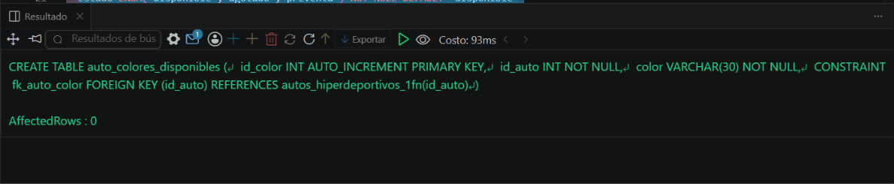
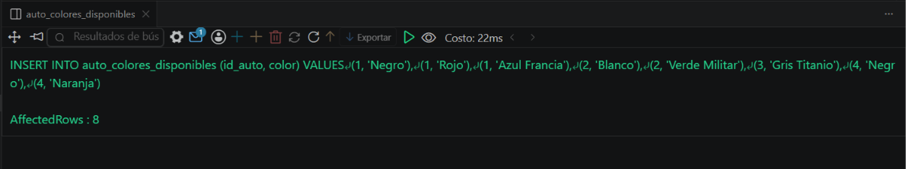
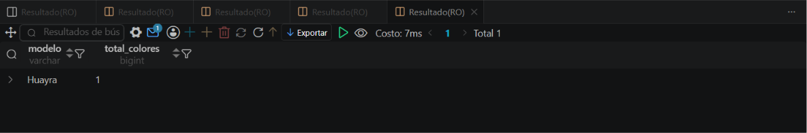

# Resolucion - Ejercicio 006 (Intermedio) - Selvin Lem

## Tematica
Autos hiperdeportivos

## Como ejecutar
1. Ejecutar `ddl/schema.sql`: crea autos_hiperdeportivos_1fn y
   auto_colores_disponibles (el diseño incorrecto queda solo
   comentado como referencia, no se ejecuta).
2. Ejecutar `dml/inserts.sql` para insertar 4 autos y 8 colores.
3. Ejecutar `dql/consultas.sql` para verificar consultas que solo
   son posibles gracias al diseño normalizado.

## Entidad principal
- Tablas: autos_hiperdeportivos_1fn, auto_colores_disponibles (FK)
- Atributos clave: modelo, color (un color por fila)

## Restriccion aplicada
FOREIGN KEY id_auto en auto_colores_disponibles, separando el
atributo multivaluado en una tabla independiente (1FN).

## Caso limite incluido
Un auto con 3 colores disponibles y otro con solo 1, demostrando
que el diseño soporta cardinalidad variable sin romper la estructura.

## Evidencia ejecucion - schema.sql
 

## Evidencia ejecucion - inserts.sql
 
 
## Evidencia ejecucion - consultas.sql
 