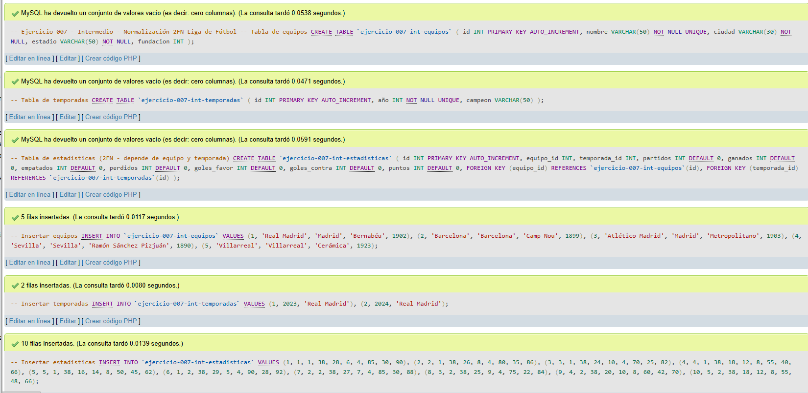
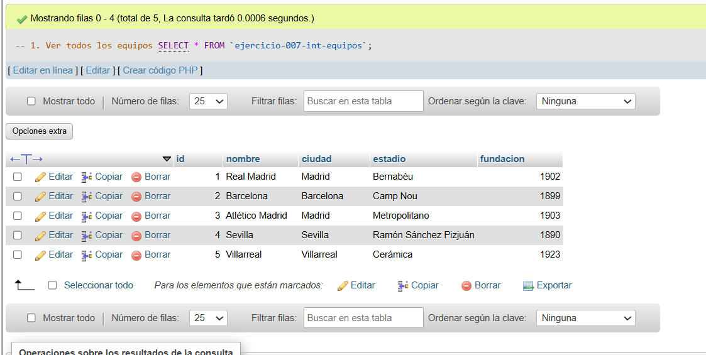
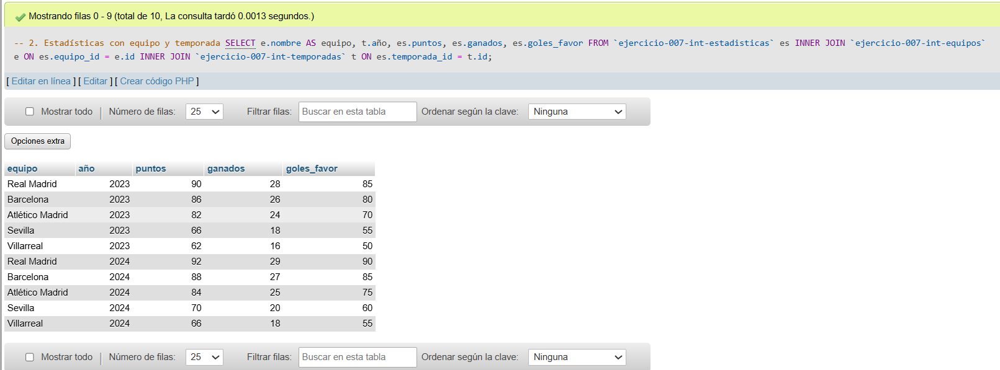
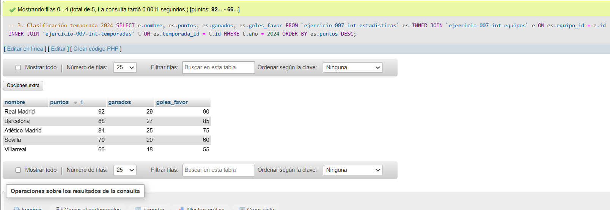
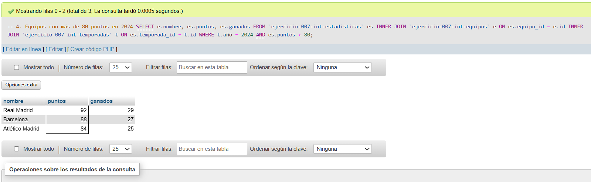
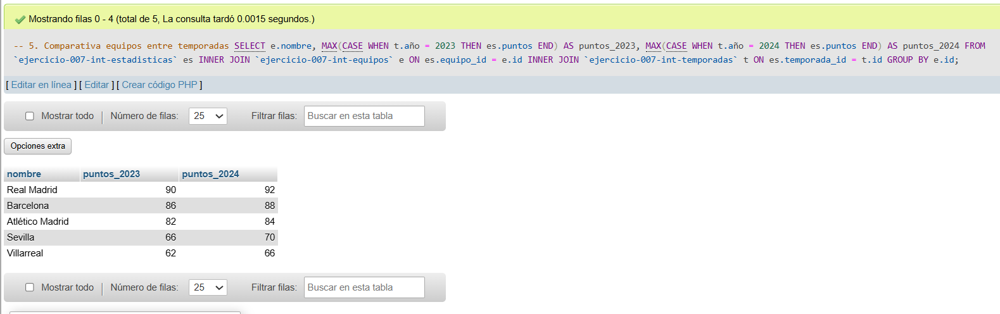

# Ejercicio 007 - Nivel Intermedio - Normalización 2FN Liga de Fútbol

## 1. Temática

Normalización a 2FN de liga de fútbol, eliminando dependencias parciales y creando tablas relacionadas.

## 2. Decisiones Técnicas

- **Diseño de Tablas (DDL):**
  - 3 tablas normalizadas:
    - `ejercicio-007-int-equipos`: información única de equipos.
    - `ejercicio-007-int-temporadas`: temporadas con campeón.
    - `ejercicio-007-int-estadisticas`: estadísticas por equipo y temporada.
  - Llaves foráneas para mantener relaciones.
  - `UNIQUE` en nombre de equipo y año de temporada.
  - Uso de comillas invertidas para nombres con guiones.

- **Normalización 2FN aplicada:**
  - **1FN ya aplicada:** Valores atómicos.
  - **2FN aplicada:** Eliminar dependencias parciales.
    - Antes: estadísticas con datos de equipo repetidos.
    - Ahora: estadísticas dependen de equipo_id y temporada_id.
  - **Clave primaria:** `id` en cada tabla.
  - **Dependencias:** estadísticas depende completamente de la combinación equipo + temporada.

- **Inserción de Datos (DML):**
  - 5 equipos con información detallada.
  - 2 temporadas (2023 y 2024).
  - 10 registros de estadísticas (5 equipos × 2 temporadas).

- **Consultas (DQL):**
  - JOIN para mostrar estadísticas con nombres.
  - Filtros por temporada y puntos.
  - Comparativa entre temporadas usando CASE.

## 3. Evidencias

*A continuación, se adjuntan capturas de pantalla que demuestran la ejecución y los resultados de los scripts SQL en phpMyAdmin.*

Definición de tablas e inserción de datos

Consulta 1

Consulta 2

Consulta 3

Consulta 4

Consulta 5
