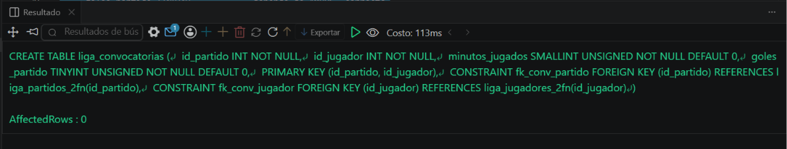
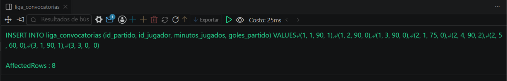

# Ejercicio 007 (Intermedio) - Selvin Lem

## Tematica
Liga de futbol

## Como ejecutar
1. Ejecutar `ddl/schema.sql`: crea liga_jugadores_2fn, liga_partidos_2fn
   y liga_convocatorias (clave compuesta). Diseño incorrecto queda
   solo comentado como referencia.
2. Ejecutar `dml/inserts.sql`: inserta 5 jugadores, 3 partidos y
   8 convocatorias.
3. Ejecutar `dql/consultas.sql` para verificar consultas y el
   UPDATE que demuestra la ventaja de la normalizacion.

## Entidad principal
- Tablas: liga_jugadores_2fn, liga_partidos_2fn,
  liga_convocatorias (clave compuesta: id_partido + id_jugador)

## Restriccion aplicada
PRIMARY KEY compuesta en liga_convocatorias, mas FOREIGN KEY dobles
hacia jugadores y partidos.

## Caso limite incluido
Jugador convocado que jugo 0 minutos (suplente sin entrar); la
clave compuesta sigue siendo valida aunque el valor de negocio
indique inactividad en ese partido.

## Evidencia ejecucion - schema.sql
 

## Evidencia ejecucion - inserts.sql
 

## Evidencia ejecucion - consultas.sql
 